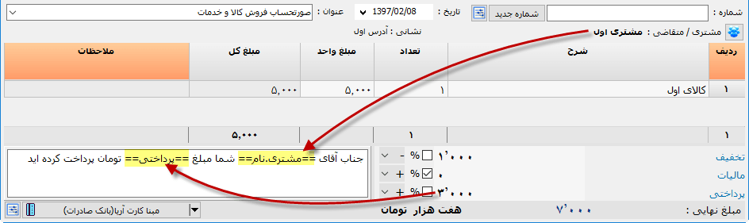
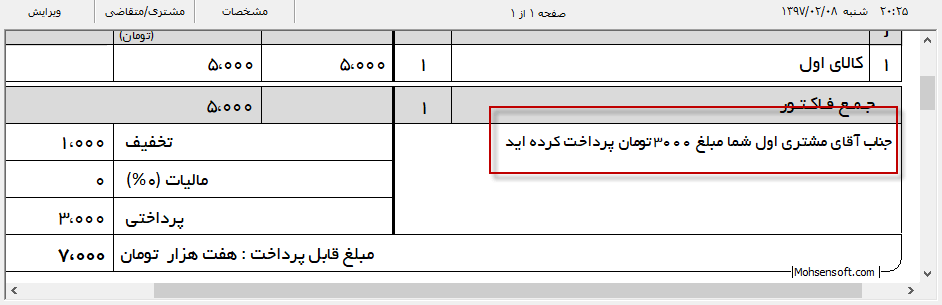

.. meta::
    :description: عملیات و دستورات پیشرفته برای کار با نرم افزار

.. _advanced:

پیشرفته 
=================
در این بخش عملیات های خاصی که میتوانید با نرم افزار انجام دهید شرح داده می شود، برای درک و استفاده از این موارد نیاز به دانش بیشتری در زمینه کامپیوتر وجود دارد.

.. raw:: html

    

|

.. _text-formatting:

فرمت بندی متن
------------------------------------------
در هر قسمت از نرم افزار میتوانید دستوراتی برای فرمت بندی متنها و اجرای بعضی تغییرات در آنها اعمال نمایید:

**ضخیم کردن :** برای این منظور کافیست اطراف متنی که قصد دارید ضخیم شود دو کاراکتر ستاره قرار دهید، برای مثال:

.. raw:: html

    
این قسمت از متن **ضخیم** خواهد شد.
      <b>خروجی:</b>  
    این قسمت از متن <b>ضخیم</b> خواهد شد.

|

**ایتالیک کردن :** برای این منظور کافیست اطراف متنی که قصد دارید ایتالیک شود دو کاراکتر خط زیر قرار دهید، برای مثال:

.. raw:: html

    
این قسمت از متن __ایتالیک__ خواهد شد.
      <b>خروجی:</b>  
    این قسمت از متن <i>ایتالیک</i> خواهد شد.

|

**رنگی کردن متن :** برای این منظور کافیست اطراف متنی که قصد دارید رنگی شود دو کاراکتر "#" قرار دهید و در بین دو کاراکتر اول کد رنگ مورد نظر را با جدا کننده ":" بنویسید، برای مثال:

.. raw:: html

    
این قسمت از متن #255:0:0#قرمز## خواهد شد.
      <b>خروجی:</b>  
    این قسمت از متن قرمز خواهد شد.

و یا

.. raw:: html

    
این قسمت از متن #255:0:255#صورتی## خواهد شد.
      <b>خروجی:</b>  
    این قسمت از متن صورتی خواهد شد.

|

**کاراکتر اینتر :** در بعضی موارد لازم است بعلت کمبود فضا یا موارد دیگر یک متن چند خطی در یک خط نوشته شود ولی بتوان متن را بصورتی نوشت که در خروجی بصورت چند خط نمایش داده شوند، برای مثال ممکن است یک متن چند خطی را بخواهید درون جدول بنویسید درحالی که متن نوشته شده کم است.

برای این منظور کافیست هرجایی از متن که به شکسته شدن نیاز است از دو کاراکتر دو نقطه استفاده نمایید، برای مثال :

.. raw:: html

    
این قسمت از متن شکسته::خواهد شد.
      <b>خروجی:</b>  
    این قسمت از متن شکسته خواهد شد.

|

.. _dynamic-text:

متن پویا
---------------

در مواردی لازم است متنی نوشته شود که در آن از اطلاعاتی دیگر استفاده می شود، یک راه پیاده سازی این متن ها این است که در هر بار علاوه بر نوشتن همه اطلاعات در درون این متن نیز اطلاعات مجددا نوشته شود.

در نرم افزار فاکتور امکانی وجود دارد که میتوانید بجای نوشتن اطلاعات مورد نیاز در متن آن قسمت از متن را به منبع اطلاعات مورد نظر متصل نمایید تا در موقع گرفتن خروجی متن منبع جایگزین گردد.

برای این منظور کافیست نام عنوان منبع را بین دو کارکتر مساوی قرار دهید،

برای خواندن از **فیلدهای پایانی** ( فیلدهای زیر جدول) کافیست عنوان آن فیلد را بعنوان منبع وارد نمایید، مانند فیلد "پرداخت" در تصویر بالا.

برای خواندن از اطلاعات **مشتری** از کلمه "مشتری" بعلاوه کاراکتر نقطه "." و سپس عنوان اطلاعات مورد نیاز استفاده نمایید، برای مثال در تصویر بالا نام مشتری جایگزین قسمت مشخص شده می شود.

برای خواندن از اطلاعات **صادر کننده** از کلمه "مشخصات" بعلاوه کاراکتر نقطه "." و سپس عنوان اطلاعات مورد نیاز استفاده نمایید.

خروجی متن متن به شکل زیر خواهد بود :

دسترسی به اطلاعات دیگری نیز امکان پذیر میباشد، برای این منظور کافیست از کلمه "فاکتور" بعلاوه کاراکتر نقطه "." و سپس عناوین زیر استفاده نمایید :

.. list-table:: 
   :widths: 25 45 30
   :header-rows: 1

   * - عنوان
     - عملکرد
     - نمونه خروجی
   * - واحد
     - واحد کالای پیشفرض
     - کیلوگرم
   * - واحد پول
     - واحد پول کنونی
     - ریال
   * - شماره
     - شماره
     - 1396-02-456
   * - توضیحات
     - مقدار کادر توضیحات
     - از انتخاب شما متشکریم
   * - جمع
     - مقدار مبلغ قابل پرداخت
     - 50000
   * - جمع متنی
     - مقدار مبلغ قابل پرداخت بصورت متنی
     - پنجاه هزار ریال
   * - تاریخ
     - فیلد تاریخ برگه
     - 1397/02/25
   * - تاریخ متنی
     - فیلد تاریخ برگه بصورت متنی
     - بیست و پنجم ادیبهشت یک هزارو سیصد و نود و هفت
   * - زمان
     - ساعت و دقیقه کنونی
     - 14:30
   * - زمان کامل
     - ساعت، دقیقه و ثانیه کنونی
     - 14:50:21
   * - تاریخ کنونی
     - تاریخ کنونی
     - 1397/02/25
   * - تاریخ کنونی متنی
     - تاریخ کنونی بصورت متنی
     - بیست و پنجم ادیبهشت یک هزارو سیصد و نود و هفت
   * - ساعت کنونی
     - ساعت کنونی
     - 14
   * - دقیقه کنونی
     - دقیقه کنونی
     - 50
   * - ثانیه کنونی
     - ثانیه کنونی
     - 21
   * - صفحات
     - تعداد صفحات خروجی
     - 2
   * - سطرها
     - تعداد سطرهای اولین جدول
     - 7
   * - سطرهای [شماره ترتیب جدول]
     - تعداد سطرهای جدولی که شماره ترتیب آن مشخص شده است
     - 7
   * - |newflag| جمع ستون [شماره جدول].عنوان ستون
     - جمع ستونی که عنوان آن ذکر میشود از جدولی که شماره آن ذکر میشود(در صورت نیاز به اولین جدول شماره جدول اختیاری است)
     - 45,000
   * - |newflag| جدول [شماره جدول].جداکننده.عنوان ستون[.عنوان ستون][.عنوان ستون]...
     - اطلاعات ستونهای انتخابی از جدول انتخابی(در صورت نیاز به اولین جدول شماره جدول اختیاری است)
     - | کالای اول | 4 | 5,000
       | کالای  دوم | 10 | 600,000

برای مثال :

.. raw:: html

    
این قرارداد در ساعت ==فاکتور.زمان== و در ==فاکتور.صفحات== صفحه تنظیم گردید.
      <b>خروجی:</b>  
    این قرارداد در ساعت 14:50 و در 2 صفحه تنظیم گردید.

در صورتی که در جدول اول 5 سطر وجود داشته باشد :

.. raw:: html

    
تعداد ==فاکتور.سطرها== سطر وجود دارد. 
    و یا 
    تعداد ==فاکتور.سطرهای 1== سطر وجود دارد.
      <b>خروجی:</b>  
    تعداد 5 سطر وجود دارد.

در صورتی که در جدول اول 3 سطر با ستونهای شرح، تعداد، فی و قیمت کل وجود داشته باشد :

.. raw:: html

    
جزئیات فاکتور شما به شرح زیر است: 
    ==فاکتور.جدول. | .شرح.تعداد.قیمت کل== 
    جمع کل فاکتور ==فاکتور.جمع== ریال میباشد.
      <b>خروجی:</b>  
    جزئیات فاکتور شما به شرح زیر است: 
    کالای اول | 4 | 5,000 
    کالای دوم | 10 | 600,000 
    کالای سوم | 50 | 40,000 
    جمع فاکتور 645,000 ریال میباشد
    

.. raw:: html

    
جمع فاکتور قبل از تخفیف و مالیات ==فاکتور.جمع ستون.قیمت کل== میباشد
      <b>خروجی:</b>  
    جمع فاکتور قبل از تخفیف و مالیات 645,000 میباشد

|

.. _data-formatting:

قالب بندی
-------------

با وارد کردن کلیدواژه "قالب" و یک یا ترکیبی از موارد زیر میتوانید انواع اطلاعات دریافتی را قالب بندی و یا تبدیل کنید :

.. list-table:: 
   :widths: 20 50 30
   :header-rows: 1

   * - عنوان
     - عملکرد
     - نمونه خروجی
   * - عدد
     - نمایش مقدار بصورت عددی به همراه جدا کننده هزارگان و فرمت انتخاب شده در تنظیمات
     - 400,000
   * - پول
     - علاوه بر اعمال حالت "عدد"، واحد پول نیز به آن اضافه میگردد
     - 400,000 ریال
   * - حروف
     - تبدیل عدد یا تاریخ به حروف
     - چهارصد هزار
   * - فیلد
     - علاوه بر نمایش مقدار فیلدی که عنوان آن تعیین میشود خود عنوان نیز با یک دو نقطه قبل از مقدار افزوده می شود
     - تخفیف : 400,000

برای مثال اگر فیلدی با عنوان "تخفیف" و مقدار 40000 و تاریخ تولد مشتری با مقدار 1300/07/14 باشند خروجی های زیر میتوانند وجود داشته باشند :

.. raw:: html

    
مقدار ==قالب.عدد.تخفیف== تخفیف داده شد.
      <b>خروجی:</b>  
    مقدار 40,000 تخفیف داده شد.

|

.. raw:: html

    
مقدار ==قالب.فیلد.تخفیف== می باشد.
      <b>خروجی:</b>  
    مقدار تخفیف : 40000 می باشد.

همچنین قابلیت ترکیب عبارات نیز وجود دارد :

.. raw:: html

    
مقدار ==قالب.فیلد.پول.تخفیف== می باشد.
      <b>خروجی:</b>  
    مقدار تخفیف : 40,000 ریال می باشد.

.. raw:: html

    
مقدار ==قالب.فیلد.پول.حروف.تخفیف== می باشد.
      <b>خروجی:</b>  
    مقدار تخفیف : چهل  هزار  ریال می باشد.

.. raw:: html

    
مشتری با ==قالب.فیلد.حروف.مشتری.تاریخ تولد== معرفی میگردد.
      <b>خروجی:</b>  
    مشتری با تاریخ تولد : چهاردهم مهر يك هزار و سيصد معرفی میگردد.

|

.. _open-with-select-page:

اجرای برنامه همراه با انتخاب برگه ای خاص
------------------------------------------
گاهی لازم است نرم افزار پس از باز شدن برگه خاص را انتخاب کند، این حالت جدا از تنظیم الگو است و اولیت بالاتری دارد.
برای مثال قصد دارید میانبری از برگه داشته باشید که با انتخاب آن پس از باز شدن نرم افزار آن برگه خاص باز شده باشد، ویا قصد دارید نرم افزار را از داخل نرم افزاری دیگر اجرا کنید و برگه ای خاص نیز انتخاب کنید.
شکل کلی دستور این عملیات به شرح زیر است:

.. code-block:: bat

    /fgid:شناسه برگه.

که بعد از دو نقطه شناسه برگه مورد نظر نوشته میشود،
برای مثال:

.. code-block:: bat

    C:\Mohsensoft\Faktor\MohsensoftFaktor.exe /fgid:MSFX07DDB16130D39033E

برای مثال میتوانید میانبری از نرم افزار ایجاد کرده دستور را به ادامه آن اضافه کنید تا با اجرای این میانبر بعد از باز شدن نرم افزار برگه مورد نظر نیز انتخاب شود.

.. _import-from-excel-with-parameters:

وارد کردن مستقیم فایل اکسل
---------------------------------

گاهی نیاز میشود نرم افزار بعد از باز شدن یک فایل اکسل را بصورت خودکار وارد جدول کند برای مثال ممکن است نرم افزار را توسط نرم افزاری دیگر اجرا میکنید و از نرم افزار فاکتور بعنوان خروجی استفاده میکنید تا اطلاعات شما را در یک فاکتور نمایش دهد و بتوانید آن را چاپ کنید، کافیست فایل خروجی اکسل را ساخته و این دستور را اجرا نمایید.
شکل کلی این دستور بصورت زیر است:

.. code-block:: bat

    /fgid: /iexcel: [/iexcel_from:] [/iexcel_to:] [/iexcel_order:]

توجه 1: موارد بین براکت ها میتوانند نوشته نشوند.
توجه 2: انتخاب برگه ای که قرار است فایل اکسل در آن وارد شود الزامی میباشد.
دستور iexcel برای مشخص کردن نام فایلی که قرار است وارد شود استفاده میشود، توجه کنید که اگر نام فایل شامل کاراکتر فاصله باشد میبایست کل نام فایل وارد شده را بین دو دبل کوتیشن ( " ) قرار دهید.

.. code-block:: bat

    MohsensoftFaktor.exe /fgid:MSFX07DDB16130D39033E /iexcel:file1.xlsx

این دستور ابتدا برگه ای که با شناسه آن مشخص شده است را باز کرده و از فایل اکسل مشخص شده همه ستونها را به ترتیب به ستونهای فاکتور وارد میکند.
دستور iexcel_from برای مشخص کردن سطر ابتدایی و iexcel_to برای مشخص کردن سطر پایانی فایل اکسل استفاده می شود، در صورت مشخص نکردن این دو بصورت پیشفرض از سطر اول تا آخرین داده موجود در فایل اکسل انتخاب می شود .
دستور iexcel_order برای مشخص کردن ترتیب ورود ستونهای فایل اکسل میباشد، ممکن است ترتیب ستونهای اکسل با ترتیب ستونهای جدول نرم افزار یکی نباشد، برای تعیین آن کافیست به ترتیب ستونهای داخل نرم افزار شماره ستونی از فایل اکسل را که میخواهید وارد آن شود را بنویسید.
برای مثال با نوشتن:

.. code-block:: bat

    /iexcel_order:1,3,5

مشخص می کنید که به ستون اول برگه ستور اول فایل اکسل وارد شود، عدد 3 بعدی مشخص میکند که برای ستون دوم برگه از ستون سوم فایل اکسل استفاده شود و عدد 5 مشخص میکند که برای ستون سوم برگه از ستون پنجم فایل اکسل استفاده شود.
همانطور که مشاهده میشود جایگاه هر عدد نشان دهنده جایگاه ستون جدول نرم افزار و مقداری که در هر جایگاه نوشته می شود تعیین کننده ستونی از فایل اکسل است که وارد می شود. 
برای نادیده گرفتن ستونهای برگه از عدد صفر در جایگاه آنها استفاده کنید، برای مثال برای نادیده گرفتن ستون "ردیف" در برگه، در جایگاه ستون ردیف عدد 0 را قرار دهید.
مثال زیر را مشاهده نمایید:

.. code-block:: bat

    MohsensoftFaktor.exe /fgid:MSFX07DDB16130D39033E /iexcel:file1.xlsx /iexcel_from:5 /iexcel_to:20 /iexcel_order:0,7,4

با اجرای این دستور برگه با شناسه نوشته شده فراخوانی و از سطر پنجم تا بیستم فایل اکسل با این ترتیب که ستون اول برگه به هیچ ستونی از فایل اکسل اشاره نشده است و ستون دوم برگه از ستون هفتم فایل اکسل و ستون سوم برگه از ستون چهارم فایل اکسل گرفته می شود وارد برگه شده و نمایش داده می شود.

