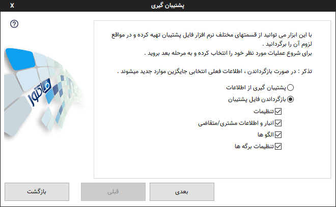

.. meta::
   :description: ساخت نسخه پشتیبان از فایل های اصلی برنامه و همچنین بازگرداندن آنها

.. _backup:

پشتیبان گیری
=================

.. note::
    * پشتیبانگیری از هر اطلاعات مهمی یک امر ضروریست و پیشنهاد هر متخصصی در این زمینه پشتیبانگیری روزانه و یا هفتگیست،
    * طبق یک اصل نانوشته تکنولوژی اگر شما پنج کپی از اطلاعات مهمتان نداشته باشد باید فرض کنید که آن اطلاعات را ندارید.
    * این موضوع مخصوصا برای سیستم هایی که از حافظه های سخت یا همان هارد دیسکها استفاده میکنند بسیار ضروری تر است.
    * مسئولیت عدم وجود پشتیبان از اطلاعات مهم بعهده کاربر است و در صورت بروز هر گونه اتفاق بدون اینکه از دستگاه ذخیره کننده استفاده زیادتری انجام دهید به یک مرکز بازیابی اطلاعات مراجعه نمایید.

برای پشتیبانگیری میتوانید از منوی اصلی برنامه در پنجره اصلی که در گوشه سمت چپ و بالا قرار دارد گزینه "پشتیبانگیری" را انتخاب نمایید.

با استفاده از این ابزار می توانید عملیات ساخت نسخه پشتیبان از فایل های اصلی برنامه و همچنین بازگرداندن آنها را انجام دهید.

این عملیات از طریق منوی اصلی در گوشه سمت چپ و بالای پنجره اصلی قابل دسترس می باشد.

|

**انتخاب نوع عملیات :** در صفحه نخست این پنجره شما می بایست نوع عملیات را انتخاب نمایید . اگر گزینه مورد نظر شما "پشتیبان گیری از اطلاعات" باشد ، از کل اطلاعات قابل پشتیبان گیری نسخه پشتیبان تهیه خواهد شد . ولی اگر "بازگرداندن فایل پشتیبان را انتخاب نمایید می توانید انتخاب کنید کدام قسمت بازگردانده شود.

پس از انتخاب گزینه مورد نظر "بعدی" را برای رفتن به مرحله بعد انتخاب نمایید.

|

**انتخاب فایل پشتبان :** در این مرحله فایلی را که میخواهید عملیات پشتیبان گیری روی آن انجام شود را انتخاب نمایید . پس از انتخاب "بعدی" را برگزینید تا عملیات پشتیبان گیری آغاز شود .

|

**پایان :** در صورت موفقیت آمیز بودن عملیات پشتیبان گیری پیامهای بالا نمایش داده می شود.

.. note:: ممکن است با اجرای فایل پشتیبان بصورت مستقیم و بدون اجرای نرم افزار و انتخاب آن از منوی اصلی با خطا مواجه شوید، در این حالت ابتدا نرم افزار را اجرا کنید و از منوی اصلی وارد قسمت پشتیبانگیری شوید و از آنجا فایل مورد نظر را انتخاب نمایید.