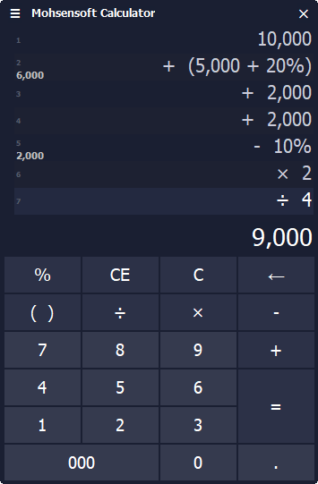

.. meta::
   :description: ماشین حساب برای محاسبات روزمره مالی بهینه شده است تا بتوانید بسرعت محاسبه مورد نظرتان را بدون کمترین خطا و اشتباه انجام دهید

.. _calculator:

ماشین حساب
====================

|

به منظور سهولت در محاسبات از این ابزار بسیار کاربردی میتوانید استفاده نمایید، این ماشین حساب برای محاسبات روزمره مالی بهینه شده است تا بتوانید بسرعت محاسبه مورد نظرتان را بدون کمترین خطا و اشتباه انجام دهید.

ویژگی ها و امکانات:
------------------------
* محاسبه درجا و سریع مقدار نهایی و نمایش آن در لحظه.
* امکان وارد کردن سه صفر با کلید میانبر کنترل یا فاصله.
* نمایش همه محاسبات بصورت لیست برای مشاهده و کنترل مقادیر وارد شده.
* شماره گذاری لیست نمایش جهت اطلاع از تعداد وارد شده.
* امکان وارد کردن پرانتز برای محاسبه یک مجموعه مستقل از محاسبات در یک سطر.
* محاسبه و نمایش درجای مقادیر پرانتر در کنار شماره آن سطر.
* امکان وارد کردن درصد در سطر و پرانتز.
* محاسبه درجای درصد و نمایش همزمان آن در کنار شماره هر سطر.
* امکان تغییر اندازه خودکار پنجره متناسب با تعداد مقادیر وارد شده برای مشاهده راحتتر همه آنها.
* امکان استفاده از ماشین حساب در هر مکان از نرم افزار فاکتور و برگشت نتیجه به همان فیلد در حال تایپ.

روش استفاده
-----------------
کار کردن با این ماشین حساب بسیار ساده و روان است و براحتی و بدون استفاده از موس میتوانید با صفحه کلید با آن کار نمایید، تنها کافیست کلیدهای میانبر هر گزینه در ماشین حساب را بدانید که به قرار زیر هستند:

* **عملگرهای ریاضی**: کلیدهای میانبر این عملگر ها همان کلیدهای معمول صفحه کلید هستند که شامل چهار عمل اصلی و همینطور کلید :code:`Enter` که برای :code:`=` استفاده میشود.
* **CE**: این کلید برای پاک کردن مقدار نوشته شده در خط جاری میباشد که با کلید میانبر :code:`Delete` قابل اجرا است.
* **C**: این کلید که برای پاک کردن کل محاسبات استفاده میشود با کلید میانبر :code:`Delete` + :code:`Shift` قابل فراخوانی میباشد.
* **000**: برای وارد کردن سه عدد صفر کافیست از کلید های :code:`Ctrl` و یا :code:`Space` یا همان فاصله استفاده نمایید.
* **(  )**: برای شروع یک عبارت پرانتر و یا پایان آن علاوه بر تایپ خود کاراکتر های پرانتز توسط صفحه کلید میتوانید از کلیدهای میانبر :code:`PageUp` یا :code:`PageDown` استفاده نمایید.
* **فراخوانی در نرم افزار فاکتور**: برای نمایش ماشین حساب در هر فیلدی از نرم افزار فاکتور کافیست از کلید میانبر :code:`F2` استفاده نمایید. سپس پس از انجام محاسبات و فشردن کلید :code:`Enter` نتیجه آن به فیلد در حال تایپ منتقل خواهد شد.