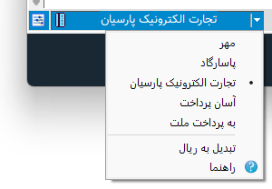
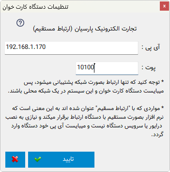

.. meta::
   :description: پرداخت مبالغ توسط دستگاه کارت خوان متصل به نرم افزار فاکتور

.. _cardpay:

پرداخت توسط دستگاه کارت خوان
===============================

| این امکان در نرم افزار وجود دارد که بتوانید توسط دستگاه کارت خوان متصل به نرم افزار مبلغ نهایی برگه را از مشتری دریافت نمایید.
| این کار مزیت های زیادی از جمله از بین رفتن اشتباه در وارد کردن مبلغ در کارت خوان، سرعت در پرداخت، سهولت در پرداخت و ... را بدنبال دارد.

| برای استفاده از این قابلیت بعد :ref:`نصب و شناسایی کارت خوان<install-cardpay>` گزینه های زیر در مقابل قسمت قیمت نهایی قابل دسترس خواهند بود :

| در این حالت دو گزینه قابل مشاهده است:
| گزینه اول از سمت چپ برای **تنظیمات کارت خوان** انتخاب شده می باشد که در ادامه به آن خواهیم پرداخت،
| گزینه دوم برای **انجام پرداخت**، دسترسی به منوی مربوطه توسط فلش کناری و نمایش وضعیت پرداخت استفاده می شود.
|
| در منو ای که پس از کلیک بر روی فلش کناری گزینه پرداخت نمایش داده می شود موارد زیر وجود دارند:
| **لیست دستگاههای کارت خوان متصل** شده به نرم افزار در ابتدای این منو قرار میگیرند و میتوانید با انتخاب هر کدام از آنها، آن کارت خوان را بعنوان پیشفرض پرداخت تعیین نمایید تا با کلیک بر روی گزینه پرداخت، پرداخت توسط آن دستگاه انجام گردد.
| **تبدیل به ریال :** با فعال کردن این گزینه مبلغ نهایی در 10 ضرب خواهد شد.
| **جستجوی دستگاه جدید :** اگر فایلهای شناسایی دستگاه جدیدی را در محل مربوطه اضافه کرده باشید توسط این گزینه دستگاه جدید شناسیی و به لیست افزوده می شود.
| **راهنما :** توسط این گزینه راهنمای مربوطه ( همین صفحه ) نمایش داده خواهد شد.

.. _cardpay-setting:

تنظیمات اتصال کارت خوان
---------------------------
در صورتی که یک کارت خوان انتخاب شده باشد، با کلیک بر روی گزینه تنظیمات کارت خوان پنجره زیر نمایش داده خواهد شد:

| در این پنجره نوع اتصال دستگاه کارت خوان و مشخصات اتصال را تعیین نمایید.
| در حالتی دستگاه بصورت پورت کام یا یو اس بی به سیستم متصل می شود پورتی در سیستم به آن اخصاص داده خواهد شد که میبایست نام پورت را در این قسمت انتخاب نمایید.
| در صورتی که قصد دارید دستگاه بصورت شبکه متصل گردد میبایست دو مشخصه آی پی و پورت اتصال را تنظیم نمایید.

.. note:: برای اتصال دستگاه و نصب آن از پشتیبانی دستگاه کارت خوان خود کمک بگیرید.
    البته راهنمای نصب بصورت کامل در فایل شناسایی و نصب دستگاه که در ادامه قابل دریافت میباشد وجود دارد و در صورت داشتن دانش کافی میتوانید این کار را خودتان انجام دهید.

.. note:: درحال حاضر تنها دستگاههای شرکت **مبنا کارت آریا( بانک صادرات)** پشتیبانی میشود. سایر دستگاهها در آپدیت بعدی افزوده خواهند شد.

.. _install-cardpay:

نصب دستگاه کارت خوان
-----------------------
| برای شناسایی و نصب دستگاه کارت خوان جدید میبایست از لیست زیر فایل شناسایی دستگاههای کارت خوان مختلف را دانلود کرده و در پوشه **Plugins\\PCPOS** در محل نصب نرم افزار فاکتور کپی نمایید.
| برای مثال پس از نصب دستگاه کارت خوان شرکت مبنا کارت فولدر، آدرس و محتوای نصب بصورت زیر خواهد بود:

.. image:: images/cardpay_install_folder.png
    :alt: محل نصب فایل مشخصات کارت خوان
    :align: center

.. note::
    | لطفا به آدرس محل نصب دقت نمایید، در صورت قراردادن در مسیر اشتباه دستگاه شناسایی نخواهد شد.
    | برای مشاهده صحت نصب فایل info موجود در فایل شناسایی دستگاه را در نظر بگیرید، این فایل میبایست در فولدری با نام شرکت صادر کننده کارت خوان، سپس در فولدر PCPOS و پس از آن در فولدر Plugins که در محل نصب نرم افزار فاکتور در کنار فایل اجرایی آن میباشد قرار دارد.

| سپس طبق راهنمای موجود در آن درایور مورد نیاز آن را نصب کنید و وارد نرم افزار شوید یا اگر نرم افزار در حال اجراست گزینه :ref:`جستجوی دستگاه جدید<cardpay>` را از منوی پرداخت کارت خوان انتخاب نمایید تا دستگاه جدید به نرم افزار افزوده گردد.

.. _cardpay-configs-file:

فایلهای شناسایی دستگاههای کارت خوان
---------------------------------------
1. مبنا کارت آریا ( بانک صادرات ) :
    | پس از نصب میتوانید از طریق فایل Readme.pdf درایورهای مورد نیاز را نصب نمایید.
    | 
    | |dl_mabnacard|

.. |dl_mabnacard| raw:: html

    <a href="http://dl.mohsensoft.com/plugins/pcpos/MabnaCard.zip" target="_blank">دانلود</a>

.. note:: درحال حاضر تنها دستگاههای شرکت **مبنا کارت آریا( بانک صادرات)** پشتیبانی میشود. سایر دستگاهها در آپدیت بعدی افزوده خواهند شد.