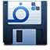
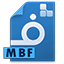

.. meta::
   :description: اصطلاحات استفاده شده در این راهنما

.. _definitions:

تعاریف
================

.. _def_page:

برگه
---------
به فایل طرح یک برگه یا فرم که تمام مشخصات ، فرمول های محاسبه ، فایلهای مورد نیاز و قابلیت های یک برگه را در خود جای داده است یک "برگ" نامیده میشود . برگ قابل افزودن می باشد و شما می توانید طبق نیاز خود برگ مناسب کار خود را از سایت نرم افزاری محسن دریافت نموده و یا آن را طبق نیاز خود سفارش دهید.

.. _def_page-install-pack:

بسته نصبی برگه ها
-------------------
|installpack| فایلی شامل برگ و تمام موارد مورد نیاز آن که توسط آن یک برگ بر روی نرم افزار نصب می شود . پسوند این فایل msfi می باشد و آیکون آن نیز به شکل مقابل است . برای نصب برگ تنها کافیست این فایل را اجرا نمایید و طبق پیامهایی که نمایش داده می شود عمل نمایید .

|backup|

.. _def_backup-file:

فایل پشتیبان
---------------
شما توسط نرم افزار می توانید یک فایل پشتیبان از تنظیمات و انبار تهیه نمایید . از این فایل پشتیبان می توانید در مواقعی مثل تعویض ویندوز و یا کپی کردن تنظیمات و انبار به سیستم های دیگر کمک گرفت . پسوند این فایل msfb می باشد و آیکون آن نیز به شکل مقابل است .

|doc|

.. _def_document-file:

فایل سند
--------------------
فایلی است که اطلاعات وارد شده به همراه مشخصات مشتری و نوع برگ در آن ذخیره می شود. این فایل قابل ویرایش و بازگشایی مجدد می باشد و می توانید در هر سیستم دیگری که برگ مربوطه روی آن نصب می باشد باز نمایید . آیکون آن به شکل مقابل می باشد.

.. _def_bank-window:

انبار
------------
در این نرم افزار بخشی برای مدیریت موجودی کالاها و خدمات شما وجود دارد که در آن می توانید کارهای زیر را انجام دهید :

        * افزودن و حذف کالا یا خدمات از انبار
        * جستجوی سریع در انبار بر اساس کد و نام
        * انتخاب کالا یا خدمات برای افزودن به فاکتور
       	* امکان افزودن گزینشی به فاکتور

.. _def_output-page:

برگه خروجی
--------------------
شما میتوانید برگ دیگری غیر از برگ کنونی برای چاپ انتخاب نمایید. برای اطلاعات بیشتر به :ref:`نوار تنظیمات<bar-settings>` مراجعه نمایید.

.. _def_page-id:

شناسه برگ
---------------------
کدی است یکتا برای تمایز هر برگ ، این کد مستقل از نام و سازنده برگ می باشد . شما میتوانید از این کد برای مواردی مثل جستجو بدنبال برگی خاص استفاده نمایید .

.. _def_template-file:

فایل الگو
---------------------
فایلی است که یک الگو در آن ذخیره شده است . برای مثال می توانید مقادیر و تنظیمات مورد نظر خود در یک برگه را در یک فایل ذخیره نمایید و آن را برای دیگری ارسال کنید و آن شخص بتواند از آن بعنوان یک برگ با تنظیمات خاص استفاده نماید . پسوند این فایل msft می باشد و آیکون آن نیز به شکل مقابل است . برای نصب الگو تنها کافیست این فایل را اجرا نمایید و طبق پیامهایی که نمایش داده می شود عمل نمایید.

