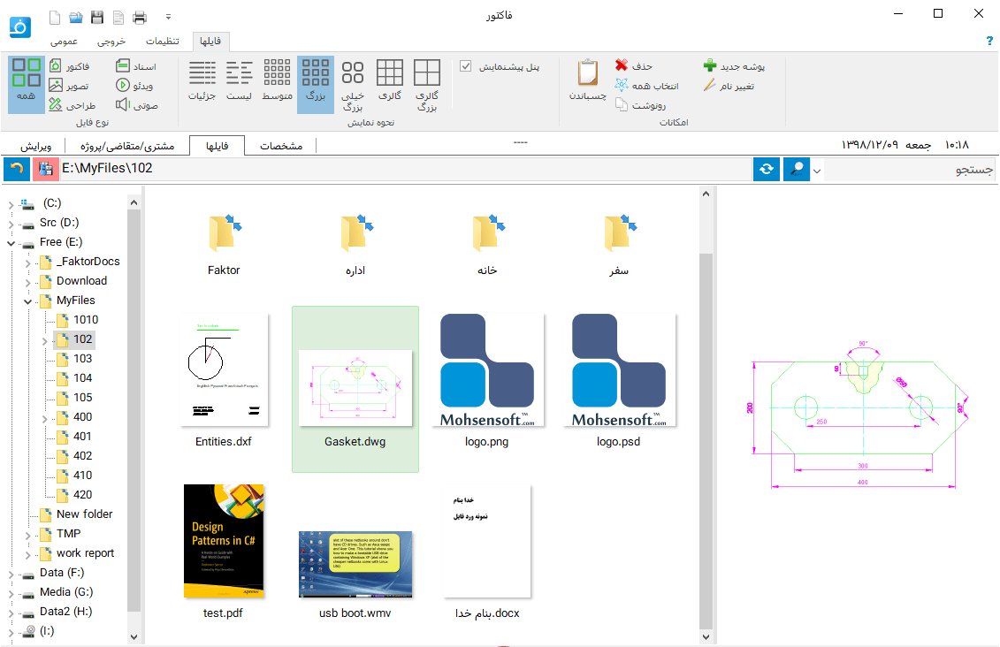

.. meta::
    :description: مدیریت بر لیست مشتری متغاضی ها در نرم افزار فاکتور

.. _file-manager:

مدیریت فایل
=========================

| در این قسمت امکانات متعدد و پیشفرته ای برای مدیریت، نمایش و جستجوی فایل در نظر گرفته شده است.
| براحتی و بدون نیاز به نصب نرم افزار های خاص یک فایل، ده ها نوع فایل مختلف را میتوانید مشاهده کنید و بدون باز کردن فایلها بصورت دسته جمعی و یکجا محتوای آنها نمایش داده می شود.
| بدون اینکه نگران گم شدن، زیاد شدن، شلوغ شدن و بهم ریختگی فایلهای یک مشتری یا پروژه باشید تنها میتوانید روی انجام کارتان تمرکز کنید و هر فایل را در محل مخصوص به همان مشتری یا پروژه ذخیره و مدیریت نمایید.
| در نحوه نمایش فایلها علاوه بر حالتهای معمول لیستی و جزئیات دو حالت گالری نیز برای نمایش بزرگتر محتوا و استفاده حداکثری از فضای نمایش وجود دارد.
| همچنین امکانات پیشرفته ای برای جتجوی یک فولدر در نظر گرفته شده است که حتما از آن شگفت زده خواهید شد.
| علاوه بر موارد بالا امکاناتی نظیر فیلتر بر اساس نوع های اصلی فایل، انیمیشن هنگام جستجو، نمایش تاریخ های مشخصات فایل مانند تاریخ آخرین ویرایش بصورت شمسی و دیدن پیشنمایش بزرگتر از فایل انتخابی نیز وجود دارد.

.. _file-manager-file-preview:

نمایش محتوای فایل
---------------------
در برنامه امکان نمایش فرمتهای مختلف زیر  بصورت مستقل وجود دارد، به مرور فرمت های بیشتری اضافه خواهد شد :

* **تصویر :** شامل انواع فرمت های نمایش و ویرایش عکس

    .. code-block:: bat

        psd, png, bmp, gif, jpg, jpeg, jpe, tif, tiff, psb 
        ico, cur, fax, g3n, g3f, xif, jif, pcx, bmp, dib, rle
        dicom, v2, wmf, emf, tga, targa, vda, icb, vst, pix, dcm
        pxm, ppm, pgm, pbm, wbmp, jp2, j2k, jpc, j2c, dcx, dic
        crw, cr2, dng, nef, raw, raf, x3f, orf, srf, mrw, dcr
        bay, pef, sr2, arw, kdc, mef, 3fr, k25, erf, cam, cs1
        dc2, dcs, fff, mdc, mos, nrw, ptx, pxn, rdc, rw2, rwl
        iiq, srw, iev, all, ien, imageen, lyr, wdp
        hdp, jxr, dds, heic, heif, heics, avcs, heifs

* **طراحی :** شامل انواع فرمت های طراحی دو بعدی و سه بعدی

    .. code-block:: bat

        dwg, dxf, dwt, svg, svgz, stl, dwfx, dwf, w2d, cgm, rtl, spl, prn, gl2, gl
        hpgl2, hpgl, hp3, hp2, hp1, hpp, hp, plo, hpg, hg, hgl, plt, pcl, gp2 

* **ویدئو :** شامل انواع فرمت های ویدئویی مانند

    .. code-block:: bat

        wmv, mpg, mpeg, avi

* **اسناد :** شامل اسناد رایج پر استفاده

    .. code-block:: bat

        pdf, docx, doc

| از کاربرد های این امکان میتوان به مدیریت فایلهای مشتریان یک عکاسی و یا یک طراح نام برد.

.. _file-manager-manage:

مدیریت فایل
---------------
علاوه بر امکان استفاده معمول و روزمره از قسمت "فایل" وقتی مشتری/متقاضی/پروژه ای انتخاب میکنید اگر به آن مشتری کد اختصاص داده باشید نرم افزار پوشه ای در محل پوشه اصلی فایلهای مشتری/متقاضی/پروژه ها (که در :ref:`پنجره تنظیمات<setting-save>` آن را مشخص میکنید) ایجاد مینماید و پس آن  محل را نمایش میدهد بدون آنکه نیاز باشد شما به محل پوشه مشتری/متقاضی/پروژه بروید.

| به گزینه قرمز رنگ موجود در سمت چپ نوار بالایی فایلها در تصویر بالا دقت کنید، در هر زمان اگر در پوشه مربوط به مشتری/متقاضی/پروژه ی انتخاب شده باشید به رنگ سبز و در غیر اینصورت قرمز خواهد شد.
| با کلیک بر روی این گزینه (و یا همانطور که گفته شد انتخاب یک مشتری/متقاضی/پروژه) به پوشه مربوط به آن مشتری/متقاضی/پروژه خواهید رفت.

| در پوشه هر مشتری/متقاضی/پروژه یک پوشه با نام "Faktor" توسط نرم افزار ایجاد میشود، کاربرد این پوشه ذخیره تمام فاکتور های مربوط یه مشتری/متقاضی/پروژه انتخاب شده در آن است،
| در صورتی که از گزینه "ذخیره در پوشه کاربر..." در منوی اصلی برنامه برای ذخیره کردن استفاده کنید این پوشه بصورت پیشفرض نمایش داده خواهد شد.

.. _file-manager-search:

جستجو
---------------

جستجو در میان فایلهای پوشه نمایش داده شده علاوه بر حالت معمول جستجو یعنی نوشتن قسمتی یا کل نام مورد جستجو امکانات زیر نیز در آن وجود دارد که میتوانید بسیار راحت و پیشرفته بدنبال فایل مورد نظرتان بگردید:

| با وارد کردن کاراکتر های زیر دستورات مختلفی را به جستجوگر میدهید:

* **\* :** با قرار دادن ستاره در قسمتی از متن جستجو به جستجوگر میگویید که جای این ستاره کاراکترهایی وجود دارد و یا ممکن است کاراکتری وجود نداشته باشد.
    
    | برای مثال با جستجوی "پ*ر" موارد "پر" و "پنیر" در صورت وجود نمایش داده میشوند.

* **\# :** این کاراکتر مانند ستاره میباشد با این تفاوت که میبایست حداقل یک حرف بجای آن وجود داشته باشد.

    | برای مثال با جستجوی "پ#ر" موارد "پدر" و "پنیر" در صورت وجود نمایش داده میشوندولی "پر" نمایش داده نخواهد شد.

* **\? :** این کاراکتر به جستجوگر میگوید که بجای آن فقط میتواند یک حرف وجود داشته باشد و نه کمتر و نه بیشتر.

    | برای مثال با جستجوی "پ?ر" موارد "پدر" و "پسر" در صورت وجود نمایش داده میشوند و مواردی مانند "پر" یا "پودر" نمایش داده نخواهند شد.

| همچنین امکان استفاده ترکیبی یا تکراری نیز در یک جستجو وجود دارد.