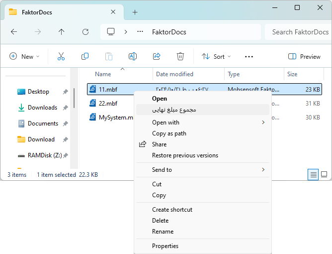
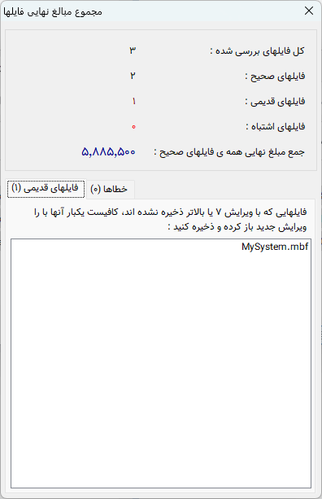

.. meta::
   :description: پردازش و محاسبه فایل های ذخیره شده با نرم افزار فاکتور

.. _fileproc:

|newflag| پردازش فایل
============================
از ویرایش 7 امکانی به نرم افزار فاکتور اضافه شده است که میتوانید بدون باز کردن فایل ها قیمت نهایی یا مجموع قیمت نهایی فایل یا فایلها را مشاهده نمایید.

این کار از چند طریق قابل انجام میباشد:

.. _fileproc_explorer:

1. اکسپلورر ویندوز
-----------------------
در این روش کافیست فایل یا فایلهایی که قصد مشاهده مجموع قیمت نهایی آنها را دارید انتخاب کرده و روی آنها راست کلیک نمایید و گزینه "مجموع مبلغ نهایی" را انتخاب نمایید :

پس از انتخاب این گزینه پنجره زیر نمایش داده میشود که در آن اطلاعات فایل(ها) نمایش داده شده است:

در این پنجره دقت داشته باشید که فایلهایی که با ویرایش 7 نرم افزار فاکتور یا بالاتر ذخیره شده باشند امکان خواندن مبلغ نهایی از آنها وجود دارد، پس نرم افزار به شما لیست فایلهایی که این شرایط را ندارند نمایش میدهد تا بتوانید آنها را یکبار با ویرایش جدید بازکنید تا این مشکل برطرف گردد.

همچنین در بخش دیگر این پنجره فایلهایی که امکان خواندن آنها بر اثر مشکلات مختلف وجود نداشته است لیست شده اند.

.. _fileproc_embed:

2. قسمت مدیریت فایل نرم افزار
--------------------------------------
با رفتن به قسمت :ref:`مدیریت فایل<file-manager>` نرم افزار فاکتور امکانات بیشتری در این رابطه در اختیار شما قرار میگیرد :

.. image:: images/tab_file_fileproc.png
    :alt:  پنجره پردازش فایل
    :align: center

|

در این قسمت با رفتن به هر پوشه اگر در آن پوشه فایل ذخیره شده فاکتور وجود داشته باشد بدون اینکه نیاز به انتخاب فایلی باشد نتیجه پردازش همه فایلهای آن پوشه در قسمت سمت راست نمایش داده میشود.

اگر فایل یا فایلهایی را انتخاب نمایید بجای حالت قبل نتیجه پردازش فایل های انتخاب شده نمایش داده خواهد شد.