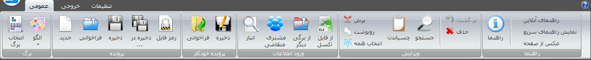
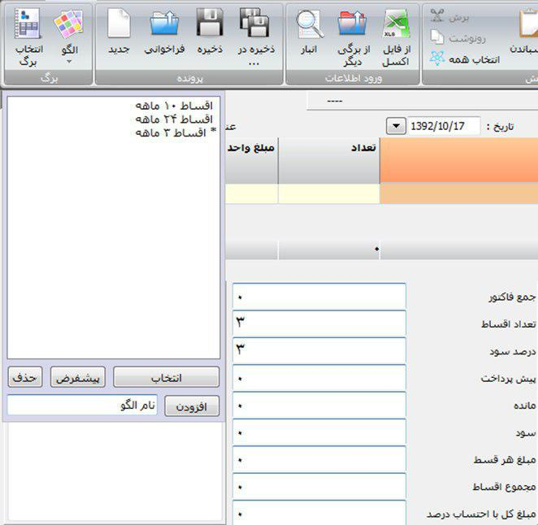
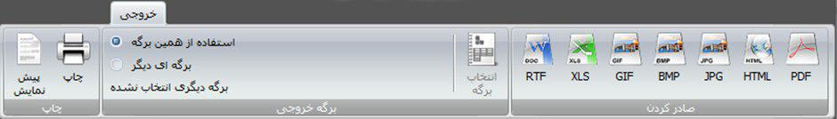
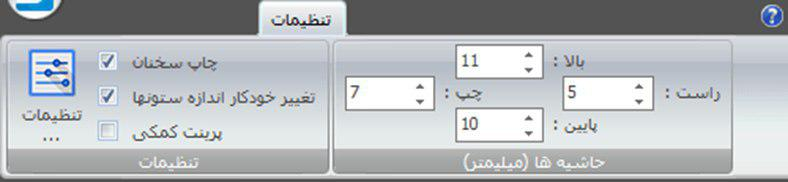
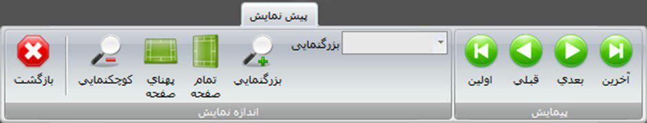
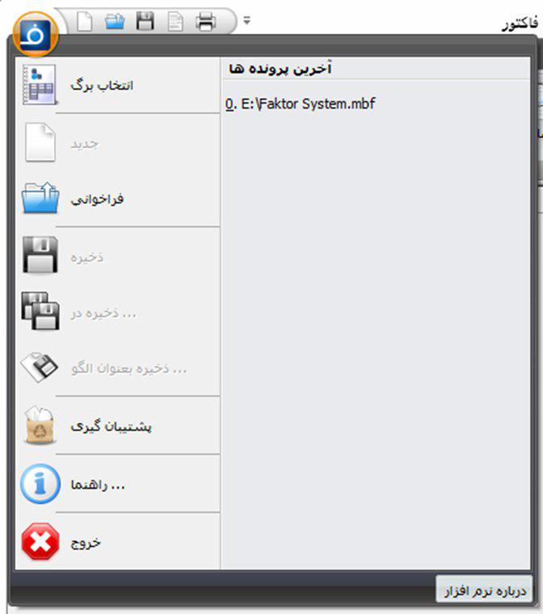

پنجره اصلی
=================
این پنجره ، پنجره اصلی برنامه می باشد که در آن می توانید به مدیریت فاکتور ، تنظیمات ، داده ها ، خروجی و ... بپردازید.

.. image:: images/main.png

بخشهای مختلف این پنجره به شرح زیر هستند :
نوار دسترسی سریع : این نوار در بالاترین قسمت سمت چپ پنجره وجود دارد شما می توانید دستورات پر کاربرد خود را در این ناحیه سازماندهی کنید . برای افزودن و کاستن به این نوار کافیست روی هر دستور دلخواه راست کلید کنید و از گزینه افزودن و کاستن از این نوار استفاده نمایید .
نوار ریبون : در این نوار دسته بندیی از دستورات و کاربردهای برنامه وجود دارد که تحت گروههایی سازماندهی شده است . در بخش بعد به شرح جزئیات هر دستور پرداخته خواهد شد .
نوار اطلاعات عمومی : در این نوار اطلاعاتی نظیر عنوان ، تاریخ و شماره قابل تنظیم می باشند . لازم به ذکر است که تاریخ را میتوانید به دو صورت جلالی ( شمسی ) و میلادی که از تنظیمات قابل انتخاب هستند داشته باشید .
نوار مشخصات جزئی مشتری/متقاضی: در این نوار برای جلوگیری از اشتباه در صدور فاکتور مشخصات کوچکی از مشتری/متقاضی انتخاب شده نمایش داده می شود، نمایش این نوار را میتوانید از پنجره تنظیمات و قسمت "ظاهر و نمایش" تنظیم کنید.
جدول : در این بخش جدول هر برگ برای ورود و ویرایش داده های برگه نمایش داده می شود .
نوار اطلاعات تکمیلی : در این نوار شما می توانید مواردی مثل توضیحات ، گزینه های نقدی یا غیر نقدی و مقادیر محاسباتی یا توضیحی پایان هر برگه بسته به برگی که انتخاب شده است نمایش داده می شود .
در ادامه به شرح جزئیات هر دستور در نوار ریبون می پردازیم:

عمومی
-------

دستورات این نوار به شرح زیراند:

**برگ :** برای انتخاب برگ از این گزینه استفاده نمایید . اگر برگه ای بصورت برگ پیش فرض انتخاب شده باشد با باز کردن برنامه آن برگ بصورت خود کار انتخاب می شود ، همچنین اگر نیاز به برگ دیگر دارید از این گزینه استفاده نمایید . 

**الگو :** از این گزینه برای مدیریت الگو برگ ها استفاده نمایید . الگو ، اطلاعاتی است از یک برگ که میتوانید آنها را ذخیره نمایید و در موقع لزوم بعنوان برگ فاکتور پیش فرض و یا برگ جدید انتخاب نمایید . برای توضیحات بیشتر قسمت `الگو`_ را مطالعه نمایید .

**جدید :** اگر برگی انتخاب کرده باشید می توانید با استفاده از این گزینه تغییرات قبلی خود را پاک کرده و برگی تازه برای نوشتن آغاز کنید.

**فراخوانی :** از این گزینه برای بازگشایی فایل سندی که قبلا ذخیره کرده اید استفاده نمایید . توجه داشته باشید که این گزینه ابتدا برگی که آن سند با آن ذخیره شده است را انتخاب کرده و در آن برگ ، سند را بازگشایی می کند .

**ذخیره :** توسط این گزینه تغییرات فایل سند حاضر ذخیره می شود و اگر تا کنون نام و آدرسی برای سند در نظر گرفته نشده است از کاربر این اطلاعات را درخواست می نماید .

**ذخیره در ... :** از این گزینه برای ذخیره سند موجود در فایلی جدید استفاده نمایید .

**رمز فایل :** برای تنظیم، تغییر و برداشتن رمز فایل باز شده از این گزینه استفاده کنید، برای اطلاعات بیشتر به قسمت رمزفایل_ مراجعه نمایید.

**پرونده خودکار:** این دو گزینه شبیه دو گزینه قبلی هستند با این تفاوت که با انتخاب گزینه "ذخیره" ، فایل کنونی در فولدری با نام شناسه برگه که خود در `فولدر پیش فرضی که در قسمت تنظیمات`__ مشخص کرده اید با نام پیشفرض انتخاب شده توسط برگه ذخیره می شود . اگر در انجام این مراحل مشکلی پیش نیاید هیچ پیامی نمایش داده نمی شود ولی اگر خطا و یا سوالی مطرح شود آنها به نمایش در خواهند آمد . گزینه "فراخوانی" پنجره فراخوانی فایل را با آدرس پیشفرض قبلی باز می کند . مزیت این امر در این است که ذخیره سازی و فراخوانی سریعتر انجام میشود و همچنین همه فایل های مربوط به یک برگه در یک فولدر مشخص ذخیره می شوند.

__ setting-window.html#id3

**انبار:** نمایش پنجره انبار جهت ویرایش و افزودن کالا یا خدمات به فاکتور .

**مشتری/متقاضی:** نمایش پنجره مشتری/متقاضی جهت ویرایش و افزودن.

**فراخوانی از برگی دیگر:** این گزینه شبیه به گزینه "فراخوانی" می باشد با این تفاوت که موقع بازگشایی سند برگ مربوط به سند را انتخاب نکرده و اطلاعات درون سند را در صورت امکان و تشابه به برگ کنونی می افزاید . به عبارت دیگر فایل سند مربوط به برگی دیگر را به برگ کنونی وارد ( import ) میکند .

**از فایل اکسل:** نمایش پنجره ورود اطلاعات از فایل اکسل به جدول فاکتور باز شده .

**ویرایش :** این گزینه ها موارد معمولی و عمومی کار با حافظه موقت است که می توانید متن انتخاب شده خود را کپی و یا کات کنید و همچنین آن را در محل مورد نظرتان انتقال دهید .

الگو
-------

اگر در یک برگ همیشه مقدار یا مقادیر خاصی را نیاز دارید که بصورت پیش فرض یا با انتخاب شما برای آن برگ اعمال شوند این گزینه ابزار بسیار مناسبی برای این کار می باشد .

برای مثال فرض کنید مانند تصویر بالا برگ فاکتوری دارید که در آن یکسری گزینه همیشه در موارد مربوط به خودشان یکسان هستند ، برای این مثال گزینه تعداد اقساط و درصد سود این شرایط را دارند ، شما میتوانید با درج این مقادیر در یک برگ خالی و ذخیره آن بعنوان الگو هر بار که نیاز به داشتن آن الگو خواص را دارید از این گزینه استفاده و آن را باز گردانی کرده و در آن شروع به ورود اطلاعات دیگر کنید و یک برگ جدید منتها با مقادیری پیش فرض داشته باشید .

**افزودن:** برای افزودن حالت کنونی فاکتور بعنوان الگو جدید استفاده می شود . برای این منظور کافیست نام الگو جدید را در کادر روبروی آن وارد کنید و سپس این گزینه را انتخاب نمایید.

**انتخاب:** برای فراخوانی الگو ای که از لیست انتخاب نموده اید می باشد .معادل اینکار دوبار کلیک کردن بر روی گزینه مورد نظر در لیست می باشد .

خروجی
------

در این نوار ابزارهای مختلفی برای چاپ و تبدیل خروجی وجود دارد که به شرح زیراند :
پیش نمایش : برای نمایش نحوه چاپ خروجی قبل از گرفتن آن بکار می رود .
چاپ : ارسال دستور چاپ به پرینتر و چاپ خروجی . بعد از انتخاب این گزینه پنجره ای برای انتخاب چاپگر و تعدادی تنظیمات چاپ نمایش داده می شود .
گروه "برگه خروجی" : شما می توانید برگه خروجیی غیر از برگه ی جاری انتخاب نمایید . برای اینکار ابتدا "برگه ای دیگر" را انتخاب کرده و "انتخاب برگه" را برگزینید ، پنجره عمومی انتخاب برگ ظاهر خواهد شد که می توانید برگی دیگر را برای خروجی گرفتن از فاکتور کنونی انتخاب نمایید . بعد از انتخاب برگ جدید نام آن در زیر گزینه "برگه ای دیگر" حک می شود که نشان از صحت انتخاب شما دارد . در این حالت اگر شما یکی از دستورات خروجی نظیر پیش نمایش ، چاپ و یا گزینه های صادر کردن را انتخاب نمایید برگه خروجی درون برگی که انتخاب کرده اید در صورت امکان و تشابه نمایش داده می شود .
صادر کردن : در این گروه دستوراتی برای تبدیل خروجی برگه به فایل های پر کاربرد دیگر وجود دارد . این فرمت ها عبارتند از:

* **RTF:** فرمت مربوط به متن دارای فرمت می باشد که میتوانید خروجی را در نرم افزار هایی مثل ویرایشگر های متن باز نمایید و ویرایش کنید
* **XLS:** فرمت مربوط به صفحه گسترده نظیر نرم افزار اکسل می باشد.
* **GIF, BMP و JPG:** فرمت های تصویری.
* **HTML:** فرمت مربوط به صفحات وب.
* **PDF:** فرمت سند فشرده و قابل حمل.

تنظیمات
----------

در این نوار تنظیمات برنامه قابل دسترسی هستند:

**تنظیمات :** برای نمایش `پنجره تنظیمات`_ پنجره تنظیمات از این گزینه استفاده نمایید . همچنین سه گزینه پرکار برد از این پنجره در این گروه قابل دسترس می باشند.

**حاشیه ها :** در این گروه می توانید فاصله برگه خروجی را از حاشیه های لبه کاغذ تغییر دهید.

پیش نمایش
------------

| **بازگشت :** وقتی به حالت پیش نمایش میروید میتوانید توسط این گزینه به حالت اولیه باز گردید.
| **کوچکنمایی :** برای کوچکتر کردن برگه پیش نمایش استفاده می شود .
| **پهنای صفحه :** اندازه برگه پیش نمایش را طوری تنظیم میکند که پهنای برگه تماما قابل روئت باشد .
| **تمام صفحه :** اندازه برگه پیش نمایش را طوری تنظیم می کند که ارتفاع برگه کاملا قابل روئت باشد .
| **بزرگنمایی :** بزرگتر کردن برگه پیش نمایش .
| **پیمایش :** جابجایی بین صفحات پیش نمایش .

مشخصات مشتری/متقاضی
--------------------
.. image:: images/com.png

| از این صفحه برای ثبت مشخصات مشتری یا متقاضی در برگه هایی که به این موارد نیاز دارند استفاده نمایید. این مشخصات در فایل سند برگه ذخیره می شود.
| **انتخاب مشتری/متقاضی :** برای این کار کافیست "انتخاب" را کلیلک کرده (یا کلید میانبر F8) و در پنجره باز شده مشتری/متقاصی مورد نظر را انتخاب کنید. برای اطلاعات بیشتر در مورد کار با این پنجره به قسمت `پنجره مشتری/متقاضی`_ مراجعه نمایید.
| **انتخاب سریع :** برای یک انتخاب سریع میتوانید قسمتی یا کل یکی از اطلاعات ( کد، نام یا شماره تلفن) مشتری/متقاضی را در کادر "شماره/کد اشتراک" وارد کرده و کلید Enter رابفشارید. در این زمان اگر اطلاعات وارد شده جهت جستجو منجر به انتخاب شدن یک مشتری/متقاضی شود اطلاعات آن مشتری انتخاب شده، کادر جستجو به رنگ سبز در میآید و اطلاعات جایگذاری می شود ولی اگر تعداد مشتری/متقاضی انتخاب شده بیشتر از یک عدد بود پنجره انتخاب مشتری باز شده و میتوانید توسط کلید های جهتنمای بالا/پایین مشتری/متقاضی مورد نظر را انتخاب کنید. اگر جستجو نتیجه ای بدنبال نداشت کادر جستجو به رنگ قرمز درآمده و صدای کوچکی پخش می شود.

مشخصات صادرکننده
------------------
.. image:: images/com.png

در این صفحه می توانید مشخصات صادر کننده برگه را وارد نمایید . این اطلاعات ، اطلاعاتی هستند که معمولا در سربرگ برگه ها نمایش داده می شود .
برای ذخیره این اطلاعات کافیست بین یک فیلد جابجا شود.
تغییر لوگو : برای تغییر لوگو کافیست بر روی شکل ذره بین در گوشه فیلد روبروی لوگو کلیک کرده و مانند بیشتر برنامه های معمول یک فایل تصویری برای آن انتخاب کنید . در انتخاب لوگو به موارد زیر توجه نمایید ، همچینین اگر با مشکلی در انتخاب لوگو مواجه شدید موارد زیر را تک تک چک نمایید و آنها را بطور کامل اجرا نمایید:

* تا حد امکان اندازه تصویر انتخابی متناسب با اندازه محل قرار گیری در فاکتور باشد.
* تا حد امکان اندازه تصویر انتخابی نزدیک به اندازه محل قرار گیری در فاکتور باشد.
* حتی الامکان نام فارسی در نام و آدرس فایل انتخابی نباشد.
* پیشنهاد میشود به ترتیب اولویت از فرمت های png ، bmp و jpg استفاده نمایید.
* فایلی را که انتخاب می نمایید باید ثابت باشد زیرا این فایل در موقع نمایش برگه فراخوانی می شود و باید در این موقع در محل انتخابی باشد.

منوی شروع
---------------

با انتخاب دایره سمت بالا و چپ این منو باز می شود . در سمت چپ این منو لیستی از پر کاربرد ترین دستورات وجود دارد . در سمت راست لیست آخرین سند های باز شده وجود دارد که می توانید با استفاده از آن خیل سریع به آخرین اسناد باز شده دسترسی داشته باشید.
در ادامه دو موردی که قبلا توضیح داده نشده است شرح داده می شوند:

| **پشتیبان گیری :** برای نمایش پنجره عملیات پشتیبان گیری.
| **راهنما :** نمایش فایل راهنمای برنامه .
| **ذخیره بعنوان الگو :** از این گزینه برای ذخیره برگ جاری بعنوان یک الگو استفاده نمایید . برای اطلاعات بیشتر به قسمت `الگو`_ مراجعه نمایید .

.. _پنجره تنظیمات: https://mohsensoft.com/docs/faktor/setting-window.html
.. _پنجره مشتری/متقاضی : https://mohsensoft.com/docs/faktor/customer-window.html

.. _رمزفایل: https://mohsensoft.com/docs/faktor/password-protect-file.html

