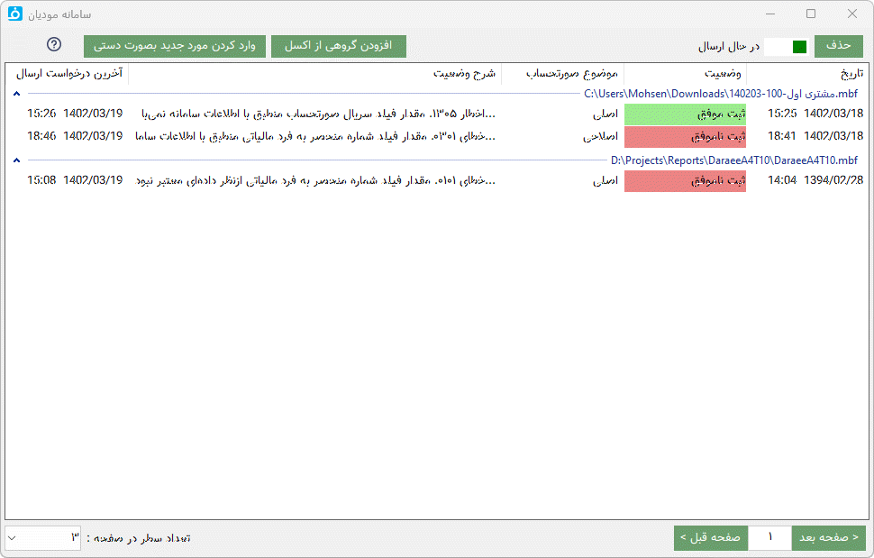

.. meta::
   :description: ارتباط به سامانه مودیان مالیاتی کشور با نرم افزار فاکتور

.. _mtax:

ارتباط با سامانه مودیان
===========================

سامانه‌ی مؤدیان مالیاتی سازمان مالیاتی کشور سامانه‌ای است تا مؤدیان مالیاتی بتوانند پایانه‌های فروشگاهی خود را به این سامانه متصل کنند، در این سامانه برای هر مودی یک کارپوشه در نظر گرفته شده است که می توانند عملیات ارسال صورت‌حساب الکترونیکی خود را انجام دهند.

نرم افزاری محسن برای انجام این عملیات توسط کابران این امکان را به نرم افزار فاکتور افزوده است که میتوانید به راحتترین، ارزانترین و ساده ترین روش صورت حسابهای خود را به سامانه مودیان ارسال نمایید.

با مطالعه این قسمت براحتی میتوانید این ارتباط را برای نرم افزار تنظیم نمایید:

.. _setting:

تنظیم سامانه مودیان و نرم افزار فاکتور
--------------------------------------------

1. ابتدا وارد لینک زیر شوید و دو فایل کلید عمومی (public_key) و کلید خصوص (private_key) را دریافت نمایید و در یک محل امن و مطمئن ذخیره نمایید :
    
    |gen_csr|

2. سپس به لینک زیر (کارپوشه -> عضویت -> شناسه های یکتای حافظه مالیاتی) رفته و روی گزینه "دریافت شناسه یکتا حافظه مالیاتی" کلیک کنید و با انتخاب "توسط مودی" در مرحله اول و انتخاب فایل کلید عمومی  که در مرحله قبل گرفتید برای مرحله دوم و تیک دار کردن کد پستی در مرحله سوم و انتخاب گزینه "اتمام"  به شما یک شناسه حدود شش کاراکتری میدهد.

    |membership_normalUniqueID|

3. این شناسه را در قسمت مشخصات صادر کننده در نرم افزار فاکتور در فیلد "شناسه یکتای مالیاتی" کپی کنید و کلید خصوصی مرحله اول را نیز در فیلد بعدی نرم افزار تنظیم نمایید.

راهنمای ویدئویی این مراحل را میتوانید در زیر ببینید:

.. raw:: html

    

|

.. |gen_csr| raw:: html

    <a href="https://mtax.mohsensoft.com/CreateCSR" target="_blank">https://mtax.mohsensoft.com/CreateCSR</a>

.. |membership_normalUniqueID| raw:: html

    <a href="https://tp.tax.gov.ir/membership/normalUniqueID" target="_blank">https://tp.tax.gov.ir/membership/normalUniqueID</a>

|

.. note::
    * قبل از اقدام به ارسال صورتحساب بهتر است قوانین و راهنمای ارسال به سامانه مودیان مالیاتی را از لینک های زیر دانلود و مطالعه نمایید،
    * در نرم افزار سعی شده است تا حد امکان خطاها و تذکرات لازم برای اطلاعات وارد شده قبل از ارسال آن داده شود ولی بهتر است همه این موارد را مطالعه و بررسی نمایید:
    * 
    * |intamedia_docs|

.. |intamedia_docs| raw:: html

    <a href="https://www.intamedia.ir/The-regulation-of-store-terminals" target="_blank">https://www.intamedia.ir/The-regulation-of-store-terminals</a>

.. _send:

ارسال به سامانه مودیان
----------------------------
| برای ارسال صورتحساب به سامانه مودیان مالیاتی از سه طریق میتوانید این کار را انجام دهید:

* **ارسال از فاکتور :** با باز کردن یک فاکتور و ارسال آن توسط گزینه "ارسال فاکتور" در نوار عمومی پنجره اصلی.
* **ارسال دستی :** با انتخاب گزینه"وضعیت" در نوار عمومی از بخش سامانه مودیان و سپس انتخاب گزینه "وارد کردن مورد جدید بصورت دستی" برای وارد کردن اطلاعات بدون فاکتور ذخیره شده است، در این حالت میتواید اقلام صورتحساب را از طریق فایل اکسل نیز وارد نمایید.
* **ارسال گروهی** انتخاب گزینه"وضعیت" در نوار عمومی از بخش سامانه مودیان و سپس انتخاب گزینه "افزودن گروهی از اکسل" برای وارد کردن لیستی از صورتحسابها بصورت و گروهی و ارسال همه آنها میباشد.

|

.. _send_from_invoice:

ارسال از فاکتور
-------------------

پس از باز کردن یک فاکتور و انتخاب گزینه "ارسال فاکتور" در نوار عمومی از پنجره اصلی نرم افزار بصورت خودکار شروع به تطبیق ستونهای فاکتور با ستونهای صورتحساب مورد نیاز سامانه میکند، اگر در این کار ستونی شناسایی نشد پنجره زیر باز خواهد شد:

.. image:: images/mtax_map.png
    :alt:  ارتباط به سامانه مودیان
    :align: center

در این پنجره میبایست ستون های مورد نیاز سامانه را نسبت به ستونهای جدول فاکتور مشخص نمایید تا اقلام آن به پنجره ارسال سامانه منتقل شود.

تنظیمی که در این پنجره انجام میدهید برای برگه ذخیره خواهد شد و در دفعالت بعدی نیازی به تنظیم آن نیست و این پنجره نمایش داده نخواهد شد.

در صورتی که این پنجره نمایش داده نشد و یا قصد تغییر در آن را دارید میتوانید از منوی اصلی پنجره بعدی این پنجره را مجدد باز نمایید.

.. image:: images/mtax_send.png
    :alt:  ورود اطلاعات سامانه مودیان
    :align: center

در این پنجره همه اطلاعاتی که برای ارسال به سامانه مودیان نیاز دارید را میبایست وارد کنید، اگر نرم افزار خطا، هشدار یا توضیحی برای اطلاعات وارد شده تان تشخیص دهید آن را در کادر پایین همین پنجره نمایش می دهد،
شما با کلیک بر روی هر پیام به فیلدی که این پیام مربوط به آن است منتقل میشوید، همچنین در زیر کادر هر فیلد در صورت وجود خطا، هشدار یا اطلاعات نواری به همان رنگ نمایش داده میشود.

پس از وارد کردن همه اطلاعات و صحیح بودن آن گزینه "ارسال" فعال خواهد شد، با انتخاب این گزینه اگر لایسنس مربوط به کد اقتصادی فروشنده وارد شده نصب شده باشد اطلاعات برای ارسال به پنجره بعد منتقل میشود تا در صف ارسال قرار گیرد:

.. note::
    * برای تهیه لایسنس از لینک زیر استفاده نمایید:
    * |taxmoadi|

.. |taxmoadi| raw:: html

    <a href="https://mohsensoft.com/product/taxmoadi" target="_blank">https://mohsensoft.com/product/taxmoadi</a>

در این پنجره همه ارسال ها به سامانه مودیان با در نظر گرفتن فایل فاکتور دسته بندی شده اند، این دسته بندی به این منظور است که تمام ارسال های مربوط به هر فایل در یک گروه قرار گیرند، برای مثال همه ارسال های فروش، ابطالی، اصلاحی و برگشت از فروش هر فایل در یک گروه قرار میگیرند تا مدیریت بهتری بر آن داشته باشید.

.. _send_manual:

ارسال دستی
---------------
اگر برای ارسال نیاز به ثبت فاکتور در سیستم ندارید میتوانید از این روش استفاده نمایید، تفاوت این روش با روش قبلی این است که مشخصات خریدار و اقلام کالا را میبایست بصورت دستی در پنجره ارسال صورتحساب وارد کنید.

.. _send_from_excel:

ارسال گروهی
-------------------
اگر لیستی از صوتحسابها در یک فایل اکسل دارید و قصد دارید همه آنها را بصورت هم زمان و گروهی ارسال نمایید از این روش استفاده کنید.

پس از انتخاب گزینه "افزودن گروهی از اکسل" در پنجره وضعیت سامانه مودیان پنجره ورود از فایل اکسل نمایش داده میشود، با انتخاب یک فایل اکسل و باز شدن آن همه ستونهای مورد نیاز برای ارسال یک صورتحساب به سامانه مودیان در بالای همه ستونهای جدول نمایش داده میشود.

نرم افزار بصورت خودکار با بررسی سطر اول که معمولا عنوان ستونها در آن نوشته می شود و مقایسه با ستونهای موجود در صورت تطابق یا شباهت ستون مورد نظر هر  ستون از جدول را انتخاب میکند، در غیر اینصورت برای هر ستون از جدول یک ستون از فیلدهای ارسال به سامانه را مشخص نمایید و تایید را انتخاب کنید تا عملیات ارسال شروع گردد.

این انتخاب ستونها برای دفعات آینده ذخیره میشود و نیازی به تنظیم مجدد آنها نیست.

**فرمت اکسل** ورودی در این روش بسیار ساده است، در هر سطر از فایل اکسل مشخصات خریدار شامل : نوع شخص از لحاظ حقیقی یا حقوقی، شماره اقتصادی و کدپستی در صورت حقیقی بودن و یک قلم کالا با مشخصات شناسه کالا و قیمت و تعداد و سایر موارد در صورت نیاز میباشد

اگر در فایل اکسل شماره فاکتور تکرار شده باشد تکرارهای بعد بعنوان اقلام بعدی فاکتور اول در نظر گرفته میشود و فاکتور جدید برای آن در نظر گرفته نمیشود، بعبارت دیگر همه سطرهایی که شماره فاکتور همسان دارند یک فاکتور با قلام همه این سطر ها در نظر گرفته میشود.

| نمونه فایل اکسل ورود اطلاعات گروهی را میتوانید از لینک زیر دانلود نمایید:
| |mtax_sample_import|

.. |mtax_sample_import| raw:: html

    <a href="https://dl.mohsensoft.com/download/files/mtax_sample_import.xlsx" download target="_blank">دانلود نمونه اکسل</a>

.. _mtax_change:

ابطالی، اصلاحی و برگشت از فروش
-----------------------------------
* برای **ابطال** یک صورتحساب ارسال شده کافیست در پنجره وضعیت ارسال روی آن راست کلیک کرده و گزینه ابطلال را انتخاب نمایید، توجه کنید که ارسال این صورتحساب نیاز به یک شماره فاکتور جدید دارد و نیازی به وارد کردن اقلام صورتحساب ابطال شده نیست.
* برای **اصلاح** و **برگشت از فروش** مانند ارسال فاکتور عمل کرده و در پنجره ارسال فیلد **موضوع صورتحساب** را روی گزینه مربوطه قرار دهید و در فیلد **شماره منحصربه فرد مالیاتی صورتحساب مرجع** شماره منحصربه فرد  صورتحسابی را که قصد تغییر دارید وارد نمایید، این شماره را میتوانید از منوی راست کلیک لیست ارسالها یا در کارپوشه سامانه مودیان بدست آورید.

اگر مورد ارسال شده را از لیست ارسال ها حذف کرده اید وارد کارپوشه سامانه مودیان شوید و **شماره منحصر به فرد مالیاتی** صورتحساب را کپی نمایید، سپس در نرم افزار ارسال فاکتور را انتخاب و موضوع صورتحساب را تنظیم کرده و مقدار کپی شده را در فیلد زیر آن با عنوان **شماره منحصر به فرد مالیاتی صورتحساب مرجع** پیست نمایید و با تنظیم یک شماره جدید و تاریخ جدیدی که از فاکتور اصلی بیشتر و از تاریخ کنونی کمتر است آن را ارسال نمایید.

نکته ها
-------------
* در قانون جدید شناسه ملی با کد اقتصادی ادقام شده اند و از شناسه ملی میبایست برای کد اقتصادی استفاده کنید، بنابراین در فیلد کداقتصادی فروشنده در قسمت مشخصات نرم افزار و لایسنس باید از این کد استفاده نمایید.
* شماره فاکتور طبق قوانین سامانه میبایست یک مقدار عددی و به ترتیب باشد، این شماره برای هر شناسه حافظه مالیاتی مستقل میباشد
* طبق قوانین ارسال صورتحساب مهلت مشخص دارد و ارسال صورتحساب های قدیمی تر از آن با خطا مواجه خواهد بود.
* برای دریافت **شناسه کالا/خدمات** میتوانید از دو لینک زیر استفاده نمایید:
  https://mtax.mohsensoft.com/Stuffid
  
  https://stuffid.tax.gov.ir

* برای **صورتحساب پیمانکاری** در ابتدا باید یک قرارداد توسط پیمانکار/کارفرما در کارپوشه ثبت شود، بعد از تکمیل مراحل و ثبت نهایی یک شماره قرارداد داده میشود، این قرارداد حتما باید توسط فرد مقابل (کارفرما یا پیمانکار) تایید شود که شماره قرارداد قابل استفاده در صورت وضعیت پیمانکاری باشد، سپس این شماره را در فیلد شماره قرارداد وارد نمایید. در نهایت صورتحساب در قسمت فروش داخلی در سامانه قرار میگیرد.

.. _fix-errors:

رفع خطا
-------------
در سامانه کنونی معمولا خطای اتفاق افتاده با شرح برگشتی و یا نتیجه تبادل ارتباط همخوانی ندارد، برای مثال ممکن است با تنظیم شناسه  یکتای مالیاتی نادرست خطای 500 شبکه دریافت نمایید!

و یا با رعایت نکردن ترتیب شماره فاکتور برای هر شناسه حافظه مالیاتی هشدار عدم تطابق شناسه یکتای مالیاتی دریافت نمایید.

پس در بروز هر خطا میبایست تمامی موارد یک ارسال را مورد بررسی قرار دهید. سعی میشود به مرور شایعترین خطاها و روش روفع آن در ادامه همین صفحه افزوده گردد.

اگر به هر دلیل در ارسال دچار مشکل شدید ابتدا تمام موارد زیر را چک نمایید:

* چک کنید از آخرین آپدیت نرم افزار فاکتور استفاده می کنید.
* شماره اقتصادی فروشنده همان شماره اقتصادی نوشته شده در قسمت بالا و سمت راست سامانه مودیان باشد.
* شماره اقتصادی خریدار وارد شده باشد و نه شناسه ملی آن.
* شناسه ملی خریدار را بصورت صحیح وارد کنید.
* شناسه یکتا را در قسمت مشخصات فروشنده صحیح وارد کرده باشید.
* در فیلد آدرس ارسال سامانه در قسمت مشخصات فروشنده گزینه سندباکس انتخاب نباشد.
* تاریخ فاکتور بیشتر از یک ماه قدیمی نباشد.
* تاریخ سیستم صحیح و بروز باشد.
* در پنجره ارسال صورتحساب تاریخ و زمان صدور و ایجاد صورتحساب بیشتر از زمان حاضر نباشد.

پس از تغییر هرکدام از این موارد میباست صورتحساب را از ابتدا ارسال نمایید.

|

**خطای 0301. مقدار فیلد «شماره مالیاتی صورتحساب» با اطلاعات سامانه منطبق نیست :**
احتمالا بخاطر ارسال شماره فاکتور تکراری و یا ارسال شدن موفق فاکتور در شرایطی که بخاطر مشکلات سامانه استعلام یا ارسال فاکتور با خطا نمایش داده شده است میباشد که میبایست کارپوشه را برای ارسال شدن فاکتور بررسی نمایید و یا در صورتی که صورتحساب هنوز ارسال نشده است آن را با یک شماره جدید ارسال نمایید.

**خطای 401. احتمالا شناسه یکتای مالیاتی یا کلید خصوصی اشتباه هستند :**
کلید خصوصی را بدرستی تنظیم نکرده اید، تمام کلیدهای دریافتی را پاک کنید و طبق ویدئوی ابتدای همین صفحه از ابتدا تا انتهای ویدئو را بصورت کامل و عینا انجام دهید، توجه کنید که کلید خصوصی و عمومی تنظیم شده در سامانه و نرم افزار باید یکی باشند و نمیتوانید از دو کلید تبادل آنها را انتخاب کنید.

**خطای 0202. مقدار فیلد «تاریخ و زمان صدور صورتحساب(میلادی)» از لحاظ قواعد محاسباتی و منطقی معتبر نیست :**
احتمالا تاریخ فاکتور از زمان حاضر بیشتر است و یا از زمان مجاز ارسال یک صورتحساب در سامانه مودیان (معمولا یک ماه) قدیمی تر است.

**خطای 0344. مقدار فیلد «نرخ مالیات بر ارزش‌افزوده(J)» با اطلاعات سامانه منطبق نیست :**
احتمالا از شناسه کالا/خدماتی استفاده کرده اید که مشمول مالیات است و شما نرخ مالیات را در ستون مربوطه مشخص نکرده اید و یا بالعکس شناسه مشمول مالیات نیست و شما مالیات تنظیم کرده اید. همچنین ممکن است شما گواهی ارزش افزوده ندارید ولی در فاکتور مالیات در نظر گرفته اید.

**خطای 032001. مقدار فیلد «شناسه یکتا ثبت قرارداد فروشنده» با اطلاعات سامانه منطبق نیست.**
ابتدا مراحل ذکر شده در قسمت نکته ها در مورد "صورتحساب پیمانکاری" را در نظر بگیرید، سپس احتمالا قرارداد ثبت شده در سامانه هنوز به تائید مشتری نرسیده است.

**خطای 0333.مقدار فیلد شناسه کالا/خدمت با اطلاعات سامانه منطبق نیست:**
مقدار وارد شده( شناسه کالا و خدمت) در پاسگاه اطلاعات شناسه کالا وجود ندارد.

**خطای 04111.قرارداد شناسه یکتا و شرکت معتمد یافت نشد:**

* شناسه یکتای مربوطه غیرفعال است.
* قرارداد بین شناسه یکتا با شرکت معتمد یافت نشود.

**خطای 011304.در مقدار وارد شده در فیلد کد شعبه فروشنده الگو( )regexرعایت نشده است:**
الگوی regex مربوط به این فیلد رعایت نشده است:

* فیلد شامل کاراکترهای عددی صفر تا 9 نباشد.
* فیلد شامل کالاکترهای بیشتر / کمتر از 4 رقم نباشد.

**خطای 011204.در مقدار وارد شده در فیلد شماره اقتصادی خریدار الگو( )regexرعایت نشده است:**
الگوی regex مربوط به این فیلد رعایت نشده است:

* فیلد شامل کاراکترهای عددی صفر تا 9 نباشد.
* برای خریدار حقیقی-اتباع غیر ایرانی فیلد شامل کالاکترهای بیشتر / کمتر از 14 رقم نباشد.
* برای خریدار حقوقی - مشارکت مدنی فیلد شامل کالاکترهای بیشتر / کمتر از 11 رقم نباشد.

**خطای 011104.در مقدار وارد شده در فیلد شماره ملی/شناسه مشارکت مدنی/کد فراگیر خریدار الگو( )regexرعایت نشده است:**
الگوی regex مربوط به این فیلد رعایت نشده است:

* فیلد شامل کاراکترهای عددی صفر تا 9 نباشد.
* برای خریدار حقیقی فیلد شامل کالاکترهای بیشتر / کمتر از 10 رقم نباشد.
* برای خریدار حقوقی - مشارکت مدنی فیلد شامل کالاکترهای بیشتر / کمتر از 11 رقم نباشد.
* برای خریدار اتباع غیر ایرانی فیلد شامل کالاکترهای بیشتر / کمتر از 12 رقم نباشد.