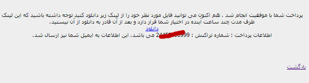
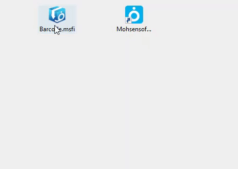

.. meta::
   :description: نحوه دانلود برگه های موجود در سایت

.. _download-pages:

دانلود برگه ها
==================

| این نرم افزار این امکان را می دهد که شما انواع برگه های مختلف را در آن نصب کنید و از آن استفاده نمایید . نرم افزار بر طبق برگه ای که برایش انتخاب میکنید محاسبات و ورودی – خروجی های مورد نیاز را انجام می دهد.در ادامه نحوه دانلود برگ ها  توضیح داده می شود:

| برای این منظور به قسمت |page_download| بروید. صفحه ای به شکل زیر خواهید دید:


| در این صفحه اطلاعات جامعی از هر برگ نمایش داده می شود . همچنین شما می توانید برگه ها به صورت های مختلف دسته بندی و جستجو نمایید . اطلاعات نمایش داده شده از برگها قبلا در قسمت "پنجره انتخاب برگ" توضیح داده شده است . تنها موردی که به این اطلاعات اضافه شده "محدودیتها" می باشد.

| **دو نوع برگ وجود دارند :** برگ های رایگان و غیر رایگان . برگ های رایگان یا کامل و بدون محدودیت می باشند و یا برای تست بصورت محدود در اختیار کاربران قرار می گیرند . گزینه "دانلود" برای برگ های رایگان به رنگ سبز می باشند.اما در نوع دوم یعنی برگ های غیر رایگان معمولا محدودیتی وجود ندارد و گزینه "دانلود" در آنها به رنگ آبی می باشد.
| برای دیدن جزئیات بیشتر هر برگ کافیست بر روی نام یا تصویر آن برگ کلیک نمایید.
| پس از انتخاب برگ مورد نظر و انتخاب گزینه "دانلود" اگر برگ انتخابی رایگان باشد مستقیما به صفحه دانلود منتقل خواهید شد و دانلود بصورت خودکار آغاز خواهد شد.

| اگر برگ انتخابی رایگان نباشد عملیات پرداخت آغاز خواهد شد ، اما ابتدا شما می بایست مشخصات خود نظیر نام و یک آدرس ایمیل را وارد نمایید.توجه داشته باشید این مشخصات فقط برای ارسال یک کپی از اطلاعات پرداخت و دانلود به ایمیل شماست و پر کردن آن الزامی نمی باشد چون این اطلاعات در پایان عملیات پرداخت نمایش داده خواهند شد ولی توصیه می شود این اطلاعات را وارد نمایید تا در صورت بروز هرگونه مشکل امکان پیگیری های بعدی راحتتر باشد.
| همچنین در این مرحله شما میبایست با |agreement| دانلود موافقت کنید و مسئولیت نقض شرایط را بپذیرید.
| در پایان بعد از انتخاب "موافقم" در این صفحه به صفحه پرداخت بانک منتقل خواهید شد.


| شما می توانید با داشتن شماره کارت ، رمز دوم کارت ( رمز اینترنتی ) و شماره شناسایی دوم و همچنین تاریخ انقضای کارت بانک خود عملیات پرداخت را انجام دهید.پس از وارد کردن این اطلاعات و انتخاب گزینه "پرداخت" در صورت صحت اطلاعات و موجودی کافی پرداخت انجام شده و صفحه زیر نمایش داده خواهد شد:
| نمایش این صفحه نشانگر صحت عملیات و پایان مرحله پرداخت می باشد . همچنین اگر شما مشخصات خود را وارد کرده باشید پیام ارسال شدن اطلاعات به ایمیلتان نیز نمایش داده خواهد شد.
 


| با نمایش این صفحه شما می توانید توسط لینک "دانلود" فایل مورد نظر خود را دانلود کنید.
| در انجام این مراحل به نکات زیر دقت کنید:

.. note::
    * برای بالا بردن امنیت اطلاعاتتان در صفحه بانک حتما از صفحه کلید مجازی استفاده نمایید .
    * توصیه می شود حتما اطلاعات خود را برای دریافت مشخصات دانلود و پرداخت وارد نمایید .
    * لینک دانلود داده شده موقت می باشد و حد اکثر ظرف مدت 24 ساعت برای شما فعال است و قادر به دانلود از آن هستید و بعد از آن از کار خواهد افتاد .
    * در انتخاب برگه ها دقت نمایید و اگر از برگه ای تردید دارید ابتدا نسخه رایگان آن را امتحان نمایید و سپس به خرید نسخه کامل اقدام نمایید

.. _installpages:

نصب برگه ها
``````````````
| اگر برنامه فاکتور را نصب کرده باشید فایل دانلود شده به شکل " بسته نصبی برگه " که در قسمت تعاریف معرفی شد نمایش داده خواهد شد ، با دوبار کلیک کردن و یا راست کلیک و انتخاب گزینه اول به معنی " نصب برگه فاکتور " می توانید آن را نصب کنید .
| همچنین با کشیدن و رها کردن فایل روی آیکون برنامه نیز می توانید آن را نصب نمایید .
| پس از نصب با باز کردن برنامه و با استفاده از گزینه " انتخاب برگ " می توانید لیست برگ های نصب شده را ببینید و مورد دلخواه را باز نمایید . مراحل تصویری این کار در زیر قابل مشاهده می باشد:

| روش اول:


| روش دوم:



| سپس نرم افزار فاکتور را اجرا کنید و برگه مورد نظر را انتخاب نمایید :


| |installpage_help|


.. _دانلود سایت نرم افزاری محسن: https://mohsensoft.com/download

.. _توافقنامه: https://mohsensoft.com/agreement.php


.. |page_download| raw:: html

    <a href="https://mohsensoft.com/download/" target="_blank">دانلود سایت نرم افزاری محسن</a>

.. |agreement| raw:: html

    <a href="https://mohsensoft.com/agreement.php" target="_blank">توافقنامه</a>

.. |installpage_help| raw:: html

    <a href="http://www.mohsensoft.com/product/faktor/index.php?page=4#navi" target="_blank">شروع به کار</a>