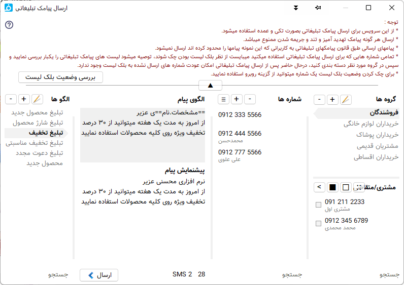

.. meta::
   :description: از این سرویس میتوانید برای ارسال پیامک های اطلاع رسانی و تبلیغاتی به صورتی پیشرفته و سریع استفاده کنید.

.. _service-sms:

==================================
|newflag| سرویس ارسال پیامک
==================================

در نرم افزار فاکتور قابلیتی قرار داده شده است که بتوانید براحتی و بصورت پیشرفته انواع پیامک های تبلیغاتی و اطلاع رسانی ارسال نمایید.


|
|

.. _service-sms-send_general:

ارسال پیامک
===============

برای ارسال پیامک ابتدا میبایست وارد حساب کاربریتان در نرم افزار شوید، این حساب کاربری همان حساب کاربری سایت میباشد.
برای این کار گزینه **وضعیت** در نوار عمومی قسمت سرویس را انتخاب نمایید تا کادر زیر در کنار پنجره نرم افزار باز گردد:

.. image:: images/service_statuslist.png
    :alt:  کادر وضعیت سرویس
    :align: center

در این کادر وضعیت ورود شما و درخواست های ارسال شده و وضعیت آنها نمایش داده میشود.

توسط گزینه اول که در تصویر بالا سبز رنگ میباشد میتوانید وارد حساب کاربری خود شوید، پس از کلیک کردن روی آن، پنجره ورود نمایش داده میشود که با وارد کردن نام کاربری (شماره موبایل) و رمز عبور میتوانید وارد حساب کاربری خود شوید، این ورود تا یک ماه اعتبار دارد و نیاز به ورود مجدد برای هر بار باز شدن نرم افزار نیست.

پس از وارد شدن به حساب کاربری رنگ این گزینه سبز میشود که نشان از صحت ورود شماست در غیراینصورت این گزینه قرمز است.

گزینه بعد برای انتقال به `قسمت سرویس از پروفایل`_ شما در سایت میباشد که در آنجا میتوانید وضعیت کامل سرویسها و شارژ آنها را انجام دهید.


|
|

.. _service-sms-send_ad:

ارسال پیامک تبلیغاتی
=======================
با انتخاب گزینه **ارسال پیامک تبلیغاتی** در نوار عمومی پنجره زیر باز خواهد شد



در این پنجره پنج بخش وجود دارد:

گروه ها و شماره ها
```````````````````````
این قسمت برای دسته بندی شماره ها بکار می رود، مانند تصویر میتوانید گروه های مختلفی برای ارسال پیامک تبلیغاتی درست کنید تا براحتی و بسرعت به آنها پیامک ارسال نمایید.

در روبروی عنوان هر بخش گزینه هایی برای افزودن، حذف کردن و ویرایش مورد انتخاب شده وجود دارد.

در قسمت شماره ها میتوانید علاوه بر افزودن شماره جدید بصورت تکی آنها را از بخش "مشتری/متقاض" و یا از منوی جلوی نام بخش از یک لیست متن و یا جدول اکسل مستقیما وارد نمایید.

توجه : نرم افزار بصورت خودکار امکان وجود شماره تکراری را نمیدهد.


مشتری / متقاضی
```````````````````
این قسمت شماره های :ref:`مشتری/متقاضی/پروژه<window-cust>` های شما را نمایش میدهد که توسط سه گزینه بالا سمت راست میتوانید آنها را انتخاب و تیک دار کنید و توسط گزینه آخر موارد تیک دار شده را به لیست شماره ها برای ارسال اضافه نمایید.


الگوی پیام
```````````````
علاوه بر نوشتن عادی پیام مورد نظر امکان استفاده از :ref:`متن پویا<dynamic-text>` در پیام ممکن میباشد که متن را منعطف و ارسال را سریعتر خواهد کرد، برای اطلاع بیشتر در مورد متن پویا به قسمت :ref:`پیشرفته<dynamic-text>` از راهنما مراجعه نمایید.

به محض نوشتن الگوی مورد نظر در کادر کادر توسی رنگ بالا خروجی آن در پایین نمایش داده میشود، همچنین در کنار گزینه ارسال تعداد پیامک مصرفی این متن و تعداد باقیمانده تا مقدار پیامک بعدی نمایش داده میشود.


الگوها
```````````
در این قسمت میتوانید لیستی از الگو ها ایجاد نمایید و یک نام مناسب برای یافتن آن در نظر بگیرید.، توسط گزینه های بالای آن نیز میتوانید الگو انتخابی را ویرایش، حذف یا مورد جدیدی اضافه کنید.


|
|

.. _service-sms-add-pattern_ad:

افزودن الگوی پیامک تبلیغاتی
==================================
اگر الگوهای موجود نیاز شما را برطرف نمیکند میتوانید الگوی مورد نظرتان را اضافه نمایید.
برای این کار کافیست گزینه :code:`+` در جلو عنوان "الگوها" را انتخاب نمایید تا پنجره زیر باز گردد:

.. image:: images/service_sms_add_pattern_ad.png
    :alt:  افزودن الگوی پیامک تبلیغاتی
    :align: center

|

در این پنجره ابتدا نام الگو را انتخاب نمایید، سپس متن مورد نظرتان را برای الگوی پیام وارد نمایید.

در هنگام وارد کردن متن الگو اگر مشکلی در پیام تشخیص داده شد پیغام آن در کادر کناری با عنوان "پیامها" نمایش داده خواهد شد.

در نوشتن الگوی پیام میتوانید از منوی این بخش که با کلیک بر روی گزینه سه خط بالای کادر ورود متن باز میشود کمک بگیرید:


.. image:: images/service_sms_add_pattern_menu.png
    :alt:  منوی افزودن الگوی پیامک تبلیغاتی
    :align: center

|

در این منو چهار مورد اول :ref:`متن پویا<dynamic-text>` ی مربوط به فاکتور، مشتری، صادر کننده و فیلدهای پایانی موجود در برگه کنونی به همراه الگوهای موجود برای استفاده از آنها برای نوشتن یک الگوی جدید وجود دارد، که براحتی با کلیک بر روی آنها :ref:`متن پویا<dynamic-text>` ی مربوطه وارد متن الگو میشود.


|
|

.. _service-sms-send:

ارسال پیامک اطلاع رسانی
============================
تفاوت پیام تبلیغاتی و پیامک اطلاع رسانی این است که در پیامک تبلیغاتی پیام ارسال شده تنها به افزادی خواهد رسید که دریافت این نوع پیامک را مسدود نکرده باشند ولی پیامک اطلاع رسانی به همه ارسال خواهد شد.

به خاطر همین حالت پیامک های اطلاع رسانی، اوپراتورها محدودیت هایی برای ارسال آن در نظر گرفته اند که میبایست رعایت شوند.
از جمله این محدودیت ها میتوان به ممنوعیت **ارسال لینک** ، **شماره تماس**، **آدرس فضای مجازی** و اجبار به مشخص بودن **نام ارسال کننده** پیام اشاره کرد.
از این رو برای ارسال پیامک اطلاع رسانی میبایست نام صادر کننده های خود را در قسمت پروفایل از سایت مشخص نمایید تا بتوانیم آنرا در پیام ارسال شده تشخیص و صحت سنجی کنیم. در این صفحه نیز روش کار توضیح داده خواهد شد.

روش ارسال پیامک اطلاع رسانی شبیه به پیامک تبلیغاتی میباشد اما در موارد زیر با هم تفاوت دارند:

طبق موارد گفته شده میبایست حتما نام ارسال کننده در متن پیام وجود داشته باشد، برای تشخیص این نام ابتدا میبایست وارد پروفایل خود در سایت شوید و در `قسمت صادر کننده از پروفایل`_ نام های مورد نظرتان را ثبت نماید و منتظر تائید آنها بمانید:


.. image:: images/service_sms_page_coms.png
    :alt:  قسمت صادر کننده از پروفایل
    :align: center

در این صفحه کافیست در کادر بالای لیست نام صادر کننده مورد نظرتان را وارد نمایید و گزینه :code:`+` را انتخاب نمایید، سپس منتظر بمانید تا وضعیت آن به "پذیرفته شده" تغییر یابد. تائید نام ممکن است نهایتا تا یک روز کاری زمان ببرد.

پس از تائید صادر کننده میتوانید پیامک اطلاع رسانی ارسال نمایید.


**افزودن الگو** برای پیامک اطلاع رسانی  نیز کمی با پیامک تبلیغاتی تفاوت دارد، به علت موارد گفته شده میبایست الگوی پیامک اطلاع رسانی مورد تائید قرار گیرد.

برای این کار در پنجره افزودن الگو، پیام به `قسمت الگوی پیامک اطلاع رسانی از پروفایل`_ شما افزوده میشود و میتوانید از طریق این صفحه وضعیت آنرا مشاهده نمایید. همانطور که مشاهده میکنید ارسال الگوی پیامک اطلاع رسانی تنها از طریق نرم افزار امکان پذیر است:


.. image:: images/service_sms_page_pattern.png
    :alt:  صفحه الگوی پیامک اطلاع رسانی از پروفایل
    :align: center

|

پس از تائید الگو در پنجره ارسال پیامک اطلاع رسانی در نرم افزار فاکتور گزینه "**بازخوانی لیست الگو ها از سرور**" در جلو عنوان الگوها که به رنگ سبز میباشد را انتخاب نمایید تا لیست الگو های قابل استفاده شما بروز شود:


.. image:: images/service_sms_send.png
    :alt:  پنجره ارسال پیامک اطلاع رسانی
    :align: center


|
|

.. _service-sms-buy:

خرید بسته پیامک
===================

به علت هزینه بر بودن ارسال پیامک میبایست قبل از ارسال حساب کاربری خود را شارژ نمایید . برای این منظور بست ههای مختلفی برا ارسال پیامک در سایت وجود دارد که بنا به نیاز خود میتوانید آنها را تهیه نمایید. ما سعی کرده ایم کمترین تعرفته پیامک را برای شما ارائه دهیم.

برای این کار کافیست به قسمت `سرویسها`_ در سایت مراجعه نمایید.


|
|

.. _service-sms-manage:

مدیریت سرویس و ارسال ها
=============================
برای مشاهده جزئیات پیامهای ارسال شده ، باقیمانده اعتبار و خرید بسته جدید میتوانید وارد `قسمت سرویس از پروفایل`_ خود شوید و نوع سرویس را انتخاب کنید تا جزئیات آن بصورت زیر به نمایش درآید:


.. image:: images/service_sms_page_manage.png
    :alt:  مدیریت سرویس ها
    :align: center

در این صفحه در بخش بالا اعتبار باقیمانده و بعد از آن سرویسهای تهیه شده شما به همراه اعتبار اولیه و وضعیت معتبر بودن آن نمایش داده میشود و در قسمت پایین ریز پیامهای ارسال شده نمایش داده میشوند.

در قسمت جزیات سطرهای تیره تر نمایانگر هر درخواست هستند که ممکن است در آن درخواست مانند پیامکهای تبلیغاتی چندین شماره زیر مجموعه با سطر روشنتر باشد.

در سطرهای روشن نیز شماره گیرنده بهمراه وضعیت، متن پیام بهمراه اندازه پیام در داخل پرانتز و در آخر شماره سرویسی که از آن استفاده شده است نمایش داده میشود.

.. _قسمت سرویس از پروفایل: https://mohsensoft.com/account/services
.. _قسمت صادر کننده از پروفایل: https://mohsensoft.com/account/servicesuserdata/company
.. _قسمت الگوی پیامک اطلاع رسانی از پروفایل: https://mohsensoft.com/account/servicesuserdata/smstemplate
.. _سرویسها: https://mohsensoft.com/search/service