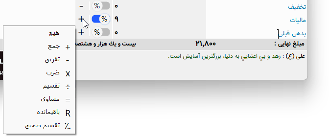

.. meta::
   :description: نکات کلیدی در کار با نر م افزار فاکتور

.. _tips:

نکته‌ها
=============
در این بخش نکته های مختلفی در کار با نرم افزار ارائه می گردد :

.. _tip-move-in-gride:

جابجایی در جدول
-------------------
برای جابجایی در جدول کافیست پس از وارد کردن داده های هر فیلد از کلید اینتر استفاده نمایید.

.. _tip-end-fields:

فیلدهای پایانی برگه
-----------------------

در بیشتر برگه ها و مخصوصا فاکتور ها فیلد هایی در پایان برگه وجود دارد که به برخی از نکات آنها می پردازیم :
ویرایش عنوان فیلد : شما می توانید در برگه هایی که این امکان را می دهند عنوان فیلد را تغییر دهید . رنگ عنوان این فیلدها بصورت فیروزه ای می باشد .
انتخاب عملگر : در برگه هایی که این اجازه را می دهند می توانید نوع عملگر را بنا به نیاز خود تغییر دهید . این عملگر ها ، عملگر های معمول ریاضی می باشند بجز مورد آخر ( = ) ، این عملگر برای نمایش مقدار کنونی عملیات تا این فیلد می باشد . برای مثال در پایان یک برگ فاکتور فیلد های تخفیف ، مالیات و بدهی وجود دارد ، اگر قرار باشد فیلدی به نام "جمع بعد از تخفیف" وجود داشته باشد می بایست عملگر این فیلد "=" انتخاب شود تا فقط مقدار کنونی محاسبه تا این فیلد را نمایش دهد .
درصد : در برگه هایی که این اجازه را می دهند می توانید انتخاب کنید که فیلد بصورت مقدار واقعی محاسبه شود یا بصورت درصدی از مقدار نهایی .
جابجایی بین فیلدها : برای جابجایی بین فیلد ها از کلید :code:`Tab` استفاده نمایید .
انتخاب از لیست : برای انتخاب گزینه ای از یک لیست بدون استفاده از موس کافیست درون فیلد از کلید :code:`F4` استفاده نمایید ، در فیلدهای تاریخ از کلید :code:`Ctrl` نیز می توانید استفاده کنید .
تیک دار کردن گزینه ها : در فیلد هایی که دارای گزینه تیک دار هستند وقتی آن گزینه انتخاب است با استفاده از کلید :code:`Space` یا همان فاصله می توانید گزینه را تیک دار کنید یا آن را برگردانید .

.. _tip-numbering:

شماره جدید
-------------------
روش دادن شماره در این ویرایش کمی متفاوت شده است . 
برای این کار دو راه وجود دارد : دستی و خودکار .
برای گرفتن شماره جدید بصورت دستی کافیست هر بار که نیاز به شماره جدید داشتید گزینه "شماره جدید" را در صفحه اصلی انتخاب نمایید تا بصورت خودکار شماره جدید بعدی داخل کادر محاسبه و نوشته شود . 
برای گرفتن شماره جدید بصورت خودکار کافیست به :ref:`پنجره تنظیمات<setting-numbering>` رفته و روش شماره زنی را به سلیقه خود تغییر دهید.
