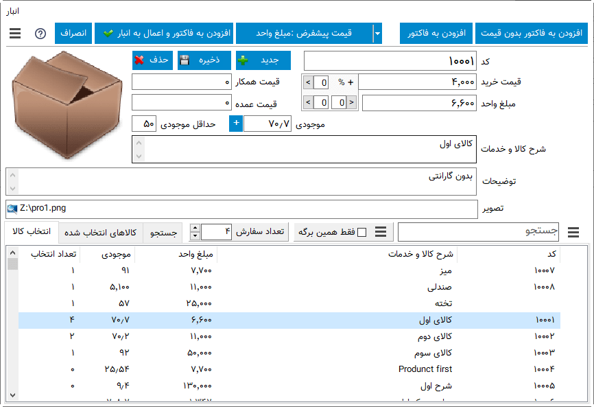
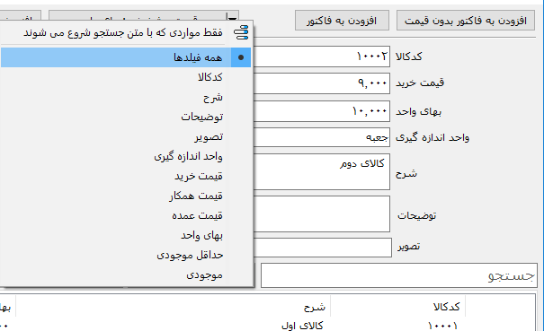
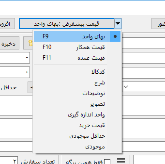
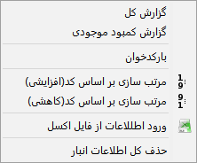
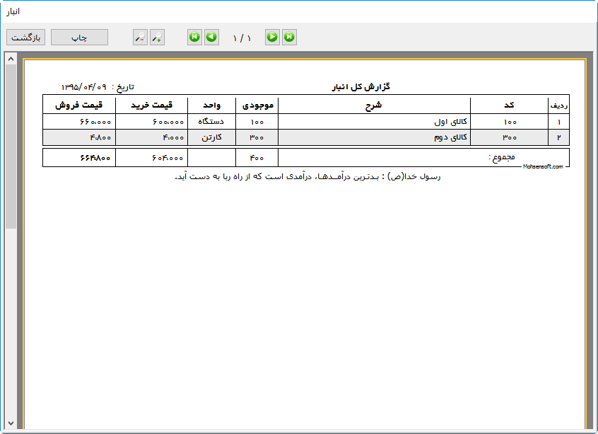

.. meta::
   :description: مدیریت بر لیست کالا و خدمات ذخیره شده در انبار و همچنین انتخاب لیستی از آنها برای افزوده شدن به برگه

.. _window-bank:

پنجره انبار
=====================


| در این پنجره اعمال متعددی بر روی انبار قابل انجام می باشد، علاوه بر گزینه هایی که در پنجره قابل مشاهده است گزینه های دیگری در منوی پنجره که توسط کلیک بر روی تصویر سه خطی گوشه سمت چپ و بالا وجود دارد قابل دسترس می باشد . کارهایی که با این پنجره قابل انجام می باشند به شرح زیراند:


.. _bank_products:

کالا و خدمات
`````````````
| **افزودن کالا یا خدمات جدید :** برای این کار ابتدا :code:`جدید` را انتخاب نمایید ، نشانه گر بر روی فیلد "کد" خواهد رفت ، اطلاعات مورد نظر را وارد کنید و با ماوس یا با زدن کلید تب ( :code:`Tab` ) به فیلد بعدی بروید ، در پایان با انتخاب :code:`ذخیره` کالای وارد شده به انبار اضافه می شود .
| توجه داشته باشید که میبایست حداقل های "کد غیر تکراری، قیمت، تعداد و شرح1" وارد شوند تا گزینه ذخیره فعال گردد.

| **محاسبه خودکار قیمت فروش :** برای وارد کردن قیمت فروش می توانید از امکان محاسبه خودکار آن استفاده کنید، به اینصورت که بعد از نوشتن قیمت خرید و زدن کلید "تب" به فیلد بعدی منتقل می شوید که در کنار آن % وجود دارد، در این فیلد با نوشتن درصد افزایش قیمت یا سود و زدن کلید "اینتر" ( :code:`Enter` ) یا کلیک بر روی فلش کنار آن درصد نوشته شده به قیمت خرید افزوده می شود و در کادر قیمت فروش نوشته خواهد شد.

| **ویرایش کالا یا خدمات :** برای این کار کافیست کالای مورد نظر را انتخاب نموده ، فیلد های مورد نظر را که در بالای لیست میباشد ویرایش کرده و :code:`ذخیره` را انتخاب نمایید .

| **حذف کالا خدمات :** ابتدا کالا یا خدمات مورد نظر را انتخاب کرده و "حذف" را انتخاب نمایید .

| با کلیک بر روی تصویر کالا، تصویری بزرگتر نمایش داده خواهد شد.

.. _bank_search:

جستجو
`````````````
| **جستجو در بین کالا یا خدمات :** کافیست قسمتی یا کل نام و یا کد کالا/خدمات مورد نظر را در کادر "جستجو" تایپ نمایید . وقتی موردی را جستجو می نمایید تب "جستجو" فعال می شود ، بدیهی است برای بازگشت به لیست کل کالا یا خدمات باید تب "انتخاب کالا" و یا "کالاهای انتخاب شده" را برگزینید .



| **فقط همین برگه :** در موقع ذخیره موردی در انبار، هر مورد با مشخصات برگه کنونی ذخیره می شود و با فعال کردن این گزینه نرم افزار فقط مواردی را نمایش می دهد و یا جستجو میکند که در موقع انتخاب برگه کنونی وارد شده اند.
| این حالت در مواردی که برگه های مورد استفاده برای مشاغل مختلف یا نوع موارد متفاوت هستند بسیار پر کاربرد خواهد بود.
| بدیهی است که با غیر فعال کردن این گزینه همه اطلاعات موجود در انبار نمایش داده خواهد شد.

| با کلیک بر روی گزینه مقابل کادر جستجو منویی برای فیلتر کردن و نوع جستجو باز خواهد شد که توضیح هر مدام به شرح زیر است:
| **فقط مواردی که با متن جستجو شروع می شوند :** در صورت فعال بودن این گزینه مورد یافت شده میبایست از ابتدای متن با متن جستجو مطابقت داشته باشند، در صورت غیر فعال بودن متن جستجو شده در هر کجای متن یافت شده می تواند باشد.
| دیگر موارد موجود در این منو لیست فیلد های موجود در برگه هستند که با انتخاب هر کدام جستجو فقط در همان فیلد انجام خواهد گرفت.
| با انتخاب گزینه **همه فیلدها** جستجو در بین همه فیلدهای انبار انجام خواهد شد.

| بعد از جستجو بدون ترک کادر جستجو می توانید با هر بار زدن کلید "اینتر" ( :code:`Enter` ) یکی به تعداد سفارش گزینه انتخاب شده بیفزایید.

.. note:: اگر فیلتری مانند جستجو در ستونی خاص و یا انتخاب ستونی برای جستجو اعمال شده باشد پس زمینه کادر فیلتر (کادر منوی فیلتر ستون برای جستجو و گزینه "فقط همین برگه") به رنگ قرمز متمایل خواهد شد.

.. _bank_select:

انتخاب
`````````````
| **انتخاب کالا یا خدمات :** در انبار داشتن تعداد سفارش بیش از صفر به منزله انتخاب برای افزودن به برگه می باشد . این امر به چهار صورت امکان پذیر است :

* کافیست برای افزایش مقدار سفارش روی هر مورد دلخواه کلیک نمایید تا تعداد سفارش آن افزایش یابد . برای کاهش تعداد سفارش راست کلیک کفایت می کند .
* کالا یا خدمات مورد نظر را انتخاب نموده و با استفاده از "تعداد" تعداد سفارش مورد نظر را تعیین کنید .
* کالا یا خدمات مورد نظر را انتخاب نموده و در کادر "تعداد سفارش" تعداد مورد نظر را وارد کرده و کلید "اینتر"( :code:`Enter` ) را بفشارید .
* بعد از جستجو بدون ترک کادر جستجو می توانید با هر بار زدن کلید "اینتر" ( :code:`Enter` ) یکی به تعداد سفارش گزینه انتخاب شده بیفزایید.

.. note::  توصیه می شود بصورت کامل تمام موارد درخواستی برای افزودن به فاکتور را در یکبار اجرای پنجره انبار انتخاب نمایید.
.. note:: در صورت انتخاب گزینه "افزودن و اعمال به انبار" تعداد موارد انتخابی از انبار کاسته خواهد شد .
.. note:: شما نمی توانید تعداد سفارشی بیش از موجودی آن کالا یا خدمات داشته باشید.

| **افزودن به برگه :** پس از انتخاب کالا (ها) ی مورد نظر می توانید آن را به برگه اضافه کنید . این کار به سه روش مجزا امکان پذیر است :

* **افزودن و اعمال به انبار :** با این گزینه تعداد کالا یا خدمات انتخابی از لیست موجودی انبار کاسته می شود و به برگه اضافه می گردد .
* **افزودن :** این گزینه شبیه به مورد قبلیست با این تفاوت که تغییری در موجودی انبار اعمال نمیشود . کاربرد این گزینه میتواند برای مثال صدور پیش فاکتور باشد .
* **افزودن بدون قیمت :** این گزینه شبیه به مورد قبلیست با این تفاوت که قیمت کالا یا خدمات نیز به برگه اضافه نمی شود.

.. _bank_defprice:

قیمت پیشفرض
``````````````


| امکانی در نرم افزار وجود دارد که میتوانید فیلدی را که بعنوان قیمت ( یا عنوانی متفاوت بسته به مشخصات موجود در برگه) در برگه وارد می شود انتخاب نمایید.
| برای مثال ممکن است فروشنده ای سه قیمت برای فروش داشته باشد که در هنگام صدور فاکتور میتواند مشخص کند که درون فاکتور از کدام قیمت استفاده شود.

.. _bank_barcode:

بارکدخوان
`````````````
اگر قصد استفاده از بارکدخوان برای انتخاب از انبار را دارید این گزینه می تواند مفید واقع شود . اصول کار بارکدخوان ها معمولا به این صورت می باشد که مانند یک صفحه کلید عمل میکنند ، تنها فرق آنها این است که فقط از بارکد ورودی می گیرند . برای این منظور کافیست نشانه گر در فیلد جستجو باشد سپس شما با استفاده از بارکدخوان ، بارکد مورد نظر را وارد کنید ، برنامه بصورت خودکار بارکد را دریافت کرده و اگر کد وارد شده در انبار موجود باشد آن را نمایش داده و به تعداد سفارش آن یکی می افزاید و اگر این روند کامل شود بعنوان اعلام صحت انتخاب کالا یک صدای بوق کوچک پخش خواهد شد . بعد از این مرحله نیازی به پاک کردن فیلد جستجو نمی باشد زیرا نرم افزار بطور خودکار قبل از خواندن بارکد بعدی فیلد را خالی میکند .


.. _bank_menu:

منوی پنجره
`````````````


| **مرتب سازی :** در منوی پنجره میتوانید توسط دو گزینه مرتب سازی اطلاعات انبار را بر اساس کد صعودی و نزولی مرتب نمایید .
| **ورود اطلاعات از فایل اکسل :** توسط این گزینه میتوانید لیست کالا/خدمات مورد نظرتان که در یک فایل اکسل ذخیره شده است را وارد نرم افزار نمایید. برای اطلاعات بیشتر در مورد نحوه کار به قسمت :ref:`ورود اطلاعات از فایل اکسل<import-from-excel>` مراجعه نمایید.
| **حذف کل اطلاعات انبار :** اگر قصد دارید کل اطلاعاتی که در انبار ذخیره کرده اید پاک کنید از این گزینه استفاده نمایید.



| **گزارش کل :** توسط این گزینه گزارشی از کل موجودی انبار نمایش داده می شود
| **گزارش کمبود موجودی :** این گزینه گزارشی از کالا/خدماتی که تعداد موجودی آنها در انبار کمتر از حداقل موجودی است نمایش می هد.
