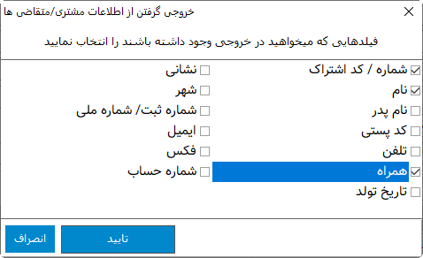

.. meta::
    :description: مدیریت بر لیست مشتری متغاضی ها در نرم افزار فاکتور

.. _window-cust:

پنجره مشتری/متقاضی
=========================
.. image:: images/window_cust.png
    :alt: پنجره مشتری/متقاضی
    :align: center

| در این پنجره اعمال متعددی بر روی مشتری/متقاضی قابل انجام می باشد، علاوه بر گزینه هایی که در پنجره قابل مشاهده است گزینه های دیگری در منوی پنجره که توسط کلیک بر روی تصویر سه خطی گوشه سمت راست و بالا وجود دارد قابل دسترس می باشد . کارهایی که با این پنجره قابل انجام می باشند به شرح زیراند :

| **افزودن مشتری/متقاصی جدید :** برای این کار کافیست "جدید" ( یا کلید میانبر :code:`F5`) را انتخاب کرده، فیلد "شماره/کد اشتراک" انتخاب میشود، سپس اطلاعات مورد نظر را وارد کرده و توسط کلید  :code:`Tab` به فیلد بعدی بروید. پس از پایان ورود اطلاعات "ذخیره" ( یا کلید میانبر :code:`F6` ) را انتخاب نمایید تا اطلاعات در رکوردی جدید دخیره شوند.

| **حذف مشتری/متقاضی :** ابتدا مشتری/متقاضی مورد نظر را انتخاب کرده و "حذف" را انتخاب نمایید .

| **جستجو :** برای جستجو در بین مشتری/متقاضی ها کافیست در فیلد "جستجو" قسمتی یا کل یکی از اطلاعات مشتری/متقاضی مورد نظر را نوشته و کلید :code:`Enter` را بفشارید، سپس تمام مواردی که با جستجوی شما مطابقت داشت در لیست پایینی نمایش داده می شود، سپس میتوانید توسط موس یا کلیدهای جهتنمای بالا/پایین رکورد مورد نظر را انتخاب کنید .

| **انتخاب سریع :** برای یک انتخاب سریع کافیست در هرجای نرم افزار کلید :code:`F8` را از صفحه کلید بفشارید، سپس پنجره مشتری/متقاضی باز شده و نشانه گر بر روی فیلد جستجو قرار میگیرد تا بتوانید بدنبال اطلاعات مورد نظر بگردید، بقیه موارد را مانند قسمت جستجو دنبال کنید . در پایان با فشردن همزمان کلیدهای :code:`Ctrl` + :code:`Enter` اطلاعات انتخاب شده برای مشخصات مشتری متقاضی انتخاب می شود .

| **تغییر عنوان فیلدها :** با راست کلیک بر روی عنوان هر فیلد میتوانید آن را تغییر دهید، کافیست با انتخاب منوی نمایش داده شده در پنجره باز شده عنوان جدید را وارد کنید تا عنوان آن فیلد تغییر کند.

.. note:: توجه کنید که تغییر عنوان فیلد مربوطه در خروجی مستلزم پشتیبانی آن برگه از تغییر عنوان میباشد و پرواضح است که برگه هایی که قبل از اضافه شدن این امکان به نرم افزار طراحی شده اند از این قابلیت پشتیبانی نمیکنند.

منو ها
`````````

| **ورود اطلاعات از فایل اکسل :** توسط این گزینه میتوانید لیست مشتری/متقاضی های مورد نظرتان که در یک فایل اکسل ذخیره شده است را وارد نرم افزار نمایید. برای اطلاعات بیشتر در مورد نحوه کار به قسمت :ref:`ورود اطلاعات از فایل اکسل<import-from-excel>` مراجعه نمایید.

| **صادر کردن اطلاعات :** از این گزینه برای خروجی گرفتن از اطلاعات موجود استفاده نمایید، موارد کاربرد آن میتواند شامل خروجی گرفتن لیست شماره تلفن همراه مشتریان باشد. پس از انتخاب این گزینه پنجره زیر باز خواهد شد :



| در این پنجره لیستی از فیلدهایی که میتوانید از آنها خروجی بگیرید نمایش داده می شود، هر تعداد فیلد مورد نیازتان را انتخاب کنید و "تایید" را بفشارید تا محل ذخیره خروجی از شما پرسیده شود و در نهایت فایل خروجی با پسوند CSV ذخیره خواهد شد.


| **مرتب سازی :** چهار گزینه مرتب سازی در این قسمت بنا بر عنوان نمایش داده شده برای مرتب سازی موارد نمایش داده شده در لیت پایینی پنجره می باشد.

| **بازنشانی همه عنوان ها :** برای برگرداندن همه تغییر عنوان های انجام شده که در بالا توضیح داده شد به حالت پیشفرض از این گزینه استفاده نمایید.
