.. meta::
   :description: این پنجره ، پنجره اصلی برنامه می باشد که در آن می توانید به مدیریت فاکتور ، تنظیمات ، داده ها ، خروجی و ... بپردازید.

.. _window-main:

پنجره اصلی
=================
این پنجره ، پنجره اصلی برنامه می باشد که در آن می توانید به مدیریت فاکتور ، تنظیمات ، داده ها ، خروجی و ... بپردازید.

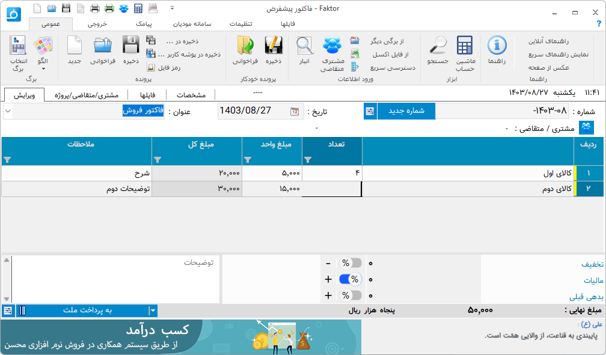

بخشهای مختلف این پنجره به شرح زیر هستند :
نوار دسترسی سریع : این نوار در بالاترین قسمت سمت چپ پنجره وجود دارد شما می توانید دستورات پر کاربرد خود را در این ناحیه سازماندهی کنید . برای افزودن و کاستن به این نوار کافیست روی هر دستور دلخواه راست کلید کنید و از گزینه افزودن و کاستن از این نوار استفاده نمایید .
نوار ریبون : در این نوار دسته بندیی از دستورات و کاربردهای برنامه وجود دارد که تحت گروههایی سازماندهی شده است . در بخش بعد به شرح جزئیات هر دستور پرداخته خواهد شد .
نوار اطلاعات عمومی : در این نوار اطلاعاتی نظیر عنوان ، تاریخ و شماره قابل تنظیم می باشند . لازم به ذکر است که تاریخ را میتوانید به دو صورت جلالی ( شمسی ) و میلادی که از تنظیمات قابل انتخاب هستند داشته باشید .
نوار مشخصات جزئی مشتری/متقاضی: در این نوار برای جلوگیری از اشتباه در صدور فاکتور مشخصات کوچکی از مشتری/متقاضی انتخاب شده نمایش داده می شود، نمایش این نوار را میتوانید از پنجره تنظیمات و قسمت "ظاهر و نمایش" تنظیم کنید.
جدول : در این بخش جدول هر برگ برای ورود و ویرایش داده های برگه نمایش داده می شود .
نوار اطلاعات تکمیلی : در این نوار شما می توانید مواردی مثل توضیحات ، گزینه های نقدی یا غیر نقدی و مقادیر محاسباتی یا توضیحی پایان هر برگه بسته به برگی که انتخاب شده است نمایش داده می شود .
در ادامه به شرح جزئیات هر دستور در نوار ریبون می پردازیم:


.. _bar-general:

عمومی
-------
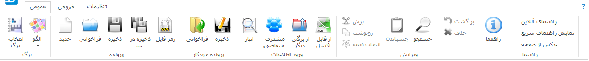

بخشهای مختلف این نوار به شرح زیراند:

.. _bar-general-page:

برگ
``````

**انتخاب برگ :** برای انتخاب برگ از این گزینه استفاده نمایید . اگر برگه ای بصورت برگ پیش فرض انتخاب شده باشد با باز کردن برنامه آن برگ بصورت خود کار انتخاب می شود ، همچنین اگر نیاز به برگ دیگر دارید از این گزینه استفاده نمایید . 

**الگو :** از این گزینه برای مدیریت الگو برگ ها استفاده نمایید . الگو ، اطلاعاتی است از یک برگ که میتوانید آنها را ذخیره نمایید و در موقع لزوم بعنوان برگ فاکتور پیش فرض و یا برگ جدید انتخاب نمایید . برای توضیحات بیشتر قسمت :ref:`الگو<template>` را مطالعه نمایید .
| 

.. _bar-general-doc: 

پرونده
````````
**جدید :** اگر برگی انتخاب کرده باشید می توانید با استفاده از این گزینه تغییرات قبلی خود را پاک کرده و برگی تازه برای نوشتن آغاز کنید.

**فراخوانی :** از این گزینه برای بازگشایی فایل سندی که قبلا ذخیره کرده اید استفاده نمایید . توجه داشته باشید که این گزینه ابتدا برگی که آن سند با آن ذخیره شده است را انتخاب کرده و در آن برگ ، سند را بازگشایی می کند .

**ذخیره :** توسط این گزینه تغییرات فایل سند حاضر ذخیره می شود و اگر تا کنون نام و آدرسی برای سند در نظر گرفته نشده است از کاربر این اطلاعات را درخواست می نماید .

**ذخیره در ... :** از این گزینه برای ذخیره سند موجود در فایلی جدید استفاده نمایید .

|newflag| **ذخیره در پوشه کاربر ... :** از این گزینه برای ذخیره سند موجود در فایلی جدید در پوشه مخصوص به مشتری/متقاضی/پروژه انتخاب شده استفاده نمایید، برای اطلاعات بیشتر به :ref:`مدیریت فایل<file-manager-manage>` مراجعه نمایید

**رمز فایل :** برای تنظیم، تغییر و برداشتن رمز فایل باز شده از این گزینه استفاده کنید، برای اطلاعات بیشتر به قسمت :ref:`رمزفایل<window-password>` مراجعه نمایید.


.. _bar-general-autodoc:

پرونده خودکار
```````````````
این دو گزینه شبیه دو گزینه قبلی هستند با این تفاوت که با انتخاب گزینه "ذخیره" ، فایل کنونی در فولدری با نام شناسه برگه که خود در :ref:`فولدر پیش فرضی که در قسمت تنظیمات<setting-save>` مشخص کرده اید با نام پیشفرض انتخاب شده توسط برگه ذخیره می شود . اگر در انجام این مراحل مشکلی پیش نیاید هیچ پیامی نمایش داده نمی شود ولی اگر خطا و یا سوالی مطرح شود آنها به نمایش در خواهند آمد . گزینه "فراخوانی" پنجره فراخوانی فایل را با آدرس پیشفرض قبلی باز می کند . مزیت این امر در این است که ذخیره سازی و فراخوانی سریعتر انجام میشود و همچنین همه فایل های مربوط به یک برگه در یک فولدر مشخص ذخیره می شوند.
|

.. _bar-general-import:

ورود اطلاعات
````````````
**انبار:** نمایش پنجره انبار جهت ویرایش و افزودن کالا یا خدمات به فاکتور .

**مشتری/متقاضی:** نمایش پنجره مشتری/متقاضی جهت ویرایش و افزودن.

**فراخوانی از برگی دیگر:** این گزینه شبیه به گزینه "فراخوانی" می باشد با این تفاوت که موقع بازگشایی سند برگ مربوط به سند را انتخاب نکرده و اطلاعات درون سند را در صورت امکان و تشابه به برگ کنونی می افزاید . به عبارت دیگر فایل سند مربوط به برگی دیگر را به برگ کنونی وارد ( import ) میکند .

**از فایل اکسل:** نمایش پنجره ورود اطلاعات از فایل اکسل به جدول فاکتور باز شده .

**ویرایش :** این گزینه ها موارد معمولی و عمومی کار با حافظه موقت است که می توانید متن انتخاب شده خود را کپی و یا کات کنید و همچنین آن را در محل مورد نظرتان انتقال دهید .
|

.. _template:

الگو
-------
.. raw:: html

    <div id="86707916686"><script type="text/JavaScript" src="https://www.aparat.com/embed/7HJ38?data[rnddiv]=86707916686&data[responsive]=yes"></script></div>

|
| اگر در یک برگ همیشه مقدار یا مقادیر خاصی را نیاز دارید که بصورت پیش فرض یا با انتخاب شما برای آن برگ اعمال شوند این گزینه ابزار بسیار مناسبی برای این کار می باشد .

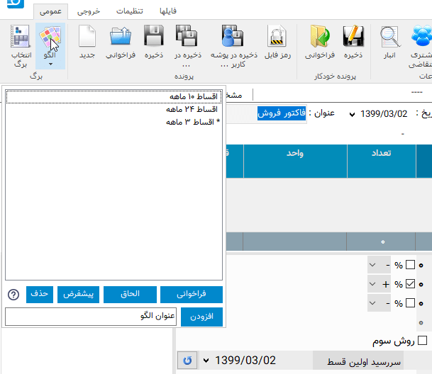

برای مثال فرض کنید مانند تصویر بالا برگ فاکتوری دارید که در آن یکسری گزینه همیشه در موارد مربوط به خودشان یکسان هستند ، برای این مثال گزینه تعداد اقساط و درصد سود این شرایط را دارند ، شما میتوانید با درج این مقادیر در یک برگ خالی و ذخیره آن بعنوان الگو هر بار که نیاز به داشتن آن الگو خواص را دارید از این گزینه استفاده و آن را باز گردانی کرده و در آن شروع به ورود اطلاعات دیگر کنید و یک برگ جدید منتها با مقادیری پیش فرض داشته باشید .

**افزودن:** برای افزودن حالت کنونی فاکتور بعنوان الگو جدید استفاده می شود . برای این منظور کافیست نام الگو جدید را در کادر روبروی آن وارد کنید و سپس این گزینه را انتخاب نمایید.

**فراخوانی:** برای فراخوانی الگو ای که از لیست انتخاب نموده اید می باشد .معادل اینکار دوبار کلیک کردن بر روی گزینه مورد نظر در لیست می باشد .

|newflag| **الحاق:** توسط این گزینه بدون بارگذاری مجدد برگه و حذف اطلاعات وارد شده تغییرات الگوی انتخاب شده اعمال میشود، این تغییرات علاوه بر فیلدها میتواند حتی مواردی در جدول باشند، برای مثال میتوانید الگویی ایجاد کنید که در آن یک یا چند سطر وارد کرده باشد و پس از آن در موقع نیاز میتوانید این سطر ها را توسط این گزینه به جدول اضافه نمایید.


.. _bar-output:

خروجی
-------
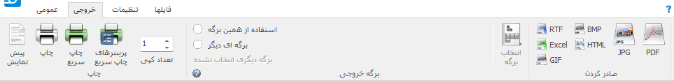

در این نوار ابزارهای مختلفی برای چاپ و تبدیل خروجی وجود دارد که به شرح زیراند :


.. _bar-output-print:

چاپ
`````
| **پیش نمایش :** برای نمایش نحوه چاپ خروجی قبل از گرفتن آن بکار می رود .
| **چاپ :** ارسال دستور چاپ به پرینتر و چاپ خروجی . بعد از انتخاب این گزینه پنجره ای برای انتخاب چاپگر و تعدادی تنظیمات چاپ نمایش داده می شود .

| **چاپ سریع :** این گزینه عملیات چاپ را بدون هیچ پرسش و نمایش کادری انجام میدهد، اگر هیچ پرینتری در گزینه "پرینترهای چاپ سریع" انتخاب نشده باشد پرینت توسط پرینتر پیشفرض انجام میگیرید، در غیر اینصورت به هر تعداد پرینتر موجود در آین لیست دستور پرینت صادر میشود.
| **پرینترهای چاپ سریع :** با انتخاب این گزینه پنجره زیر نمایش داده می شود:

.. image:: images/bar_output_multiprinter_settings.png
    :alt: خروجی
    :align: center

| در این پنجره دو لیست وجود دارد : لیست پایین پرینتر های قابل دسترس و نصب شده بر روی سیستم نمایش داده می شود و در لیست بالا پرینترهایی که آنها را انتخاب کرده اید نمایش داده میشود.
| توسط گزینه های افزودن و حذف نیز میتوانید موارد انتخاب شده را از لیست پایین با لیست بالا منتقل نمایید و یا از لیست بالا حذف کنید.
| با انتخاب گزینه "چاپ سریع" دستور چاپ به ترتیب به همه پرینترهای موجود در این لیست صادر میشود.
| از موارد کاربرد این گزینه میتوان به چاپ رسید درخواست با پرینتر قسمت پذیرش سفارش برای مشتری و چاپ همان رسید با پرینتر دیگری در قسمت انجام خدمت در یک مجموعه مانند رستوران نام برد.

.. _bar-output-outputpage:

برگه خروجی
````````````
| در این قسمت شما می توانید برگه خروجی ای غیر از برگه ی جاری انتخاب نمایید .
| برای مثال ممکن است در حال استفاده از یک برگ در اندازه A5 باشید و بخواهید آن را روی یک برگه A4 پرینت بگیرید، در این زمان کافیست در این قسمت برگه ای دیگر با سایز دلخواه انتخاب نمایید تا خروجی برگه کنونی در صورت وجود همان ستونها و فیلدها در برگه انتخاب شده قرار گرفته و نمایش داده شود.
| برای اینکار ابتدا "برگه ای دیگر" را انتخاب کرده و "انتخاب برگه" را برگزینید ، پنجره عمومی انتخاب برگ ظاهر خواهد شد که می توانید برگی دیگر را برای خروجی گرفتن از فاکتور کنونی انتخاب نمایید . بعد از انتخاب برگ جدید نام آن در زیر گزینه "برگه ای دیگر" حک می شود که نشان از صحت انتخاب شما دارد . در این حالت اگر شما یکی از دستورات خروجی نظیر پیش نمایش ، چاپ و یا گزینه های صادر کردن را انتخاب نمایید برگه خروجی درون برگی که انتخاب کرده اید در صورت امکان و تشابه نمایش داده می شود .

.. _bar-output-export:

برگه خروجی
````````````
 در این گروه دستوراتی برای تبدیل خروجی برگه به فایل های پر کاربرد دیگر وجود دارد . این فرمت ها عبارتند از:

* **RTF:** فرمت مربوط به متن دارای فرمت می باشد که میتوانید خروجی را در نرم افزار هایی مثل ویرایشگر های متن باز نمایید و ویرایش کنید
* **XLS:** فرمت مربوط به صفحه گسترده نظیر نرم افزار اکسل می باشد.
* **GIF, BMP و JPG:** فرمت های تصویری.
* **HTML:** فرمت مربوط به صفحات وب.
* **PDF:** فرمت سند فشرده و قابل حمل.

|

.. _bar-settings:

تنظیمات
-----------------
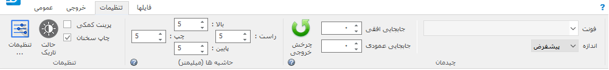

در این نوار تنظیمات برنامه قابل دسترسی هستند:

.. _bar-settings-settings:

تنظیمات
````````````
**تنظیمات :** برای نمایش :ref:`پنجره تنظیمات<window-settings>` از این گزینه استفاده نمایید . همچنین سه گزینه پرکار برد از این پنجره در این گروه قابل دسترس می باشند.

|newflag| **حالت تاریک :** نمایش نرم افزار در حالت تیره، توصیه میشود در محیط های با نور کم برای کاهش فشار بر چشم این حالت را فعال نمایید.

.. _bar-settings-margins:

حاشیه ها
````````````
در این گروه می توانید فاصله برگه خروجی را از حاشیه های لبه کاغذ به میلیمتر تغییر دهید. از این تنظیم برای مواردی مانند افزایش ارتفاع سربرگ یا پاورقی استفاده نمایید و برای جابجایی برگه از تنظیمات قسمت بعد استفاده نمایید.

.. _bar-settings-layout:

چیدمان
````````````
در این قسمت تنظیماتی برای تعیین مکان خروجی و ظاهر آن وجود دارد:

| **چرخش خروجی :** در برگه هایی مانند انواع چک نیاز است که متناسب با امکانات و یا محدودیت های پرینتر خروجی با 90 درجه چرخش چاپ گردد که میتوانید از این امکان استفاده نمایید
| **جابجایی افقی :** با تغییر این تنظیم ابتدا برگه به درون یک برگه A4 قرار داده می شود، سپس مقدار مثبت آن باعث حرکت خروجی به سمت راست و مقدار منفی باعث حرکت خروجی به سمت چپ خواهد شد.
| **جابجایی عمودی** در این گزنه نیز مقدار مثبت باعث جابجایی به سمت پایین و مقدار منفی برای جابجایی به سمت بالا می باشد.
| **فونت و اندازه :** با تنظیم مقدار فونت میتوانید فونت برگه را تغییر دهید. همچنین میتوانید اندازه فونت ها را نسبت به اندازه فعلی آن به مقدار "اندازه" کم یا زیاد نمایید.
|

|newflag| فایلها
````````````````````
.. image:: images/bar_file.png
    :alt: تنظیمات
    :align: center

در این قسمت گزینه هایی برای فیلتر کردن گروهی فایلها بر اساس انواع اصلی دسته بندی های فایل و همجنین نحوه نمایش شکل فایلها وجود دارد که در بخش :ref:`مدیریت فایل<file-manager>` بصورت کامل توضیح داده شده است.

.. _bar-preview:

پیش نمایش
------------
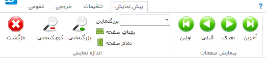

| **بازگشت :** وقتی به حالت پیش نمایش میروید میتوانید توسط این گزینه به حالت اولیه باز گردید.
| **کوچکنمایی :** برای کوچکتر کردن برگه پیش نمایش استفاده می شود .
| **پهنای صفحه :** اندازه برگه پیش نمایش را طوری تنظیم میکند که پهنای برگه تماما قابل روئت باشد .
| **تمام صفحه :** اندازه برگه پیش نمایش را طوری تنظیم می کند که ارتفاع برگه کاملا قابل روئت باشد .
| **بزرگنمایی :** بزرگتر کردن برگه پیش نمایش .
| **پیمایش :** جابجایی بین صفحات پیش نمایش .
|

.. _tab-cust:

مشخصات مشتری/متقاضی
--------------------
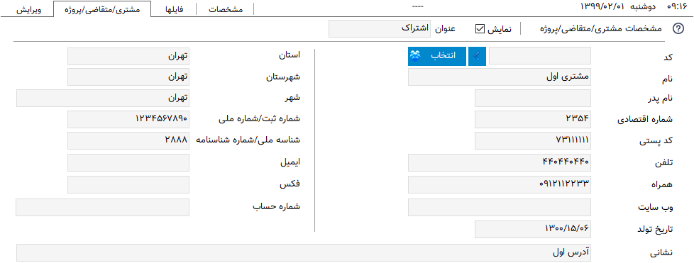

| از این صفحه برای ثبت مشخصات مشتری یا متقاضی در برگه هایی که به این موارد نیاز دارند استفاده نمایید. این مشخصات در فایل سند برگه ذخیره می شود.
| **نمایش :** توسط این این گزینه در صورتی که برگه انتخاب شده این امکان را داشته باشد میتوانید قسمت مشخصات مشتری را از خروجی حذف و یا نمایش دهید.
| |newflag| **عنوان :** توسط این این گزینه در صورتی که برگه انتخاب شده این امکان را داشته باشد میتوانید عنوان قسمت مشخصات مشتری را در خروجی تغییر دهید.
| **انتخاب مشتری/متقاضی :** برای این کار کافیست "انتخاب" را کلیلک کرده (یا کلید میانبر  :code:`F8` ) و در پنجره باز شده مشتری/متقاصی مورد نظر را انتخاب کنید. برای اطلاعات بیشتر در مورد کار با این پنجره به قسمت :ref:`پنجره مشتری/متقاضی<window-cust>` مراجعه نمایید.
| **انتخاب سریع :** برای یک انتخاب سریع میتوانید قسمتی یا کل یکی از اطلاعات ( کد، نام یا شماره تلفن) مشتری/متقاضی را در کادر "شماره/کد اشتراک" وارد کرده و کلید  :code:`Enter` رابفشارید. در این زمان اگر اطلاعات وارد شده جهت جستجو منجر به انتخاب شدن یک مشتری/متقاضی شود اطلاعات آن مشتری انتخاب شده، کادر جستجو به رنگ سبز در میآید و اطلاعات جایگذاری می شود ولی اگر تعداد مشتری/متقاضی انتخاب شده بیشتر از یک عدد بود پنجره انتخاب مشتری باز شده و میتوانید توسط کلید های جهتنمای بالا/پایین مشتری/متقاضی مورد نظر را انتخاب کنید. اگر جستجو نتیجه ای بدنبال نداشت کادر جستجو به رنگ قرمز درآمده و صدای کوچکی پخش می شود.
| **تغییر عنوان فیلدها :** برای تغییر عنوان مشخصات مشتری/متقاضی از پنجره :ref:`مشتری/متقاضی<window-cust>` استفاده نمایید.

.. _tab-com:

مشخصات صادرکننده
------------------
.. raw:: html

    <div id="19450882798"><script type="text/JavaScript" src="https://www.aparat.com/embed/op4kK?data[rnddiv]=19450882798&data[responsive]=yes"></script></div>

|
| در این صفحه می توانید مشخصات صادر کننده برگه را وارد نمایید . این اطلاعات ، اطلاعاتی هستند که معمولا در سربرگ برگه ها نمایش داده می شود .

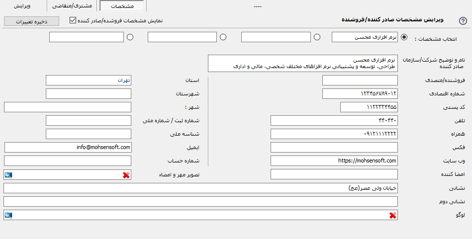


| **نمایش :** توسط این این گزینه در صورتی که برگه انتخاب شده این امکان را داشته باشد میتوانید قسمت مشخصات صادرکننده را از خروجی حذف و یا نمایش دهید.
| **عنوان :** توسط این این گزینه در صورتی که برگه انتخاب شده این امکان را داشته باشد میتوانید عنوان قسمت مشخصات صادرکننده را در خروجی تغییر دهید.
| **تغییر لوگو :** برای تغییر لوگو کافیست بر روی شکل ذره بین در گوشه فیلد روبروی لوگو کلیک کرده و مانند بیشتر برنامه های معمول یک فایل تصویری برای آن انتخاب کنید . در انتخاب لوگو به موارد زیر توجه نمایید ، همچینین اگر با مشکلی در انتخاب لوگو مواجه شدید موارد زیر را تک تک چک نمایید و آنها را بطور کامل اجرا نمایید:

.. note::
    * تا حد امکان نسبت تصویر فایل انتخابی متناسب با اندازه محل قرار گیری در فاکتور باشد.
    * تا حد امکان اندازه تصویر انتخابی نزدیک به اندازه محل قرار گیری در فاکتور باشد. توجه کنید که ممکن است با انتخاب یک تصویر بسیار بزرگ( مانند تصاویر دوربین یا کیفیت بسیار بالا) در هنگام گرفتن خروجی با خطا مواجه شوید.
    * حتی الامکان نام فارسی در نام و آدرس فایل انتخابی نباشد.
    * پیشنهاد میشود به ترتیب اولویت از فرمت های png ، bmp و jpg استفاده نمایید.
    * فایلی را که انتخاب می نمایید باید ثابت باشد زیرا این فایل در موقع نمایش برگه فراخوانی می شود و باید در این موقع در محل انتخابی وجود داشته باشد.

| **تغییر عنوان فیلدها :** با راست کلیک بر روی عنوان هر فیلد میتوانید آن را تغییر دهید، کافیست با انتخاب منوی نمایش داده شده در پنجره باز شده عنوان جدید را وارد کنید تا عنوان آن فیلد تغییر کند.

.. note:: توجه کنید که تغییر عنوان فیلد مربوطه در خروجی مستلزم پشتیبانی آن برگه از تغییر عنوان میباشد و پرواضح است که برگه هایی که قبل از اضافه شدن این امکان به نرم افزار طراحی شده اند از این قابلیت پشتیبانی نمیکنند.


.. _menu-start:

منوی شروع
---------------
.. image:: images/start-menu.png
    :alt: منوی شروع
    :align: center

با انتخاب دایره سمت بالا و چپ این منو باز می شود . در سمت چپ این منو لیستی از پر کاربرد ترین دستورات وجود دارد . در سمت راست لیست آخرین سند های باز شده وجود دارد که می توانید با استفاده از آن خیل سریع به آخرین اسناد باز شده دسترسی داشته باشید.
در ادامه دو موردی که قبلا توضیح داده نشده است شرح داده می شوند:

| **ذخیره فیلتر در :** توسط این گزینه میتوانید فیلتر های اعمال شده در جدول ها را در وضعیت فعلی آنها به عنوان یک فایل جدید ذخیره نمایید.
| **ذخیره بعنوان الگو :** از این گزینه برای ذخیره برگ جاری بعنوان یک الگو استفاده نمایید . برای اطلاعات بیشتر به قسمت :ref:`الگو<template>` مراجعه نمایید .
| **پشتیبان گیری :** برای نمایش پنجره عملیات :ref:`پشتیبان گیری<backup>`.
| **راهنما :** نمایش فایل راهنمای برنامه.
|


.. _qbank:

انبار سریع
--------------

این امکان قابلیتی برای انتخاب سریع کالا/خدمات در جدول میباشد، توسط آن بسیار سریع کالا/خدمات مورد نظرتان را بدون رفتن به پنجره انبار انتخاب میکنید، تعداد مورد نیاز را تنظیم و از موجودی انبار کم میکنید.

اگر گزینه ":ref:`انبار سریع<setting-general>`" در پنجره تنظیمات فعال باشد هرگاه در یکی از ستونهای جدول کلمه ای را تایپ کنید اگر مورد مشابهی از آن کلمه و یا موردی که شامل کلمات وارد شده باشد در انبار وجود داشته باشد لیستی از آن به مایش در خواهد آمد. مانند تصویر زیر:

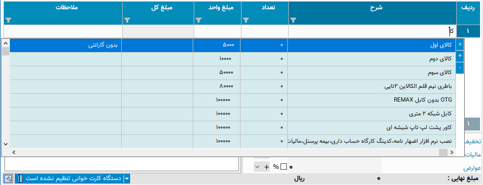

با نمایش این لیست میتوانید بدون در نظر گرفتن آن به تایپ خود ادامه دهید و از کلید :code:`Enter` برای حرکت به ستون بعدی استفاده نمایید.

برای استفاده از لیست کافیست توسط یکی از کلید های جهت نمای بالا یا پایین بین موارد لیست جابجا شوید و مورد مورد نظر را انتخاب نمایید.
پس از انتخاب میتوانید با استفاده از کلیدهای :code:`+` یا :code:`-` صفحه کلید یا گزینه های کناری لیست باز شده تعداد سفارش آن را تغییر دهید و در نهایت با فشار کلید :code:`Enter` از صفحه کلید مورد انتخابی به جدول اضافه میشود.

پس از باز شدن لیست با انتخاب یکی از کلیدهای جهت پایین یا بالا و یا کلیدهای :code:`+` یا :code:`-` از صفحه کلید وارد حالت انتخاب از لیست می شوید و پس از آن با انتخاب کلید :code:`Enter` از صفحه کلید مورد انتخابی به جدول افزوده می شود،
برای انصراف از حالت انتخاب از لیست کافیست کلید :code:`ESC` از صفحه کلید را انتخاب نمایید.

.. note::
    * توجه کنید که مقدار سفارش تنظیم شده پس از فشردن کلید :code:`Enter` از صفحه کلید از انبار کم میشود.
    * مقدار سفارش نباید از موجودی بیشتر شود، در غیراینصورت به شما توسط یک پیام اطلاع داده خواهد شد.
    * برای کم نشدن موجودی از انبار کافیست پس از انتخاب مقدار سفارش را تعیین نکرده و بعد از افزودن به جدول در ستون مربوطه تعداد را تعیین نمایید.

|


.. _gride:

جدول
-----------
در برگه هایی مانند فاکتور که نیاز به ورود لیستی از اقلام دارد جدول یا جدولهایی نمایش داده میشوند، در صورت وجود بیش از یک جدول نام هر جدول در زیر آنها نمایش داده میشود که از آن طریق قابل انتخاب هستند.

| برای حرکت بین سلولهای جدول کافیست کلید :code:`Enter` را بفشارید.
| برای افزودن سطر جدید میتوانید با تکرار کلید :code:`Enter` و رسیدن به ستون آخر سطر جدید ایجاد نماید یا از منویی که در ادامه توضیح داده میشود استفاده کنید یا از کلید میانبر آن یعنی :code:`Ctrl` + :code:`Ins` استفاده نمایید.

با راست کلیک بر روی عنوان های جدول منوی زیر نمایش داده میشود :

.. image:: images/gride_headermenu.png
    :alt: منوی عنوان جدول
    :align: center

| در این منو میتوانید اطاعات جدول را بر اساس ستونی که انتخاب کرده اید بصورت سعودی یا نزولی مرتب نمایید،
| توسط گزینه آخر میتوانید مشخص کنید که با تغییر اندازه پنجره اندازه ستونها نیز با همان نسبت پیشفرض تغییر اندازه دهند، توجه کنید که این گزینه در مورد جدول میباشد  نه در مورد خروجی.

با راست کلیک کردن روی سلولهای جدول منوی زیر نمایش داده میشود :

.. image:: images/gride_menu.png
    :alt: فیلتر جدول
    :align: center

| گزینه های اول مربوط به عملیات های مختلف کپی متن میباشد.
| یک نکنه مهم و کاربردی این است که توسط این گزینه ها میتوانید محتوای یک یا چند سلول را کپی نمایید و آنها را بین این نرم افزار یا نرم افزاری مثل اکسل بصورت مستقیم جابجا نمایید.
| در این منو گزینه هایی برای افزودن سطر، جابجایی و حذف سطر ها وجود دارد که که از نام هر کدام از گزینه ها کار هر کدام مشخص میباشد.
| **تغییر خودکار ارتفاع سطرها :** با فعال بودن این گزینه در صوزت وارد کردن بیش از یک سطر در خانه های جدول اتفاع آن سطر بصورت خودکار افزایش پدا میکند، توجه کنید که این گزینه مربوط به جدول میباشد و نه خروجی.
| **جستجو :** با انتخاب این گزینه قسمتی برای جستجو در جدول نمایش داده خواهد شد که میتوانید توسط آن درون اطلاعات داخل جدول جستجو انجام دهید.
| |newflag| **مقداردهی گروهی :** این گزینه برای پر کردن خودکار سلول های انتخاب شده جدول میباشد، با انتخاب این گزینه پنجره زیر نمایش داده می شود:

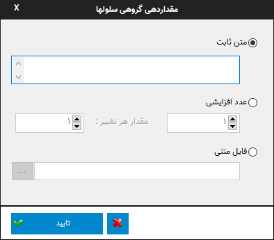

در این پنجره سه روش برای پر کردن سلولهای انتخاب شده وجود دارد که برای فعال شدن هر کدام کافیست گزینه کناری آن را فعال کنید و مقادیر مورد نیاز آن را تنظیم نمایید:

* **متن ثابت :** توسط این روش میتوانید یک متن ثابت را در تمام سلول های انتخاب شده تکرار کنید.
* **عدد افزایشی :** این گزینه برای وارد کردن خودکار ترتیبی از اعداد میباشد، برای این منظور کافیست عدد شروع را در فیلد اول و مقدار هر تغییر را در فیلد دوم بنویسید، برای مثال با نوشتن عدد 1 در هر دو فیلد سلول های انتخاب شده از عدد 1 تا تعداد سلولهای انتخاب شده مقدار دهی میشوند و با وارد کردن 1 و 5 سلول های انتخاب شده از عدد 1 شروع شده و مقدار هر خانه از مقدار خانه قبل بعلاوه 5 بدست میآید. در هر دو فیلد امکان نوستن اعداد منفی نیز وجود دارد که برای مثال میتوان ترتیب اعداد را بصورت نزولی نیز تنظیم نمود.
* **فایل متنی :** توسط این گزینه امکان وارد کردن خطوط یک فایل متنی بعنوان ترتیب پر شدن سلولها انتخاب شده وجود دارد، بعبارت دیگر در این حالت هر سلول انتخاب شده با در نظر گرفتن ترتیب انتخاب با خط متناظرش در فایل پر میشود.

نکته کاربردی این امکان این است که علاوه بر انتخاب ستونی سلول های جدول اگر در انتخاب شما چند ستون وجود داشته باشد ترتیب پر شدن سلولها بصورت اولیت اول سطر و بعد از آن ستون است، به این معنی که در صورت انتخاب دو ستون در انتخاب سلولها ترتیب پر شدن سلولها به این صورت است که ابتدا سلول اول از سطر اول، سپس سلول دوم از سطر اول و بعد از آن سلول اول سطر دوم پر خواهد شد.

.. _gride-filter:

فیلتر جدول
-------------

توسط این امکان میتوانید اطلاعات موجود در جدول را بر اساس داده یا داده هایشان فیلتر نمایید، برای مثال به تصویر زیر دقت کنید :

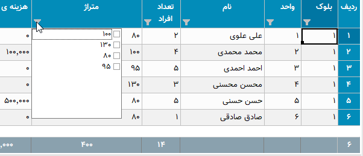

این تصویر مربوط به برگه شارژ ساختمان میباشد، با کلیک بر روی آیکون فیلتر در عنوان هر ستون لیستی یکتا از اطلاعات آن ستون نمایش داده می شود،
شما میتوانید با تیک دار کردن هر کدام از موارد این لیست اطلاعات آن جدول را بر اساس سطر هایی که شامل این انتخاب ها هستند فیلتر نمایید.

برای مثال در تصویر بالا با انتخاب گزینه "80" لیست بر اساس سطرهایی که در آنها متراژ "80" متر میباشد فیلتر خواهد شد، مانند تصویر زیر:

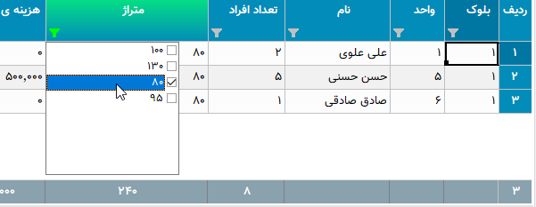

همانطور که در تصویر نیز مشاهده میکنید ستون هایی که در آنها فیلتر اعمال شده است پس زمینه عنوان ستون متمایل به سبز شده و خود نماید فیلتر نیز سبز رنگ خواهد شد.

توجه کنید که در این حالت تمام محاسبات بر اساس موارد فیلتر شده خواهد بود.

امکان دیگری در نرم افزار گنجانده شده است تا بتوانید برگه ای جدید از فیلتر های انجام شده ذخیره نمایید، در این نوع ذخیره فقط موارد فیلتر شده در فایل ذخیره می شوند. این گزینه در منوی اصلی برنامه با عنوان ":ref:`ذخیره فیلتر در...<menu-start>`" وجود دارد.


.. _inlinecalc:

|newflag| محاسبه درجای عبارت ریاضی
--------------------------------------


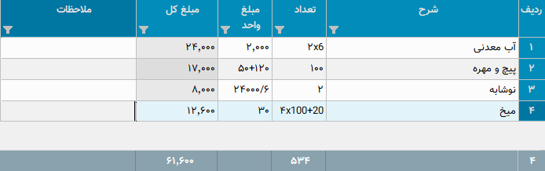


| توسط این قابلیت موانید در سلولهای جدول مستقیما یک عبارت ریاضی را بنویسید، نرم افزار فاکتور بدون آنکه آن را تبدیل به نتیجه کند در محاسبات از مقدار حساب شده آن عبارت استفاده میکند.
| برای مثال در تصویر بالا برای ستونهای تعداد و مبلغ واحد عباراتی نوشته شده است که میتواند در کم کردن و ساده کردن بسیاری از محاسبات موثر باشد.

| عملگرهای پشتیانی شده چهار عمل اصلی بعلاوه تقسیم صحیح و باقیمانده تقسیم میباشد که به شرح زیراند:

* **جمع**: علامت آن همان کاراکتر "+" میباشد.
* **تفریق**: علامت آن همان "-" میباشد.
* **ضرب**: برای علامت آن علاوه بر کاراکتر "*" میتوانید از ایکس "x" هم استفاده نمایید.
* **تقسیم**: علامت آن اسلش "/" میباشد.
* **تقسیم صحیح**: علامت آن بک اسلش "\" میباشد که برای محاسبه نتیجه یک تقسیم بدون در نظر گرفتن اعشار در مقدار نهایی بکار میرود.
* **باقیمانده تقسیم**: علامت آن "|" میباشد.