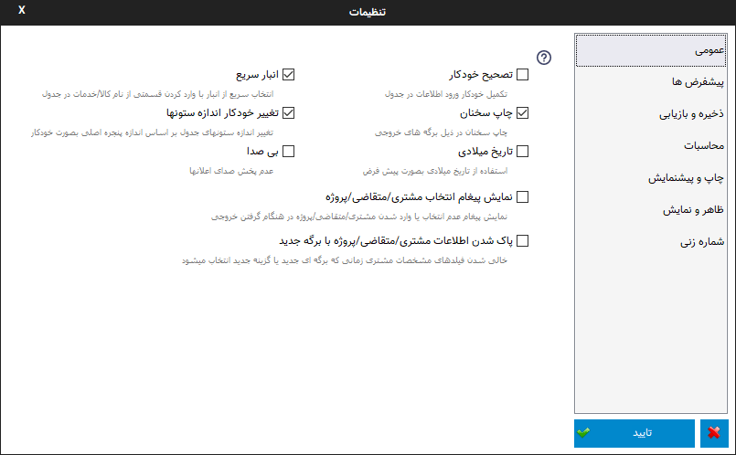
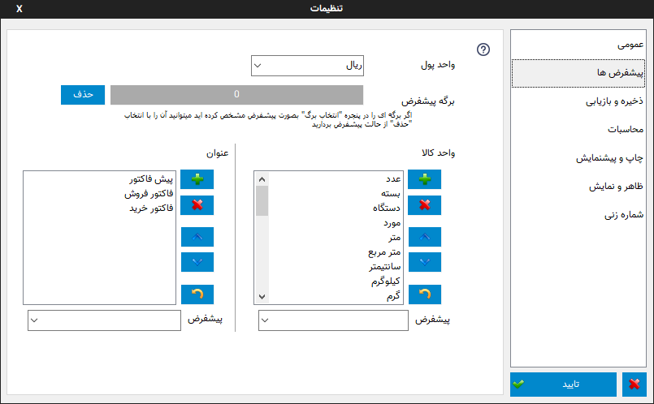

.. meta::
   :description: تنظیمات کلی برنامه برای تغییر در عملکرد آن و تنظیم محاسبات، شماره زنی، پیشفرض ها، ظاهر برنامه و ...

.. _window-settings:

پنجره تنظیمات
=======================
این پنجره مربوط به تنظیمات کلی برنامه می باشد که در ادامه به شرح تک تک صفحات این پنجره می پردازیم:

.. _setting-general:

عمومی
--------------

در این پنجره کل تنظیمات نرم افزار در چند گروه قابل دسترس می باشند تا بتوانید آنها را به سلیقه خود تغییر دهید.این تنظیمات عبارتند از :
 | **تصحیح خودکار :** با فعال بودن این گزینه در موقع نوشتن درون جدول پیش نویسی از مقادیر قبلی وارد شده پیشنهاد می شود ، شما میتوانید آن را قبول کنید و یا به نوشتن خود ادامه دهید . اگر در این زمان ادامه متن پیشنهادی را لازم نداشتید کافیست از کلید backspace استفاده نمایید .
 | **تاریخ میلادی :** توسط این گزینه میتوانید از بین تاریخ جلالی ( شمسی ) و میلادی یکی را برای نمایش در برگه انتخاب نمایید .
 | **تغییر خودکار اندازه ستونها :** اگر این گزینه فعال باشد هنگام تغییر اندازه پنجره اصلی، ستونهای جدول نیز بصورت خودکار به اندازه پیشفرض تعیین شده تنظیم می شوند.

.. _setting-defaults:

پیش فرض ها
---------------

**واحد پول :** انتخاب واحد پول پیش فرض برای نمایش بعد از قیمت.
 | **برگه پیشفرض :** اگر برگه ای را بعنوان پیشفرض انتخاب کرده باشید میتوانید آن را توسط گزینه ببینید و یا با گزینه "حذف" از حالت پیشفرض بیرون بیاورید.
 | **واحد کالا :** توسط این قسمت میتوانید لیست واحد های کالا را خصوصی سازی کنید، آنها را پاک کنید، جابجا کنید و یا واحدی جدید به آنها بیفزایید، کلیدهای کنار لیست به ترتیب از بالا به پایین برای : افزودن واحد جدید، حذف واحد انتخابی، جابجایی به بالا، جابجایی به پایین و برگرداندن لیست به حالت پیشفرض میباشد .
 | **واحد کالای پیشفرض :** توسط این گزینه میتوانید درون برگه هایی که واحد کالا دارند اگر بصورت پیش فرض در برگه مشخص نشده باشد واحد کالای پیش فرض را مشخص کنید که موقع ورود به فیلد واحد کالا بصورت خودکار درج شود .

.. _setting-save:

ذخیره و بازیابی
-----------------
 
| **آدرس پیشفرض :** در این کادر آدرسی را مشخص کنید که توسط دو دستور موجود در بخش " پرونده خودکار " میخواهید تمام کارهای با فایل در این آدرس انجام شوند.
| **آدرس ذخیره اطلاعات:** این گزینه امکان تغییر محل ذخیره بانک اطلاعات انبار و مشتری/متقاضی ها را فراهم میکند. برای این کار کافیست گزنیه ذره بین در کادر مربوطه را انتخاب و پوشه جدید محل ذخیره اطلاعات را انتخاب کنید، سپس نرم افزار پوشه انتخابی را چک کرده و در صورت نبودن اطلاعاتی از قبل در این پوشه اطلاعات کنونی را به آن کپی خواهد کرد، سپس با تایید و بستن نرم افزار تنظمیات در اجرای بعدی نرم افزار اعمال خواهد شد.
| از این امکان میتوانید در موارد مختلی مانند سیستم هایی که درایو ویندوز آنها فریز شده اند استفاده کرد تا اطلاعات پس از خاموش شدن سیستم به حالت اولیه باز نگردند.

|   کاربرد دیگر این امکان برای اشتراک این اطلاعات بین چند سیستم میباشد، برای اینکار کافیست پوشه ای را در یک سیستم که بیشتر روشن است یا سرور شبکه به اشتراک بگذارید و این آدرس را در دیگر سیستم ها روی این پوشه تنظیم کنید تا همه سیستم های تنظیم شده از یک اطلاعات مشترک انبار و مشتری/متقاضی ها استفاده کنند.
| در این حالت به تداخل دسترسی همزمان سیستم ها به فایل های اطلاعات توجه کنید، این تداخل ممکن است حالتی باشد که دو سیستم بصورت همزمان قصد تغییر در این اطلاعات را داشته باشند، برای رفع این تداخل توصیه میشود فقط یک سیستم را برای تغییر در این اطلاعات قرار دهید و از دیگر سیستم ها فقط برای استفاده از این اطلاعات استفاده کنید.
| ممکن است مواقعی در حالت شبکه هنگامی که قصد ذخیره اطلاعات را داشته باشید( این ذخیره شامل اعمال تغییرات به مواردی مثل تعداد موجودی انبار بعد از خرید نیز میتواند باشد) پیغام قفل بودن بانک اطلاعاتی (Database id Locked) نمایش داده شود که نشان دهنده این است که فایل اطلاعات توسط کاربری دیگر در حال استفاده است و میبایست تا بستن پنجره مربوطه در سیستم استفاده کننده از فایل صبر کنید.
| از گزینه قرمز رنگ موجود در این کادر برای بازگشت به پوشه پیشفرض اطلاعات استفاده کنید.
| توصیه میشود اگر اطلاع زیادی از این گزینه ندارید قبل از هر اقدامی یک پشتیبان_ از اطلاعات تهیه نمایید.

.. _setting-calculation:

محاسبات
---------

| **رند کردن مبلغ نهایی :** در این گزینه تعیین میشود عدد نهایی به چه میزان رند شود . برای مثال : اگر عدد ۵۰ را انتخاب کرده باشید ، اگر مبلغ نهایی ۵۲۴ شده باشد مبلغ نهایی به عدد ۵۰۰ ولی اگر مبلغ نهایی ۵۳۰ شده باشد مبلغ نهایی به ۵۵۰ رند می شود .
| **رند کردن محاسبات :** اگر نمیخواهد نتیجه محاسبات بصورت عدد با اعشار نمایش داده شود این گزینه را فعال کنید تا نتیجه محاسبات قبل از نمایش رند شود.
| **رقم اعشار :** توسط این گزینه می توانید تعداد رقم اعشار را برای نمایش انتخاب کنید، برای مثال اگر نتیجه یک محاسبه ۲.۳۴۵ شده باشد و شما تعداد رقم اعشار را ۲ انتخاب کرده باشید، رقم اعشار به دو رقم گرد شده و ۲.۳۵ نمایش داده می شود.

.. _setting-print:

چاپ و پیش نمایش
----------------

| **پرینت کمکی :** این گزینه برای کاربرانی مناسب می باشد که با پرینت کردن برگه ها مشکلاتی نظیر : چاپ نکردن قسمتی از یک متن و یا پرینت صفحه ای خالی از متن را دارند .
| **نمایش رنگ پس زمینه ردیفها :** برای حذف رنگ پس زمینه ردیفهای فاکتور که معمولا بصورت یک در میان برای تمایز و تشخیص بهتر ردیفها کشیده می شوند از این گزینه استفاده کنید. توجه کنید که این گزینه در برگه های جدید که از این حالت پشتیبانی می کنند قابل انجام است.

.. _setting-ui:

ظاهر و نمایش
---------------
| **نمایش خط جدا کننده فیلدها :** اگر از حالت ساده و بدون کادر فیلدهای پایانی نمیتوانید استفاده کنید با فعال کردن این گزینه یک خط جداکننده زیر فیلدها کشیده می شود تا فیلد ها از هم متمایل نشان داده شوند .
| **تغییر خودکار ارتفاع سطرها :** با فعال کردن این گزینه که از منوی راست کلیک جدول نیز قابل دسترسی میباشد در هنگام وارد کردن متن در جدول اگر متن وارد شده از اندازه سطر بیشتر باشد ارتفاع سطر مورد نظر به اندازه متن وارد شده تنظیم می شود.
| **تغییر خودکار انداره ستون ها:** با فعال کردن این گزینه که از منوی راست کلیک جدول نیز قابل دسترسی میباشد در هنگام تغییر اندازه پنجره اصلی ستونهای جدول نیز با درصد اندازه پیشفرض برگه تغییر اندازه خواهند داد.
| **عدم نمایش اطلاعات مختصر مشتری/ متقاضی در بالای جدول:** اگر این گزینه غیر فعال باشد اطلاعات مختصری از مشتری/متقاضی انتخاب شده در برگه هایی که این حالت را دارند در قسمت بالای جدول اصلی نمایش داده می شود.

.. _setting-numbering:

شماره زنی
--------------
| در این پنجره گزینه ها و امکانات مختلفی برای شماره زنی در دسترس میباشد:
| **قالب شماره زنی:** در این قسمت میتوانید قالبی برای شماره های صادره تنظیم نمایید، به این ترتیب که شش جزء مختلف برای شماره قابل انتخاب است که پس از انتخاب به ترتیب از چپ به راست تشکیل یک شماره واحد را میدهند.
| پس از تنظیم پیشنمایشی از حالت انتخابی نمایش داده می شود و توسط گزینه "شماره بعدی" میتوانید رفتن به شماره بعدی را امتحان نمایید یا بصورت دستی شماره های بعدی را انتخاب نمایید.
| موارد قابل انتخاب شامل اجزای مختلف زمان، کاراکترهای خاص مثل خط تیره و نقطه، عدد خودکار افزایشی و متن قابل انتخاب میباشد.
| اجزای زمان نیاز به توضیح خاصی ندارند و از عنوان آنها، کارشان قابل فهم است، برای مثال "روز" در موقع فراخوانی شماره جدید شماره روز کنونی را انتخاب میکند و یا "تاریخ" روز ، ماه و سال تاریخ کنونی را بصورت یک عدد انتخاب مینماید.
| با انتخاب "متن" میتوانید یک متن ثابت برای شماره انتخاب کنید.
| با انتخاب "عدد افزایشی" کادری نمایش داده میشود که میتوانید عدد شروع این جزء را تعیین کنید، سپس هر بار که شماره جدیدی درخواست می شود به این عدد افزوده می شود.
| برای مثال اگر فقط نیاز به یک عدد که در هر بار یک واحد افزایش یابد مانند ویرایش های قبل دارید کافیست جزء سمت چپ را روی عدد افزایشی قرار داده و مقدار مورد نظر را وارد کنید و بقیه اجراء را روی "هیچ" تنظیم کنید. 
| **شماره جدید برای یک فایل ذخیره شده:** نرم افزار بصورت پیشفرض کنترل میکند که برای یک فایل که ذخیره شده است بصورت خودکار شماره جدیدی درنظر گرفته نشود، با فعال کردن این گزینه این کنترل برداشته می شود.
| **تعیین کنید چه زمان هایی شماره جدید تعیین شود:** در این قسمت تعیین کنید چه زمانهایی بصورت خودکار نرم افزار برای شما شماره جدیدی اختصاص دهد.

.. _پشتیبان: https://mohsensoft.com/docs/faktor/backup.html