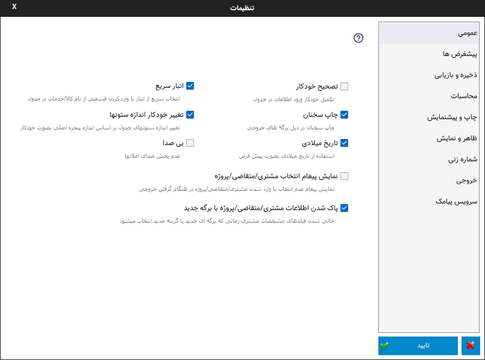
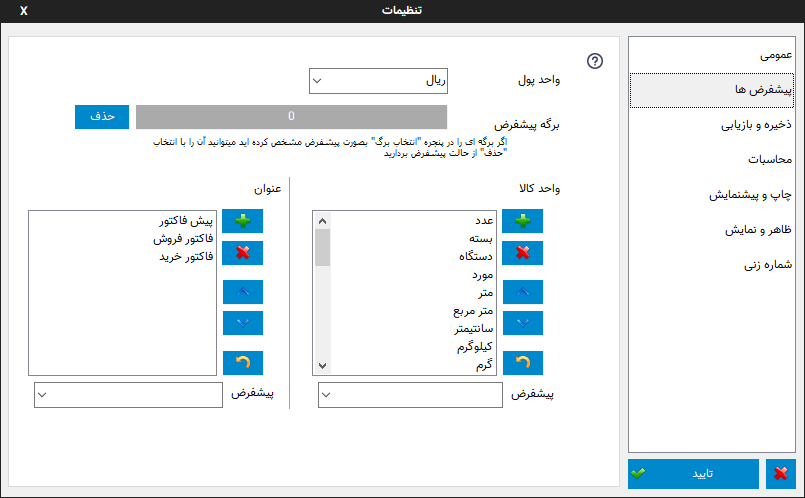
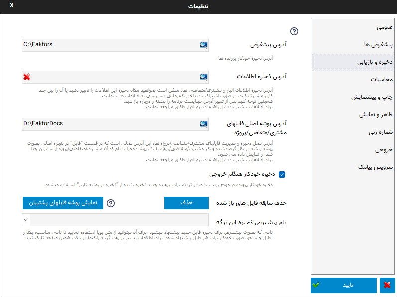
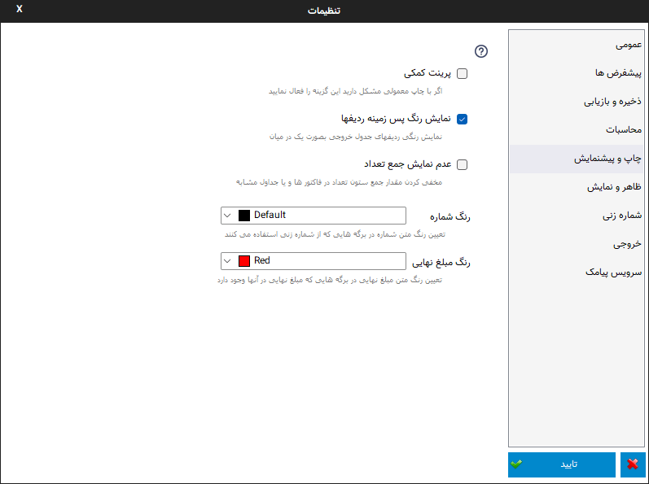
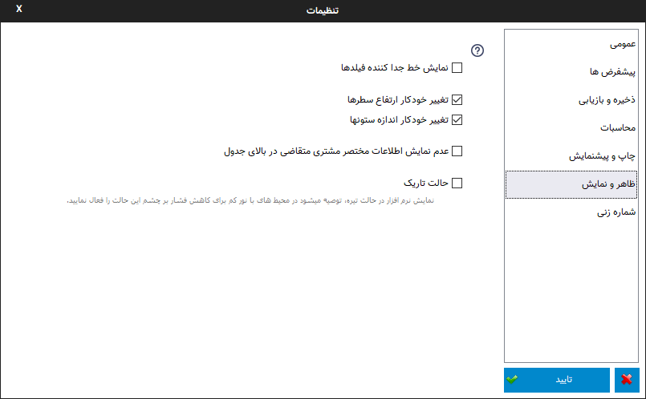
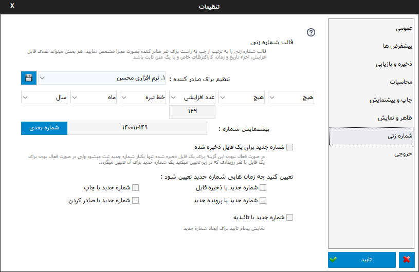
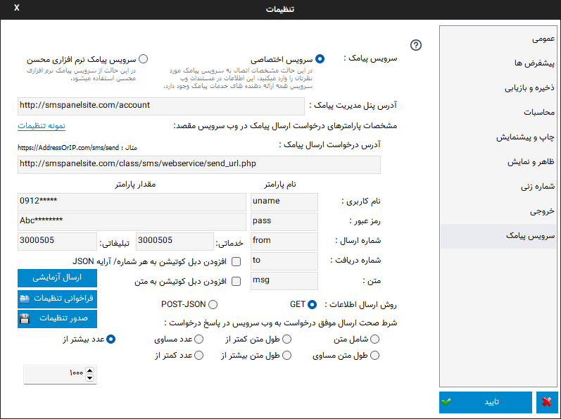

.. meta::
   :description: تنظیمات کلی برنامه برای تغییر در عملکرد آن و تنظیم محاسبات، شماره زنی، پیشفرض ها، ظاهر برنامه و ...

.. _window-settings:

پنجره تنظیمات
=======================
این پنجره مربوط به تنظیمات کلی برنامه می باشد که در ادامه به شرح تک تک صفحات این پنجره می پردازیم:

.. _setting-general:

عمومی
--------------

در این پنجره کل تنظیمات نرم افزار در چند گروه قابل دسترس می باشند تا بتوانید آنها را به سلیقه خود تغییر دهید.این تنظیمات عبارتند از :

**تصحیح خودکار :** با فعال بودن این گزینه در موقع نوشتن درون جدول پیش نویسی از مقادیر قبلی وارد شده پیشنهاد می شود ، شما میتوانید آن را قبول کنید و یا به نوشتن خود ادامه دهید . اگر در این زمان ادامه متن پیشنهادی را لازم نداشتید کافیست از کلید backspace استفاده نمایید .

**چاپ سخنان :** کنترل چاپ سخنان در برگه ها

**تاریخ میلادی :** توسط این گزینه میتوانید از بین تاریخ جلالی ( شمسی ) و میلادی یکی را برای نمایش در برگه انتخاب نمایید.

**تغییر خودکار اندازه ستونها :** اگر این گزینه فعال باشد هنگام تغییر اندازه پنجره اصلی، ستونهای جدول نیز بصورت خودکار به اندازه پیشفرض تعیین شده تنظیم می شوند.

**انبار سریع :** این امکان قابلیتی برای انتخاب سریع کالا/خدمات در جدول میباشد، توسط آن بسیار سریع کالا/خدمات مورد نظرتان را بدون رفتن به پنجره انبار انتخاب میکنید، تعداد مورد نیاز را تنظیم و از موجودی انبار کم میکنید. :ref:`اطلاعات بیشتر...<qbank>`

**بی صدا :** در صورت فعال بودن این گزینه صدا های اعلان پخش نخواهند شد.

**نمایش پیغام انتخاب مشتری/مقاضی :** در صورتی که این گزینه فعال باشد اگر در هنگام گرفتن خروجی مشتریی انتخاب نشده باشد پیغامی نمایش داده خواهد شد.

**پاک شدن اطلاعات مشتری/متقاضی/پروژه با برگه جدید :** اگر برای صدور برگه جدید نیاز به اطلاعات مشتری/متقاضی/پروژه قبلی دارید و نمیخواهید مجدد آن را انتخاب کنید میتوانید این گزینه را غیر فعال نمایید تا در موقع انتخاب یک برگه جدید یا زمانی که گزینه "جدید" در نوار اصلی را انتخاب میکنید اطلاعات مشتری قبلی حذف نشوند.

.. _setting-defaults:

پیش فرض ها
---------------

**واحد پول :** انتخاب واحد پول پیش فرض برای نمایش بعد از قیمت.

**برگه پیشفرض :** اگر برگه ای را بعنوان پیشفرض انتخاب کرده باشید میتوانید آن را توسط گزینه ببینید و یا با گزینه "حذف" از حالت پیشفرض بیرون بیاورید.

**واحد کالا :** توسط این قسمت میتوانید لیست واحد های کالا را خصوصی سازی کنید، آنها را پاک کنید، جابجا کنید و یا واحدی جدید به آنها بیفزایید، کلیدهای کنار لیست به ترتیب از بالا به پایین برای : افزودن واحد جدید، حذف واحد انتخابی، جابجایی به بالا، جابجایی به پایین و برگرداندن لیست به حالت پیشفرض میباشد .

**واحد کالای پیشفرض :** توسط این گزینه میتوانید درون برگه هایی که واحد کالا دارند اگر بصورت پیش فرض در برگه مشخص نشده باشد واحد کالای پیش فرض را مشخص کنید که موقع ورود به فیلد واحد کالا بصورت خودکار درج شود .

**عنوان :** توسط این قسمت میتوانید لیست عنوان های موجود در نرم افزار را خصوصی سازی کنید، آنها را پاک کنید، جابجا کنید و یا عنوان جدیدی به آنها بیفزایید، کلیدهای کنار لیست به ترتیب از بالا به پایین برای : افزودن عنوان جدید، حذف عنوان انتخابی، جابجایی به بالا، جابجایی به پایین و برگرداندن لیست به حالت پیشفرض میباشد .

**پیشفرض** در قسمت نیز میتوانید عنوان پیشفرض را برای برگه کنونی انتخاب نمایید.

.. _setting-save:

ذخیره و بازیابی
-----------------

**آدرس پیشفرض :** در این کادر آدرسی را مشخص کنید که توسط دو دستور موجود در بخش " پرونده خودکار " میخواهید تمام کارهای با فایل در این آدرس انجام شوند.

**آدرس ذخیره اطلاعات:** این گزینه امکان تغییر محل ذخیره بانک اطلاعات انبار و مشتری/متقاضی ها را فراهم میکند. برای این کار کافیست گزنیه ذره بین در کادر مربوطه را انتخاب و پوشه جدید محل ذخیره اطلاعات را انتخاب کنید، سپس نرم افزار پوشه انتخابی را چک کرده و در صورت نبودن اطلاعاتی از قبل در این پوشه اطلاعات کنونی را به آن کپی خواهد کرد، سپس با تایید و بستن نرم افزار تنظمیات در اجرای بعدی نرم افزار اعمال خواهد شد.

.. warning:: در استفاده از این گزینه دقت نمایید، پوشه ای که انتخاب میکنید محل ذخیره اطلاعات انبار و مشتری/متقاضی هاست، مکان انتخابی میبایست یک مکان امن باشد که برای مثال با تعویض ویندوز پاک نگردد.

.. warning:: اگر آدرسی که برای این گزینه انتخاب میکنید در هنگام اجرای نرم افزار وجود نداشته باشد خطای **پیدا نشدن فایل دیتابیس** به نمایش در خواهد آمد.
    در این حالت میبایست برای این گزینه یک آدرس صحیح وارد نمایید و یا آدرس را حذف کنید تا از مکان پیشفرض استفاده شود.

از این امکان میتوانید در موارد مختلی مانند سیستم هایی که درایو ویندوز آنها فریز شده اند استفاده کرد تا اطلاعات پس از خاموش شدن سیستم به حالت اولیه باز نگردند.

**حالت شبکه :** کاربرد دیگر این امکان برای اشتراک این اطلاعات بین چند سیستم میباشد، برای اینکار کافیست پوشه ای را در یک سیستم که بیشتر روشن است یا سرور شبکه به اشتراک بگذارید و این آدرس را در دیگر سیستم ها روی این پوشه تنظیم کنید تا همه سیستم های تنظیم شده از یک اطلاعات مشترک انبار و مشتری/متقاضی ها استفاده کنند.

در این حالت به تداخل دسترسی همزمان سیستم ها به فایل های اطلاعات توجه کنید، این تداخل ممکن است حالتی باشد که دو سیستم بصورت همزمان قصد تغییر در این اطلاعات را داشته باشند، برای رفع این تداخل توصیه میشود فقط یک سیستم را برای تغییر در این اطلاعات قرار دهید و از دیگر سیستم ها فقط برای استفاده از این اطلاعات استفاده کنید.

ممکن است مواقعی در حالت شبکه هنگامی که قصد ذخیره اطلاعات را داشته باشید( این ذخیره شامل اعمال تغییرات به مواردی مثل تعداد موجودی انبار بعد از خرید نیز میتواند باشد) پیغام قفل بودن بانک اطلاعاتی (Database id Locked) نمایش داده شود که نشان دهنده این است که فایل اطلاعات توسط کاربری دیگر در حال استفاده است و میبایست تا بستن پنجره مربوطه در سیستم استفاده کننده از فایل صبر کنید.

از گزینه قرمز رنگ موجود در این کادر برای بازگشت به پوشه پیشفرض اطلاعات استفاده کنید.

توصیه میشود اگر اطلاع زیادی از این گزینه ندارید قبل از هر اقدامی یک :ref:`پشتیبان<backup>` از اطلاعات تهیه نمایید.

**آدرس پوشه اصلی فایلهای مشتری/متقاضی/پروژه:** آدرس محل ذخیره و مدیریت فایلهای مشتری/متقاضی/پروژه ها، این آدرس محلی است که در قسمت "فایل" در پنجره اصلی بصورت پوشه ریشه در نظر گرفته شده و هر مشتری/متقاضی/پروژه با یک پوشه مجزا با نام کد آن مشتری/متقاضی/پروژه از سایرین جدا شده و نمایش داده می شود.

وارد کردن این آدرس ضروری است، سعی کنید محلی را انتخاب نمایید که مطمئن باشد و بهتر است این محل در درایوی که در آن ویندوز نصب کرده اید نباشد تا با تعویض ویندوز مشکلی ایجاد نگردد.

همچنین پشتیبانگیری از این فایلها به عهده کاربر نرم افزار می باشد.

**حذف سابقه فایلهای باز شده :** برای پاک کردن لیست فایل های باز شده که در منوی اصلی و پنجره شروع نمایش داده می شوند میتوانید از این گزینه استفاده نمایید.

|newflag| **نمایش پوشه فایلهای پشتیبان :** نرم افزار بصورت خودکار 10 ذخیره آخر یک فایل را در یک پوشه ذخیره میکند تا در صورت بروز هر مشکلی بتوانید به آن رجوع کنید.

نامگذاری این فایلها به این صورت است که ابتدا یک شماره که مربوط به آدرس آن فایل است و برای هر آدرس یکتاست قرار میگیرد، سپس نام فایل و بعد از آن اندیس یک تا ده برای سابقه ذخیره آن فایل. توجه کنید که برای یافتن آخرین فایل به تاریخ تغییر آن فایل مراجعه نمایید و نه اندیس آن. بعبارت دیگر مثلا همیشه اندیس ده نشاندهنده آخرین ذخیره نیست.

**نام پیشفرض ذخیره برگه**: توسط این گزینه میتوانید نامی که بصورت پیشفرض در موقع ذخیره فایل برگه ها پیشنهاد میشود را تعیین کنید، این نام میتواند در یافتن آن برگه بسیار کارآمد باشد، پس نامی را انتخاب نمایید که برای هر برگه یکتا باشد و شامل اطلاعاتی باشد که برای جستجوی آن در آینده مفید است.

برای تنظیم این نام بهتر است از :ref:`متن پویا<dynamic-text>` استفاده نمایید.

.. _setting-calc:

محاسبات
---------
.. image:: images/setting_calc.png
    :alt: محاسبات
    :align: center

**رند کردن مبلغ نهایی :** در این گزینه تعیین میشود عدد نهایی به چه میزان رند شود . برای مثال : اگر عدد ۵۰ را انتخاب کرده باشید ، اگر مبلغ نهایی ۵۲۴ شده باشد مبلغ نهایی به عدد ۵۰۰ ولی اگر مبلغ نهایی ۵۳۰ شده باشد مبلغ نهایی به ۵۵۰ رند می شود .

**رند کردن محاسبات :** اگر نمیخواهد نتیجه محاسبات بصورت عدد با اعشار نمایش داده شود این گزینه را فعال کنید تا نتیجه محاسبات قبل از نمایش رند شود.

**رقم اعشار :** توسط این گزینه می توانید تعداد رقم اعشار را برای نمایش انتخاب کنید، برای مثال اگر نتیجه یک محاسبه ۲.۳۴۵ شده باشد و شما تعداد رقم اعشار را ۲ انتخاب کرده باشید، رقم اعشار به دو رقم گرد شده و ۲.۳۵ نمایش داده می شود.

.. _setting-print:

چاپ و پیش نمایش
----------------

**پرینت کمکی :** این گزینه برای کاربرانی مناسب می باشد که با پرینت کردن برگه ها مشکلاتی نظیر : چاپ نکردن قسمتی از یک متن و یا پرینت صفحه ای خالی از متن را دارند .

**نمایش رنگ پس زمینه ردیفها :** برای حذف رنگ پس زمینه ردیفهای فاکتور که معمولا بصورت یک در میان برای تمایز و تشخیص بهتر ردیفها کشیده می شوند از این گزینه استفاده کنید. توجه کنید که این گزینه در برگه های جدید که از این حالت پشتیبانی می کنند قابل انجام است.

**عدم نمایش جمع تعداد :** در صورتی که به نمایش جمع ستون تعداد در برگه هایی نظیر فاکتور نیاز ندارید و یا نمایش آن بخاطر مواردی نظیر عدم یکی بودن واحد ها معنیی ندارد میتوانید این گزینه را فعال نمایید.

**رنگ شماره :** توسط این گزینه میتوانید رنگ مقدار شماره در برگه هایی که این فیلد را دارند تعیین نمایید.

.. _setting-ui:

ظاهر و نمایش
---------------

**نمایش خط جدا کننده فیلدها :** اگر از حالت ساده و بدون کادر فیلدهای پایانی نمیتوانید استفاده کنید با فعال کردن این گزینه یک خط جداکننده زیر فیلدها کشیده می شود تا فیلد ها از هم متمایل نشان داده شوند .

**تغییر خودکار ارتفاع سطرها :** با فعال کردن این گزینه که از منوی راست کلیک جدول نیز قابل دسترسی میباشد در هنگام وارد کردن متن در جدول اگر متن وارد شده از اندازه سطر بیشتر باشد ارتفاع سطر مورد نظر به اندازه متن وارد شده تنظیم می شود.

**تغییر خودکار انداره ستون ها:** با فعال کردن این گزینه که از منوی راست کلیک جدول نیز قابل دسترسی میباشد در هنگام تغییر اندازه پنجره اصلی ستونهای جدول نیز با درصد اندازه پیشفرض برگه تغییر اندازه خواهند داد.

**عدم نمایش اطلاعات مختصر مشتری/ متقاضی در بالای جدول:** اگر این گزینه غیر فعال باشد اطلاعات مختصری از مشتری/متقاضی انتخاب شده در برگه هایی که این حالت را دارند در قسمت بالای جدول اصلی نمایش داده می شود.

**حالت تاریک :** نمایش نرم افزار در حالت تیره، توصیه میشود در محیط های با نور کم برای کاهش فشار بر چشم این حالت را فعال نمایید.

.. _setting-numbering:

شماره زنی
--------------

|

در این پنجره گزینه ها و امکانات مختلفی برای شماره زنی در دسترس میباشد:

**قالب شماره زنی:** در این قسمت میتوانید قالبی برای شماره های صادره تنظیم نمایید، به این ترتیب که شش جزء مختلف برای شماره قابل انتخاب است که پس از انتخاب به ترتیب از چپ به راست تشکیل یک شماره واحد را میدهند.

|newflag| توسط فیلد **تنظیم برای صادر کننده** میتوانید برای هر صادر کننده ای که در بخش مشخصات در پنجره اصلی تنظیم کرده اید یک قالب مخصوص تنظیم نمایید که شماره هرکدام بصورت مستقل محاسبه و نمایش داده میشود. بعد از تنظیم یک قالب برای یک صادر کننده گزینه :code:`ذخیره` را انتخاب نمایید تا برای آن صادر کننده این قالب تنظیم گردد.

پس از تنظیم پیشنمایشی از حالت انتخابی نمایش داده می شود و توسط گزینه "شماره بعدی" میتوانید رفتن به شماره بعدی را امتحان نمایید یا بصورت دستی شماره های بعدی را انتخاب نمایید.

موارد قابل انتخاب شامل اجزای مختلف زمان، کاراکترهای خاص مثل خط تیره و نقطه، عدد خودکار افزایشی و متن قابل انتخاب میباشد.

اجزای زمان نیاز به توضیح خاصی ندارند و از عنوان آنها، کارشان قابل فهم است، برای مثال "روز" در موقع فراخوانی شماره جدید شماره روز کنونی را انتخاب میکند و یا "تاریخ" روز ، ماه و سال تاریخ کنونی را بصورت یک عدد انتخاب مینماید.

با انتخاب "متن" میتوانید یک متن ثابت برای شماره انتخاب کنید.

با انتخاب "عدد افزایشی" کادری نمایش داده میشود که میتوانید عدد شروع این جزء را تعیین کنید، سپس هر بار که شماره جدیدی درخواست می شود به این عدد افزوده می شود.

برای مثال اگر فقط نیاز به یک عدد که در هر بار یک واحد افزایش یابد مانند ویرایش های قبل دارید کافیست جزء سمت چپ را روی عدد افزایشی قرار داده و مقدار مورد نظر را وارد کنید و بقیه اجراء را روی "هیچ" تنظیم کنید. 
|

**شماره جدید برای یک فایل ذخیره شده:** نرم افزار بصورت پیشفرض کنترل میکند که برای یک فایل که ذخیره شده است بصورت خودکار شماره جدیدی درنظر گرفته نشود، با فعال کردن این گزینه این کنترل برداشته می شود.
|

**تعیین کنید چه زمان هایی شماره جدید تعیین شود:** در این قسمت تعیین کنید چه زمانهایی بصورت خودکار نرم افزار برای شما شماره جدیدی اختصاص دهد.
|

**شماره جدید با تائیدیه:** با فعال شدن این گزینه قبل از ایجاد شماره جدید پیغام پرسشی برای اینکار نمایش داده می شود و در صورت تایید این پیغام شماره جدید ایجاد میشود، این گزینه برای کاربرانی که ترتیب شماره ها برای آنها بسیار با اهمیت است کاربرد دارد.

.. _setting-export:

|newflag| خروجی
-----------------------

در این پنجره گزینه های مختلفی برای تنظیمات خروجی وجود دارد:

**خروجی جدول**: در این قسمت گزینه هایی برای خروجی csv وجود دارد که میبایست بنابر نیاز نرم افزار مقصد که قصد ارسال اطلاعات به آن را دارید این موارد را تنظیم نمایید.

**اجبار به استفاده از اعداد فارسی در خروجی پی دی اف :** اگر نیاز ندارید که در خروجی پی دی اف اعداد بصورت کاراکترهای فارسی نمایش داده شوند این گزینه را غیر فعال نمایید.

.. _setting-sms:

|newflag| سرویس پیامک
-----------------------------
در این قسمت تنظیماتی برای انتخاب نوع سرویس و خصوصیات آن وجود دارد:

|

**سرویس پیامک**: توسط این گزینه میتوانید انتخاب کنید که قصد استفاده از سرویس پیامک خودتان را دارید یا از سرویس پیامک نرم افزاری محسن استفاده میکنید.

در مواردی که قصد استفاده از محدودیت های موجود در سرویس نرم افزاری محسن را دارید مانند ارسال شماره کارت و یا شماره تلفن، لینک یا متن های خاص که بخاطر بوجود آمدن مسئولیت برای ما محدود شده اند میتوانید از گزینه سرویس اختصاصی استفاده نمایید.

**سرویس اختصاصی**: برای استفاده از این گزینه میبایست در یکی از خدمات دهنده های ارسال پیامک ثبتان کرده و در قسمت اطلاعات فنی وب سرویس اطلاعات مورد نیاز را در فیلدهای زیر پر کنید تا نرم افزار مستقما به وب سرویس شرکت مذکور متصل و پیامک ها را ارسال نماید.

توجه کنید که در این حالت هیچ اطلاعاتی سمت سرویس های نرم افزاری محسن ارسال نمیشود و نرم افزار مستقیما با وب سرویس شرکت مورد نظرتان ارتباط برقرار میکند.

در لینک زیر میتوانید تنظیمات برخی ارائه دهندگان سرویس پیامک را مشاهده نمایید:
|service_sms_configs|

.. |service_sms_configs| raw:: html

    <a href="https://mohsensoft.com/blog/faktor-sms-configs" target="_blank">https://mohsensoft.com/blog/faktor-sms-configs</a>

پس از انتخاب این گزینه فیلدهای زیر بنابر موارد مورد نیاز وب سرویس مورد نظرتان میبایست کامل گردند :

* **آدرس پنل مدیریت پیامک**: برای دسترسی سریع به پنل مدیریت پیامک ها میتوانید آدرس آن را اینجا وارد کنید تا در قسمت وضعیت سرویس با کلیک بر روی دکمه وضعیت/شارژ این لینک باز گردد.
* **مشخصات پارامترهای درخواست**: در این قسمت مشخصات اتصال نرم افزار به وب سرویس پیامک را وارد کنید، این مشخصات را میتوانید در مستندات وب سرویس ارائه دهنده سرویس پیامکتان بیابید:

  * **آدرس درخواست ارسال پیامک**: در این فیلد آدرس اصلی اتصال به متد ارسال پیامک از وب سرویس را وارد نمایید.
  * **نام کاربری و رمزعبور**: در این فیلد عنوان این پارامترها و در مقابل آن مقدار آنها را وارد نمایید.
  * **شماره ارسال**: این فیلد مربوط به شماره خطی است که با آن ارسال انجام میشود، در دو کادر بعدی میتوانید شماره ارسال کننده را برای پیامک های خدماتی و تبلیغاتی به تفکیک بنویسید و یا هر دو را مانند هم وارد نمایید.
  * **شماره دریافت**: در این فیلد عنوان پارامتر شماره تلفن را وارد نمایید، بدیهی است مقدار آن را در هنگام ارسال پیام مشخص میکنید و نرم افزار آن را بعنوان مقدار این فیلد تنظیم خواهد کرد.
  * **متن**: در این فیلد عنوان پارامتر متن اصلی پیامک را وارد کنید.

**روش ارسال اطلاعات**: این فیلد روش ارسال درخواست توسط نرم افزار را مشخص میکند، در حالت Get پارامتر ها بصورت Query String یا به عبارتی دیگر بعنوان جزئی از آدرس لینک درخواست ارسال میشوند. در حالت POST-JSON پارامترها بصورت یک شیئ متنی جیسون در بدنه درخواست به آدرس درخواست بصورت Post ارسال میشود.

**شرط صحت ارسال موفق درخواست**: در نرم افزار در قسمت وضعیت، وضعیت هر پیام پس از ارسال قابل مشاهده است و در صورت موفقیت آمیز بودن علاوه بر نمایش پیام مربوطه پس از چند دقیقه از لیست پاک میشود و در صورت موفقیت آمیز نبودن علاوه بر نمایش وضعیت و شرح مشکل امکان ارسال مجدد آن وجود خواهد داشت.
نرم افزار برای اینکه بتواند وضعیت ارسال درخواست یک پیامک را درک کند پاسخ برگشتی در جواب درخواست ارسال را مورد بررسی قرار میدهد، اگر پاسخ با شرایطی که در این فیلد مشخص میکنید مطابقت داشت پیام موفقیت آمیز تلقی خواهد شد و در غیراینصورت پیام ناموفق بوده و مقدار بازگشتی بعنوان پیغام خطا در وضعیت پیام قابل مشاهده خواهد بود.

برای بررسی پیام برگشتی از وب سرویس گزینه های زیر وجود دارد:

* **شامل متن**: پس از انتخاب این گزینه کادر متنی در زیر آن نمایش داده خواهد شد، پیام در صورتی موفق در نظر گرفته خواهد شد که متن بازگشتی از وب سرویس شامل متنی باشد که در این کادر مینویسید.
  برای مثال اگر پاسخ برگشتی از وب سرویس به این صورت در مستندات نوشته شده باشد:
  
  .. code-block:: json

    {
      "status":{
        "code":200,
        "message":"تایید شد"
      }
    }

  ساده ترین و بهترین قسمت این متن که نشان دهنده صحت ارسال درخواست است، قسمت :code:`"code":200` میباشد. 
* **طول متن**: میتوانید مشخص کنید که طول متن بازگشتی در چه صورت بعنوان مقدار صحیح نشان دهنده صحت ارسال درخواست در نظر گرفته شود و این طول از یک مقدار کمتر، بیشتر یا مساوی است.
* **مقایسه عددی**: همچنین میتوانید مشخص کنید محتوای عددی پیام بازگشتی در چه صورت بعنوان صحت ارسال درخواست در نظر گرفته شود.

.. note::    
    * در حالت سرویس اختصاصی نیازی به تائید صادر کننده و متن پیام نیست و میبایست قوانین سرویس دهنده انتخابی خودتان را رعایت نمایید.
    * قبل از بررسی متن پیام برگشتی درخواست از نظر خطاهای معمول شبکه مانند خطای نبود آدرس، عدم دسترسی، پایامترهای اشتباه، خطای وب سرویس و موارد مشابه بررسی میشود و در صورت صحت موارد بالا وارد قسمت بررسی شرط خواهد شد.

**ارسال آزمایشی**: با استفاده از این گزینه میتوانید یک پیام آزمایشی با تنظیماتی که انجام داده اید ارسال نمایید و نتیجه ارسال را مشاهده کنید، پس از این ارسال پیفامی شامل موفقیت آمیز بودن یا نبودن، متن پاسخی که از سرور دریافت شده است ( این متن به حافظه موقت نیز کپی میشود و میتوانید آنرا در یک ویرایشگر متن بچسبانید و مورد بررسی قرار دهید) و همچنین نتیجه بررسی شرط نمایش داده خواهد شد.

**افزودن دبل کوتیشن**: با فعال کردن این دو گزینه کاراکتر " به شماره دریافت کننده یا متن در حالت GET اضافه خواهد شد. در حالت POST-JSON شماره یا شماره های دریافت کننده تبدیل به آرایه میشوند.