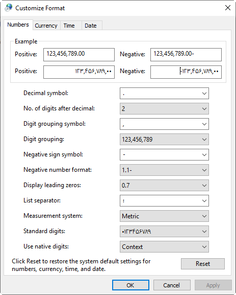
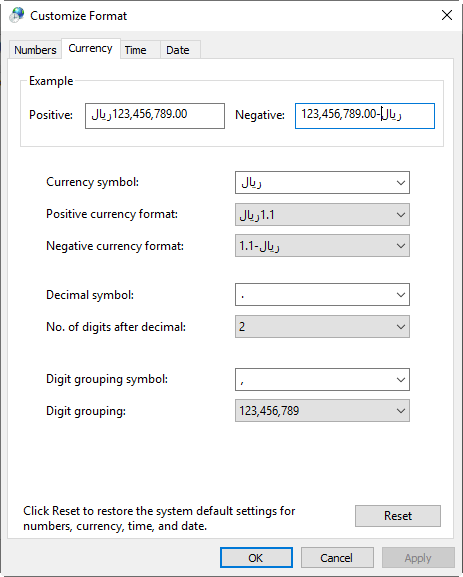

.. meta::
   :description: سوالات متدوالی که ممکن است در کار با نرم افزار با آن روبرو شوید

.. _faq:

سوالات متداول
===============

.. _faq-numbers-characterset:

1. چطور اعداد را فارسی کنیم؟
-----------------------------
نسبت به ویندوز خود یکی از مسیر های زیر را دنبال کنید:

در ویندوز 11:

.. code-block :: bat

    'Settings -> Time & language -> Language & region -> Administrative language settings -> Format -> Additional settings'

در ویندوز 8 و 10:

.. code-block :: bat

    'This PC -> Open Control Panel -> Region -> Additional Settings'

برای ویندوز 7:

.. code-block :: bat

    'Start -> Control Panel -> Regional and Language -> Additional Settings'

برای ویندوز ایکس پی:

.. code-block :: bat

    'Start -> Control Panel –> Regional and Language Options -> Customize'

سپس گزینه Use native digits را اگر از تنظیمات کامل فارسی استفاده می کنید روی Context و الا روی National قرار دهید.

| **تنظیمات صحیح اعداد**

| **تنظیمات صحیح پول**

|

.. _faq-install-page:

2. برگه ای را دانلود کرده ام،چطور نصب و استفاده کنم؟
-----------------------------------------------------------------
- اگر برنامه فاکتور را نصب کرده باشید فایل دانلود شده به شکل " بسته نصبی برگه " که در قسمت تعاریف معرفی شد نمایش داده خواهد شد ، با دوبار کلیک کردن و یا راست کلیک و انتخاب گزینه اول به معنی " نصب برگه فاکتور " می توانید آن را نصب کنید . همچنین با کشیدن و رها کردن فایل روی آیکون برنامه نیز می توانید آن را نصب نمایید . پس از نصب با باز کردن برنامه و با استفاده از گزینه " انتخاب برگ " می توانید لیست برگ های نصب شده را ببینید و مورد دلخواه را باز نمایید . مراحل تصویری این کار در لینک زیر قابل مشاهده می باشد:    http://www.mohsensoft.com/product/faktor/index.php?page=4#navi

.. _faq-setdefaults:

3. چطور میتوانم فیلد هایی را بعنوان پیش فرض یا ثابت تنظیم کنم؟
---------------------------------------------------------------------------
- همانطور که در قسمت " :ref:`الگو<template>` " توضیح داده شده است می توانید یک برگ را باز نموده و گزینه های مورد نظر را تنظیم کنید ، سپس با استفاده از گزینه "  الگو " یک الگو جدید اضافه نمایید و بعد از آن هر کدام از الگو ها را که بیشتر مورد کاربرد دارید بعنوان پیشفرض انتخاب کنید تا موقع انتخاب آن برگ این تنظیمات روی آن بصورت پیشفرض اعمال شود . این تنظیمات می تواند تمام موارد موجود در یک برگ شامل جدول ، فیلدهای پایانی ، تنظیمات و مشخصات مشتری/متقاضی باشد .

    :ref:`رفتن به قسمت الگو<template>`

.. _faq-newupdate:

4. چگونه از ویرایش جدید مطلع شوم؟
-----------------------------------------
کافیست سیستم خود را به اینترنت متصل نمایید ، اگر از ویرایشی قدیمی استفاده می کنید پیامی به همین مضمون در کادر پایین پنجره اصلی به نمایش در خواهد آمد که در آن آدرس محل دانلود نسخه جدید قابل انتخاب می باشد.

.. _faq-current-version:

5. ویرایش کنونی نرم افزار من چیست؟
-------------------------------------------
برای دیدن ویرایش کنونی نرم افزار می توانید روی آیکون علامت سوال آبی رنگ در قسمت بالا و سمت راست برنامه کلیک کنید،پنجره ای حاوی اطلاعات نرم افزار نمایش داده خواهد شد که در آن در قسمت بعد از نام لاتین نرم افزار ویرایش آن نوشته شده است که عددی چهار قسمتی می باشد.

.. _faq-incorrect-contexts:

6. بعد از باز کردن فایل از ویرایش قبلی کلمات فارسی بهم ریخته است.
------------------------------------------------------------------------------
این مورد در قسمت " :ref:`مهاجرت از نسخه های قبلی<from-old-version>` " توضیح داده شده است.

.. _faq-empty-print:

7. وقتی دستور چاپ را صادر میکنم در صفحه چاپ شده هیچ نوشته ای وجود ندارد یا خروجی سفید است و یا متنها کامل نیستند.
--------------------------------------------------------------------------------------------------------------------------------
| اگر به تازگی نرم افزار را نصب کرده اید با یکبار ریست سیستم مشکل برطرف خواهد شد.

| اگر مشکل هنوز ادامه داشت فونت های زیر را دانلود و نصب نمایید :

http://dl.mohsensoft.com/download/files/MSNazanin.zip
http://dl.mohsensoft.com/download/files/MSYekan.zip

| و در نهایت گزینه " :ref:`پرینت کمکی<setting-print>` " را در قسمت تنظیمات فعال نمایید.

.. _faq-move-output:

8. متن چاپ شده در محل خود چاپ نمی شود.
-----------------------------------------
در بعضی برگه ها نظیر برگه های چک ، که میبایست متن چاپ شده در محل مشخص چاپ شود شما میبایست به نسبت نوع چاپگر خود تنظیمات حاشیه را تغییر دهید .
برای این کار پیشنهاد میشود ابتدا یک برگ سفید ( و یا یک کپی و یا اصل برگ ) را در چاپگر خود قرار دهید و یکبار روی این برگ چاپ بگیرید ،
سپس توسط یک خط کش محل چاپ متن ها را نسبت به محل درست مقایسه نمایید و مقادیر صحیح را در قسمتهای "جابجایی افقی" و جابجایی عمود" از گروه "چیدمان" در نوار تنظیمات  بنویسید.
برای مثال اگر پرینت خروجی سه میلیمتر از مکانی که میبایست چاپ کند به سمت چپ چاپ میکند کافیت مقدار جابجایی افقی را بعلاوه سه کنید .
برای اطلاعات بیشتر به :ref:`نوار تنظیمات<bar-settings-layout>` از پنجره اصلی مراجعه نمایید.

.. _faq-install-template:

9. چگونه یک فایل الگو را نصب کنم؟
------------------------------------
نصب یک فایل الگو مانند نصب یک برگه می باشد ، تنها کافیست روی آن دوبار کلیک نمایید تا توسط برنامه باز شود . بعد از بازگشایی توسط برنامه ، سوالی در مورد پیشفرض کردن الگو پرسیده می شود ، اگر تمایل دارید برگ مورد نظر همیشه با این الگو باز شود جواب مثبت دهید .

.. _faq-share-data:

10. چگونه اطلاعات انبار و مشتری/متقاضی را بین چند سیستم به اشتراک بگذارم؟
----------------------------------------------------------------------------
برای اینکار یک پوشه را در سیستم اصلی یا سرور شبکه برای دیگر سیستم ها به اشتراک بگذارید، سپس بهتر است در دیگر سیستم ها این پوشه را بصورت یک درایو شبکه تعریف کنید و توسط راهنمای موجود در بخش "ذخیره و بازیابی" از پنجره تنظیمات آدرس پوشه پیشفزض اطلاعات را به آن درایو یا پوشه تغییر دهید. توجه کنید که اینکار نیاز به دانش اولیه شبکه دارد و اگر از آن اطلاعی ندارید از یک متخصص این کار کمک بگیرید، لطفا از پرسیدن سوال در مورد نحوه شبکه کردن از پشتیبانی نرم افزار خودداری کنید زیرا این کار مربوط به نرم افزار نیست و راهنمایی غیر حضوری معمولا در برپایی شبکه های کامپیوتری کار منتطقی و کارسازی نیست و نیاز به دانش و تجربه دارد 

.. _faq-install-other-os:

11. میتونم نرم افزار رو روی موبایل یا مک نصب کنم؟
-------------------------------------------------------------
نسخه موبایل، وب و دیگر سیستم عامل ها در دست طراحی میباشد و در آینده عرضه خواهد شد. در حال حاضر نرم افزار فاکتور مخصوص ویندوز میباشد.

.. _faq-call:

12. چطور میتونم با شما تماس بگیرم؟
----------------------------------------------
پشتیبانی ما تنها از طریق تیکت در قسمت پشتیبانی در آدرس https://mohsensoft.com/account/tickets میباشد.

.. _faq-mtax-online-price:

13. هزینه ارسال با سیستم آنلاین ارسال صورتحساب به سامانه مودیان چقدره؟
---------------------------------------------------------------------------------
هزینه ارسال در صفحه "گزارش" از سامانه مویان در آدرس زیر وجود دارد:
https://mtax.mohsensoft.com/Reports

.. _faq-picing:

14. هزینه استفاده از نرم افزار فاکتور چگونه است؟
---------------------------------------------------------
نرم افزار فاکتور و برگه های پیشفرض که به همراه آن نصب میشوند رایگان هستند، طراحی های مختلف فاکتور با ظاهر، ستونها و محاسبات مختلف از طریق سایت قابل خرید و دانلود میباشد.
همچنین امکانات داخلی نرم افزار مانند انبار، مشتری ها و ... نیز رایگان و نامحدد هستند.

.. _faq-faktor-report:

15. امکان گزارشگیری از نرم افزار یا محاسبه سود و زیاد و یا تراکنشهای مشتری در نرم افزار وجود دارد؟
------------------------------------------------------------------------------------------------------------------
لطفا دقت نمایید که در حال حاضر هر فاکتور بصورت فایلی مجزا ذخیره میشود و امکان گزارشگیری از خرید و فروش و سود و زیان وجود ندارد ولی میتوانید حساب هر فرد را بصورت دستی در برگه های دفتر معین ذخیره کنید.
این امکان در ویرایش های آینده افزوده خواهد شد.

.. _faq-backup-for-update:

16. آیا برای آپدیت نرم افزار تنظیمات و اطلاعات انبار یا مشتری ها پاک میشوند؟
----------------------------------------------------------------------------------------
در حالت عادی با نصب و حذف نرم افزار یا آپدیت آن تغییری در اطلاعات انبار و مشتریان ایجاد نمیشود، ولی پشتیبانگیری دائمی از همه اطلاعات مهم امری ضروری میباشد.

.. _faq-recover-delete-doc:

17. یک فایل فاکتور را به اشتباه پاک کردم یا فایلی را باز کردم اطلاعاتی در آن نیست، باید چکار کنم؟
---------------------------------------------------------------------------------------------------------------
به هر دلیلی ممکن است یک فایل دچار مشکل شود، از جمله مشکلات دستگاه ذخیره کننده، قطع ناگهانی برق، ویروس و ... . در این مواقع علاوه بر استفاده از پشتیانگیری ها نرم افزار فاکتور امکان دیگری در اختیار شما قرار داده است که در آن ده ذخیره آخر یک فایل در محلی نگهداری میشود که در صورت لزوم میتوانید از آن استفاده نمایید.
برای اطلاعات بیشتر به قسمت ":ref:`نمایش پوشه فایلهای پشتیبان<setting-save>`" از پنجره تنظیمات بخش ذخیره و بازیابی مراجعه نمایید

.. _faq-auto-bank-backup:

18. تغییری در انبار داده ام و یا مورادی را حذف کرده ام چطور سریع به حالت قبل برگردم؟
-----------------------------------------------------------------------------------------------------
نرم افزار بصورت خودکار هر ساعت یکبار در صورت ذخیره اطلاعات انبار یک پشتیبان از انبار تهیه میکند، توسط منوی "بازگردادن اطلاعات از پشتیبانگیری خودکار" در پنجره انبار بصورت سریع میتوانید به آخرین ذخیره هایی که انجام داده اید بازگردید.