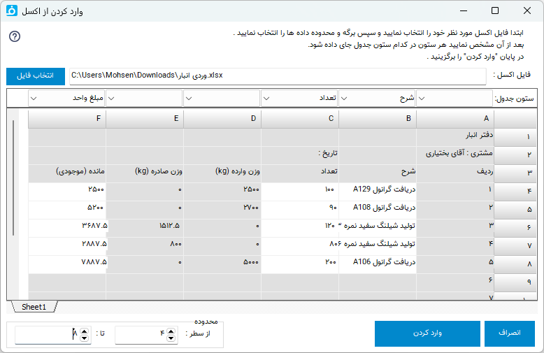

.. meta::
   :description: وارد کردن اطلاعات به نرم افزار از طریق فایل اکسل

.. _import-from-excel:

ورود اطلاعات از فایل اکسل
===========================

|

گاهی لازم می شود اطلاعات را از فایل اکسل به برنامه وارد کرد . برای مثال ممکن از قبلا از اکسل برای بایگانی داده ها استفاده می کردید و یا برای وارد کردن داده ها از برنامه ای دیگر تنها راه خروجی گرفت از آن برنامه به یک فایل اکسل و بعد از آن وارد کردن به برنامه باشد .
بسته به محلی که قرار است اطلاعات به آن قسمت منتقل شود که ممکن است خود جدول فاکتور، انبار و یا لیست مشتری/متقاضی باشد. پنجره زیر باز خواهد شد :

در این پنجره ابتدا فایل اکسل مورد نظر خود را توسط گزینه "انتخاب فایل" انتخاب نمایید.
بعد از انتخاب فایل محتویات فایل نمایش داده خواهد شد. ابتدا برگه ( Sheet ) مورد نظر خورد را انتخاب نمایید ، سپس در نوار "ستون " مشخص کنید هر ستون از فایل پس از وارد کردن در کدام یک از ستون های فاکتور یا انبار و یا فیلدهای مشتری/متقاضی جای گیرند .

بعد از آن مشخص کنید داده ها از سطر چندم تا سطر چندم وارد شوند. با انتخاب محدوده و سطر مورد نظر برای راحتی شما و بالابردن دقت محدوده مورد نظرتان، مناطقی که روشن میمانند وارد خواهند شد و مناطق تیره رنگ وارد نخواهند شد.

در پایان "وارد کردن" را انتخاب نمایید .
